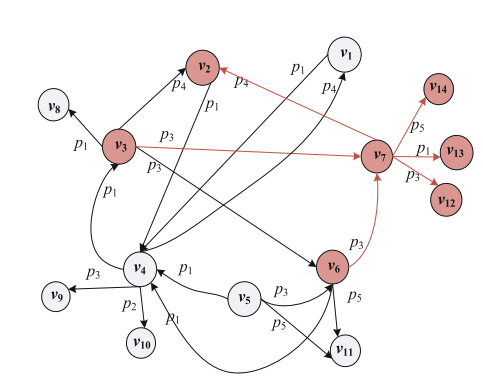

# Knowledge Graph

A $KG$ is defined as $G = (V, P, R, L_{V} , \varphi)$, where 
- $V$ is the set of nodes or entities, 
- $P$ is a set of relation types, i.e., properties, 
- $R \subset V \times P \times V$ is a set of relations or triples between nodes,  
- $L_{V}$ is a set of node labels or types, and 
- $\varphi: V \rightarrow \rho(L_{V})$ is a function that maps a node to the set of types.

**Definition 1** (Node feature). Given $G = (V, P, R, L_{V} , \varphi)$, the feature of a node $v \in V$ is
defined as a finite set of elements that characterizing $v$, denoted as $$F(v) = \{f_{1}, f_{2},\ldots, f_{s}\}.$$

**Definition 2** (Feature Pattern, $FP$ ). Given $G = (V, P, R, L_{V} , \varphi)$, a feature pattern ($FP$)
is defined as a tuple: $c = (W, T)$, where $W$ is a subset of $V$ and $T$ is a subset of $P$ and
satisfies: 
- (i) $\forall v \in W, F(v) = T$, and 
- (ii) for any subset of $V$ that include $W$, i.e., $W' \subset V$ and $W ⊆ W'$, the condition (i) does not hold for every node in $W'$.

Definition 2 describes that an $FP$ is a maximum set of common features for a set of nodes. $T$ in an $FP$ $c$ is called the feature set.

**Definition 3** ($KG$ summary based on $FP$). Given $G = (V, P, R, L_{V} , \varphi)$, let $C$ be the set of $FPs$ formed by all the nodes of $G$, the summary of $G$ is the Hasse Diagram ($HD$) formed by $(C, \subset)$, where $\subset$ is the subset relation between the feature sets in $C$. We denote the summary of $G$ as $L = (C, E)$, where $E$ describes the cover relations between the elements of $C$.

### Example

#### $KG = (V, P, R, L_{V})$ where
- $V = {v_{1}, v_{2}, v_{3}, v_{4}, v_{5}, v_{6}, v_{7}, v_{8}, v_{9}, v_{10}, v_{11}, v_{12}, v_{13}, v_{14}}$
- $P = {p_{1}, p_{2}, p_{3}, p_{4}, p_{5}}$
- $R = $

| V initial | R | V end | | V initial | R | V end |
| --- | --- | --- | --- | --- | --- | --- | 
| $v_{1}$ | $p_{1}$ | $v_{4}$ | | $v_{5}$ | $p_{1}$ | $v_{4}$ | 
| $v_{2}$ | $p_{1}$ | $v_{4}$ | | $v_{6}$ | $p_{1}$ | $v_{4}$ | 
| $v_{3}$ | $p_{4}$ | $v_{2}$ | | $v_{6}$ | $p_{3}$ | $v_{7}$ | 
| $v_{3}$ | $p_{3}$ | $v_{7}$ | | $v_{6}$ | $p_{5}$ | $v_{11}$ | 
| $v_{3}$ | $p_{3}$ | $v_{6}$ | | $v_{7}$ | $p_{4}$ | $v_{2}$ | 
| $v_{3}$ | $p_{1}$ | $v_{8}$ | | $v_{7}$ | $p_{3}$ | $v_{12}$ |
| $v_{4}$ | $p_{1}$ | $v_{3}$ | | $v_{7}$ | $p_{1}$ | $v_{13}$ | 
| $v_{4}$ | $p_{3}$ | $v_{9}$ | | $v_{7}$ | $p_{5}$ | $v_{14}$ | 
| $v_{4}$ | $p_{2}$ | $v_{10}$ | | | |

Lets define $F(v) = $ outgoing properties then 

| $F(v)$ | outgoing properties from $v$| | $F(v)$ | outgoing properties from $v$|
| --- | --- | --- | --- | --- |
| $F(v_{1})$ | $\{p_{1}\}$ | | $F(v_{8})$ | $\{\empty\}$ |
| $F(v_{2})$ | $\{p_{1}\}$ | | $F(v_{9})$ | $\{\empty\}$ |
| $F(v_{3})$ | $\{p_{1}, p_{3}, p_{4}\}$ | | $F(v_{10})$ | $\{\empty\}$ |
| $F(v_{4})$ | $\{p_{1}, p_{2}, p_{3}\}$ | | $F(v_{11})$ | $\{\empty\}$ |
| $F(v_{5})$ | $\{p_{1}\}$ | | $F(v_{12})$ | $\{\empty\}$ |
| $F(v_{6})$ | $\{p_{1}, p_{3}, p_{5}\}$ | | $F(v_{13})$ | $\{\empty\}$ |
| $F(v_{7})$ | $\{p_{1}, p_{3}, p_{4}, p_{5}\}$ | | $F(v_{14})$ | $\{\empty\}$ |

with this the summary $L$ based on HD $C$ has 6 distinct elements
| $C$ | value | Cardinality | Layer |
| --- | --- | --- | --- |
| $c_{1}$ | $(\{v_{8}, v_{9}, v_{10}, v_{11}, v_{12}, v_{13}, v_{14}\}, \empty)$ | 0 | 1 |
| $c_{2}$ | $(\{v_{1}, v_{2}, \{p_{1}\})$ | 1 | 2 |
| $c_{3}$ | $(\{v_{3}\}, \{p_{1}, p_{3}, p_{4}\})$ | 3 | 3 |
| $c_{4}$ | $(\{v_{5}, v_{6}\}, \{p_{1}, p_{3}, p_{5}\})$ | 3 | 3 |
| $c_{5}$ | $(\{v_{4}\}, \{p_{1}, p_{2}, p_{3}, p_{4}\})$ | 4 | 4 |
| $c_{6}$ | $(\{v_{7}\}, \{p_{1}, p_{3}, p_{4}, p_{5}\})$ | 4 | 4 |

The **height** of this summary $L$ is 4.

**Definition 4** (Base graph of an $FP$). Given $G = (V, P, R, L_{V} , \varphi)$, a summary $L = (C,E)$, and an $FP$ $c = (W, T) \in C$, the base graph of $c$ is a subgraph of $G: g_{b} = (V_{b}, P_{b}, R_{b}, L^{b}_{V}, \varphi_{b})$, where: 
- (1) $V_{b} = V_{\sigma} \cup V_{N}$, $V_{\sigma} = \bigcup_{ W \in c}W$ and $V_{N}$ includes all the one-hop neighbor of the nodes in $V_{\sigma}$;
- (2) $R_{b} = \left\{(u, p, v)|u \in V_{\sigma}\, or\, v \in V_{\sigma}\right\}$;
- (3) $P_{b} = \left\{p| p \in P\, and\, (u, p, v) \in Rb\right\}$;
- (4) $L^{b}_{V}$ is a subset of $L_{V}$ which includes the node labels of $V_{b}$; and
- (5) $\varphi_{b}$ is a labeling function that maps each node in $V_{b}$ to its types.

**Definition 5** (Base graph of a summary). Given $G = (V, P, R, L_{V} , \varphi)$ and a summary $L = (C, E)$, the base graph $G_{L} = (V_{s}, P_{s}, R_{s}, L^{s}_{V}, \varphi_{s})$ of $L$ is the union of the base graphs of all its $FPs$: 
- (1) $V_{s} = V_{\sigma} \cup V_{N}$, $V_{\sigma} = \bigcup_{W \in c}W$ and $V_{N}$ includes all the one-hop neighbor of the nodes in $V_{\sigma}$; 
- (2) $P_{s} = \bigcup_{T\in c} T$;
- (3) $R_{s} = \left\{(u, p, v)| u \in V_{\sigma}\, or\, v \in V_{\sigma}\right\}$; 
- (4) $L^{s}_{V}$ is a subset of $L_{V}$ which includes the node labels of $V_{s}$; and 
- (5) $\varphi_{s}$ is a labeling function that maps each node in $V_{s}$ to its types.

# Why knowledge graph?

A number of different knowledge graphs have been constructed in recent years such as:
- [DBpedia](https://www.dbpedia.org/), 
- [Wikidata](https://www.wikidata.org/) and
- [YAGO](https://yago-knowledge.org/)

These knowledge graphs have provided significant advantages in a number of different application areas, such as:
- semantic parsing,
- recommendation systems,
- information retrieval, and
- question answering.

There are a number of applications around code that could potentially benefit from such knowledge graphs, such as:
- code search,
- code automation,
- refactoring,
- bug detection, and
- code optimization.

Facts can be represented in form of triplets in either of the ways,
- HRT: <head, relation, tail>
- SPO: <subject, predicate, object>

## HRT

- Head or tail: these are entities that are real-world objects or abstract concepts which are represented as nodes
- Relation: these are the connection between entities which represented as edges

## Compared to Normal Graphs

- Heterogenous data: supports different types of entities (person, date, painting, etc) and relations (likes, born on, etc).
- Model real-world information: closer to our brain’s mental model of the world (represents information as a normal human does)
- Perform logical reasoning: traverse the graphs in a path to make logical connections (A’s father is B and B’s father is C, hence C is the grandfather of A)

## Creating custom Knowledge Graph

In spite of having several open-source KGs, we may have a requirement to create domain-specific KG for our use case. There, our base data (from which we want to create the KG), could be of multiple types — tabular, graphical, or text blob. 

- Facts creation: this is the first step where we parse the text/object and extract facts in triplet format like <H, R, T>. If we are processing text, we can leverage pre-processing steps like tokenization, stemming, or lemmatization, etc to clean the text. Next, we want to extract the entities and relations (facts) from the text. For entities, we can use Named entity recognition (NER) algorithms. For relation, we can use sentence dependency parsing techniques to find the relationship between any pair of entities. 
- Facts selection: Once we have extracted several facts, the next obvious steps could be:
    - to remove duplicates and 
    - identify relevant facts that could be added to a KG. 

To identify duplicates, we can use entity and relation disambiguation techniques. The idea is to consolidate the same facts or elements of a fact, in case of repetitions. 

## Source code summarization

Source code summarization is the process of generating a concise and generalized natural language summary from a given source code, which can facilitate software developers to comprehend and use the code better. Currently, most research on source code summarization generation focuses on either converting the source code into abstract syntax tree (AST) sequences or directly converting it into code segments and then feeding these representations into deep learning models. However, these single representation approaches ignore the semantic features of source code and destroy the structure of the abstract syntax tree, which affects the quality of the generated source code summarization. 

