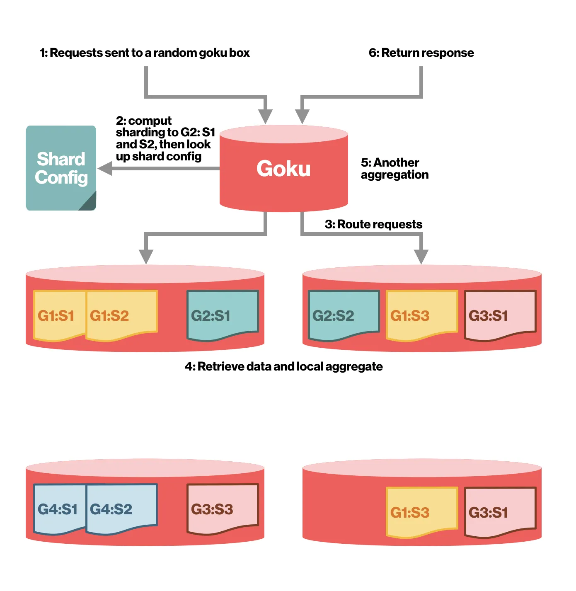
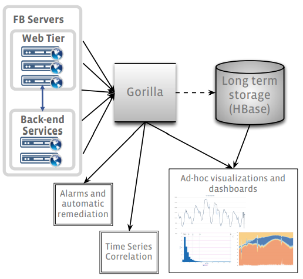
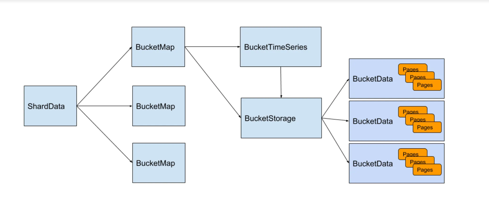
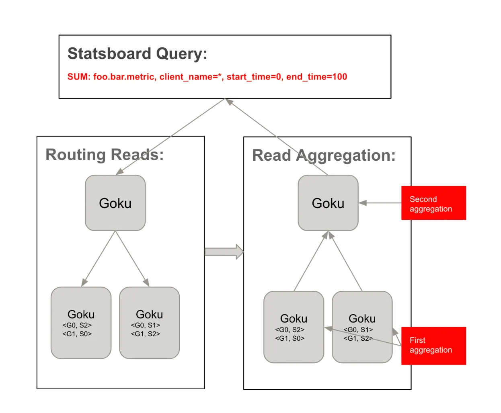
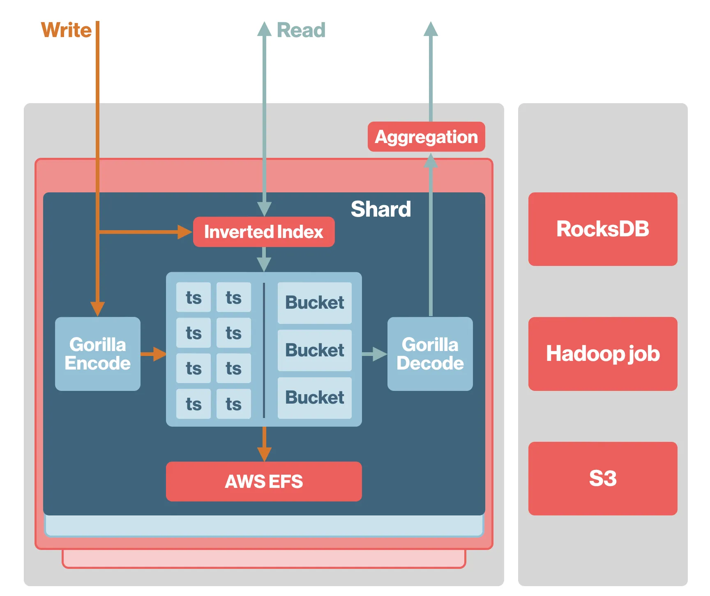

# Goku

En **Pinterest**, los desarrolladores usan **Statsboard** para monitorear sus sistemas y
detectar problemas. Un sistema de monitoreo fiable y eficiente es determinante para la
velocidad de desarrollo. Históricamente usaron [OpenTSDB](opentsdb.md) para ingerir y servir
métricas. Sin embargo, al crecer Pinterest, el número de servicios pasó de cientos a miles,
generando millones de puntos de datos por segundo, y en aumento.

Aunque OpenTSDB funcionaba correctamente a nivel funcional, su rendimiento se degradó con el
crecimiento, provocando una carga operativa considerable (problemas serios de *garbage
collection* y caídas frecuentes de HBase). Como solución, desarrollaron **Goku**: una base de
datos de series de tiempo propia, escrita en C++ y con APIs compatibles con OpenTSDB, capaz
de soportar ingesta eficiente y consultas costosas.



## Modelo de datos

Goku sigue el modelo de datos de OpenTSDB. Una serie de tiempo se compone de una **clave** y
una secuencia de puntos numéricos a lo largo del tiempo:

`clave = nombre de la métrica + un conjunto de pares clave-valor de tags`

Por ejemplo:

```text
tc.proc.stat.cpu.total.infra-goku-a-prod{host=infra-goku-a-prod-001,cell_id=aws-us-east-1}
```

Un **punto de datos** es la clave más un valor, donde el valor es un par timestamp-valor:

| timestamp | valor |
| --- | --- |
| 1525724520 | 174706.61 |
| 1525724580 | 173456.08 |

## Consultas

Cada consulta se compone de parte o de todos estos elementos, además del tiempo de inicio y
de fin:

- nombre de la métrica,
- filtros,
- agregadores,
- *downsampler*,
- opción de tasa (*rate option*).

1. Un ejemplo de **nombre de métrica** es `tc.proc.stat.cpu.total.infra-goku-a-prod`.

2. Los **filtros** se aplican sobre los valores de los tags para reducir el número de series
   que entran en una consulta o grupo, y agregarlas por distintos tags. Goku soporta
   coincidencia exacta, comodines, `Or`, `Not or` y expresiones regulares.

3. El **agregador** especifica la forma matemática de fusionar varias series en una sola.
   Goku soporta `Sum`, `Max`/`Min`, `Avg`, `Zimsum`, `Count` y `Dev`.

4. El **downsampler** requiere un intervalo de tiempo y un agregador. El agregador calcula un
   nuevo punto a partir de todos los puntos del intervalo especificado.

5. La **rate option** calcula opcionalmente la tasa de cambio. Ver el modelo de datos de
   OpenTSDB para el detalle.

## Limitaciones que resuelve

Goku aborda varias limitaciones de OpenTSDB:

1. **Escaneos innecesarios**. Goku sustituye el escaneo ineficiente de OpenTSDB por un motor
   de **índice invertido**.

2. **Tamaño de los datos**. Un punto en OpenTSDB ocupa 20 bytes. Adoptando la compresión
   **Gorilla** se logra una compresión de **12x**.

3. **Agregación en una sola máquina**. OpenTSDB **lee los datos en un servidor y agrega
   ahí**, mientras que el motor de consultas de Goku **acerca el cómputo a la capa de
   almacenamiento**, permitiendo procesamiento paralelo en los nodos hoja antes de agregar
   los resultados parciales en el nodo raíz.

4. **Serialización**. OpenTSDB usa JSON, que es lento cuando hay que devolver muchos puntos;
   Goku usa binario Thrift.

## Arquitectura

### Motor de almacenamiento

Goku emplea el motor de almacenamiento en memoria **Gorilla** de Facebook para guardar los
datos más recientes de las últimas 24 horas.



La imagen anterior muestra cómo funciona Gorilla. La implementación del motor de
almacenamiento de Pinterest es esta:



Como se ilustra arriba, las series de tiempo se dividen en distintos *shards* llamados
**BucketMap**. Cada serie se divide además en *buckets* cuya duración es configurable
(internamente usan buckets de 2 horas). En cada BucketMap, cada serie recibe un identificador
único y se enlaza a un objeto **BucketTimeSeries**, que mantiene el buffer modificable más
reciente y los identificadores de almacenamiento hacia los buckets inmutables en
**BucketStorage**. Pasado el tiempo de bucket configurado, los datos del BucketTimeSeries se
escriben en BucketStorage y pasan a ser inmutables.

Para la persistencia, los BucketData también se escriben a disco. Al reiniciar, Goku lee los
datos de disco a memoria. Usan un NFS para almacenarlos, lo que facilita la migración de
shards.

### Sharding y enrutamiento

Se usa una estrategia de sharding **en dos capas**. Primero se hace *hashing* sobre el nombre
de la métrica para determinar a qué **grupo de shards** pertenece la serie. Después se hace
*hashing* sobre el nombre de la métrica más el conjunto de pares clave-valor de tags para
determinar **en qué shard de ese grupo** está la serie.

Esta estrategia garantiza que los datos queden balanceados entre shards. Al mismo tiempo,
como cada consulta va a un único grupo, el *fanout* se mantiene bajo, lo que reduce la
sobrecarga de red y la latencia de cola. Además, cada grupo de shards se puede escalar de
forma independiente.

### Motor de consultas

#### Índice invertido

Goku permite consultar especificando claves y valores de tags. Por ejemplo, para conocer el
uso de CPU de un host `host1`, se envía la consulta `cpu.usage{host=host1}`. Para soportar
este tipo de consultas se implementó un **índice invertido** (internamente, un *hashmap* de
término de búsqueda a *bitset*).

El término de búsqueda puede ser el nombre de la métrica —`cpu.usage`— o un par clave-valor
de tag —`host=host1`—. Con este motor se pueden hacer rápidamente operaciones `AND`, `OR`,
`NOT`, `WILDCARD` y `REGEX`, lo que además elimina muchas búsquedas innecesarias frente al
enfoque basado en escaneo de OpenTSDB.

#### Agregación

Tras recuperar los datos del motor de almacenamiento viene el paso de agregación y
construcción del resultado final.

Inicialmente se intentó usar el motor de consultas propio de OpenTSDB, pero el rendimiento se
degradaba mucho: todos los datos crudos tenían que viajar por la red, y los objetos de vida
corta generaban muchísimo *garbage collection*.

Por eso se replicó la capa de agregación de OpenTSDB dentro de Goku, adelantando el cálculo
lo máximo posible para minimizar los datos que circulan por la red.

Un flujo de consulta típico es el siguiente:

- Una consulta del cliente Statsboard (la interfaz interna de monitoreo de Pinterest) llega a
  cualquier instancia proxy de Goku.
- El proxy reparte la consulta (*fanout*) entre las instancias de Goku del mismo grupo, según
  la configuración de sharding.
- Cada instancia lee el índice invertido para obtener los identificadores de las series
  relevantes y recupera sus datos.
- Cada instancia agrega los datos según la consulta: agregador, downsampler, etc.
- El proxy hace una **segunda ronda de agregación** con los resultados de cada instancia y
  devuelve la respuesta al cliente.



#### Rendimiento

Comparado con la solución previa de OpenTSDB sobre HBase, Goku rinde mucho mejor en casi
todos los aspectos:

| | Goku | OpenTSDB |
| --- | --- | --- |
| Latencia P99 | 0.04 s | 4 s |
| Hosts | **100** r4.2xlarge | **270** HBase i3.2xlarge, **150** OpenTSDB c3.2xlarge |
| Tamaño de datos | 1 T | 5 T |

## Trabajo futuro

### Almacenamiento en disco para datos de largo plazo

Goku terminará soportando consultas de más de un día. Para rangos largos —un año, por
ejemplo— no interesa tanto qué pasó en un segundo concreto como la tendencia general. Por eso
se aplicará *downsampling* y compactación para fusionar buckets horarios en buckets de plazo
más largo, reduciendo el tamaño de los datos y mejorando el rendimiento de consulta.



### Replicación

Actualmente hay dos clústeres de Goku haciendo escritura doble. Esta configuración da alta
disponibilidad: si hay problemas en uno, se puede desviar el tráfico al otro fácilmente. Sin
embargo, como los dos clústeres son independientes, es difícil garantizar la consistencia de
los datos: si una escritura tiene éxito en uno y falla en el otro, los datos divergen. Otro
inconveniente es que la conmutación por error siempre es a nivel de clúster completo.

Se está trabajando en **replicación intra-clúster basada en log** para soportar shards
maestro-esclavo. Esto mejorará la disponibilidad de lectura, preservará la consistencia y
permitirá conmutación por error a nivel de shard.

### Caso de uso analítico

La analítica es necesaria en todos los sectores y Pinterest no es la excepción: preguntas
sobre resultados de experimentos y rendimiento de campañas publicitarias surgen a cada minuto.
Actualmente se usan sobre todo trabajos *offline* y HBase, lo que significa que no hay datos
en tiempo real y que se hacen muchas preagregaciones innecesarias. Por la naturaleza de los
datos de series de tiempo, Goku encaja bien y puede ofrecer no solo datos en tiempo real,
sino también **agregación bajo demanda**.

## Referencias

- [Goku: building a scalable and high performant time series database system](https://medium.com/pinterest-engineering/goku-building-a-scalable-and-high-performant-time-series-database-system-a8ff5758a181)
- [Paper de Gorilla](https://www.vldb.org/pvldb/vol8/p1816-teller.pdf)
- [Understanding OpenTSDB, a distributed and scalable time series database](https://medium.com/analytics-vidhya/understanding-opentsdb-a-distributed-and-scalable-time-series-database-e4efc7a3dbb7)
