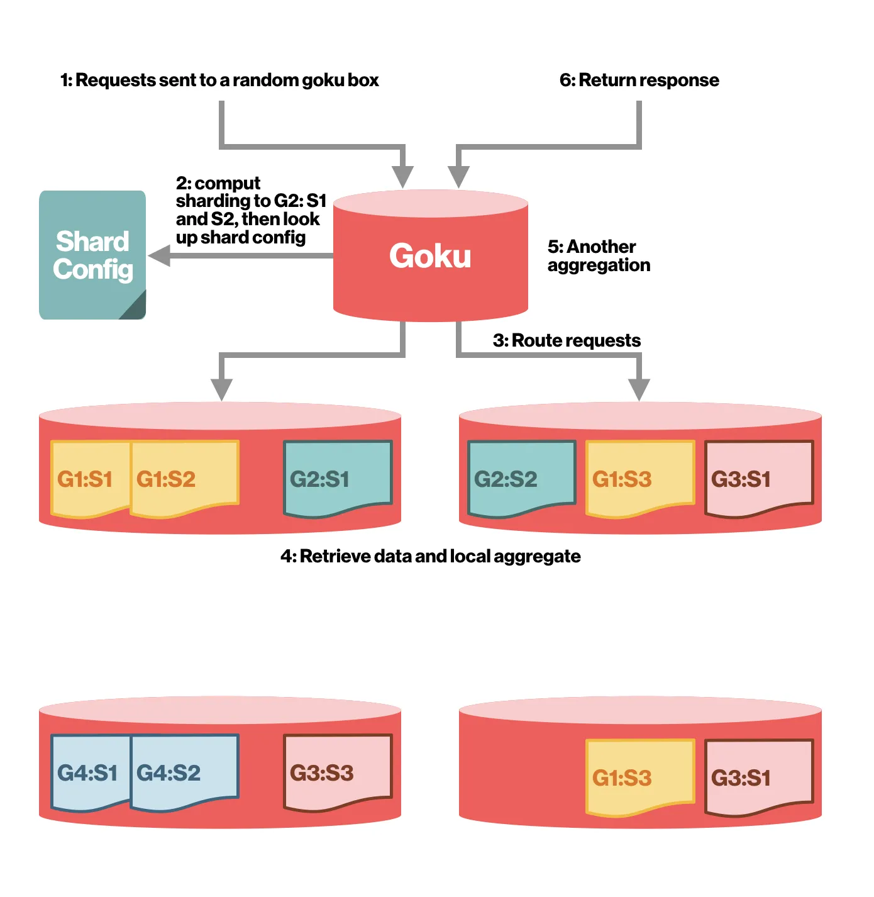
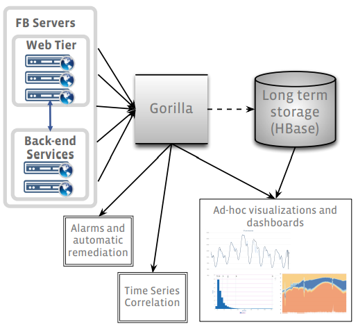
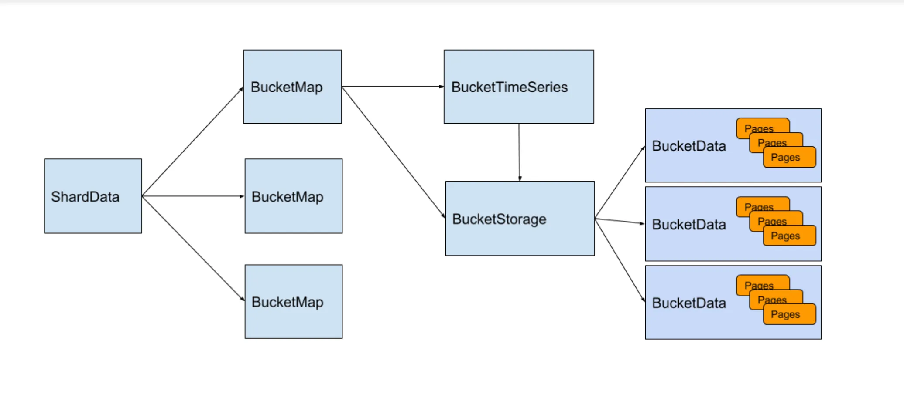
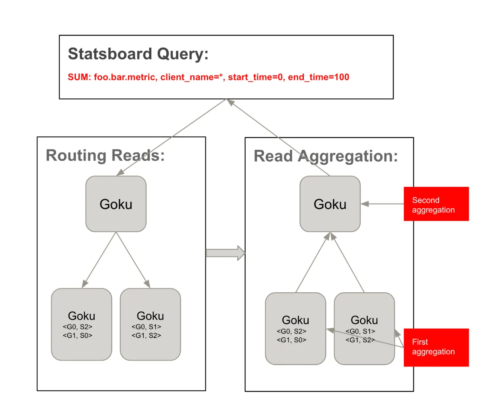

# Goku

At **Pinterest**, developers rely on **Statsboard** to monitor their systems and discover issues. A reliable and efficient monitoring system is very important for development velocity. Historically, we've used [OpenTSDB](http://opentsdb.net/) to ingest and serve metrics data. However, as Pinterest grows, the number of services have also increased from hundreds to thousands, generating millions of data points every second, and growing.

While OpenTSDB worked fine functionally, its performance became degraded as Pinterest grew, causing operational overhead (ex. serious GC issues and crashed HBase quite often). As a solution, developed Goku - our in-house time series database with OpenTSDB compliant APIs written in C++, to support efficient data ingestion and expensive time series queries.

## Time Series Data Model

Goku follows OpenTSDB's time series data model. A time series is composed of a key and a series of numeric data points over time. `key = metric name + a set of tag key value pairs`. 

E.g., `tc.proc.stat.cpu.total.infra-goku-a-prod{host=infra-goku-a-prod-001,cell_id=aws-us-east-1}`. 

data point = key + value. Value is a timestamp and value pair. 

E.g,

| timestamp | value |
| --- | --- |
| 1525724520 | 174706.61 |
| 1525724580 | 173456.08 |

## Time Series Query

Each query consists of part/all of the following: 

- metric name,
- filters,
- aggregators,
- downsampler,
- rate option, in addition to start time and end time.

1) An example of a metric name is, `tc.proc.stat.cpu.total.infra-goku-a-prod`.

2) Filters are applied against tag values to reduce the number of times series are picked up in a query or group, and aggregated on various tags. Examples of filters Goku supports include: Exact match, Wildcard, Or, Not or, Regex.

3) Aggregator specifies the mathematical way of merging multiple time series into a single one. Examples of aggregators that Goku support include: Sum, Max/Min, Avg, Zimsum, Count, Dev. 4) Downsampler requires a time interval and an aggregator. The aggregator is used to compute a new data point across all of the data points in the specified interval.

4) Rate Option optionally calculates rate of change. For details, see OpenTSDB Data Model.

## Challenges

Goku addresses many of limitations in OpenTSDB, including:

1) Unnecessary scan: Goku replaces OpenTSDB's inefficient scan by an inverted index engine.

2) Data size: A data point in OpenTSDB is 20 byte. We adopted Gorilla compression to achieve **12x** compression.

3) Single machine aggregation: OpenTSDB **reads data onto one server and aggregates** while Goku's new query engine **moves computation closer to storage layer that enables parallel processing on leaf nodes before aggregating partial results on root node**.

4) Serialization: OpenTSDB uses JSON, which is slow when there are too many data points to return; Goku uses thrift binary instead.

## Architecture

### Storage Engine

Goku has employed Facebook Gorilla in memory Storage Engine to store the most recent data from the past 24 hours.

This image show how Gorillas works.

Pinterest Storage Engine implementation

As illustrated above, in the storage engine, Timeseries are divided into different shards called BucketMap. For one Timeseries, it’s also divided into buckets whose duration can be configured (internally we use a 2-hour bucket). In each BucketMap, every time series is assigned one unique id and linked to one BucketTimeSeries object. The BucketTimeSeries holds the most recent modifiable buffer bucket and storage ids to immutable data buckets in BucketStorage. After the configured bucket time, data in BucketTimeSeries will be written to BucketStorage and become immutable.

To achieve persistence, BucketData are written to disk as well. When Goku restarts, it will read data from disk into memory. We use an NFS to store the data which enables easy shard migration.

### Sharding & Routing

We use a two-layer sharding strategy. First we do hashing on the metric name to determine which shard group one Time Series belongs to. We follow with hashing on the metric name + tag key value sets to determine which shard in that group the Time Series is in. This strategy ensures data will be balanced across shards. Meanwhile since each query only goes to one group, the fanout remains low to reduce network overhead and tail latency. In addition, we can scale each shard group independently.

### Query Engine

#### Inverted Index

Goku supports query by specifying tag key and tag values. For example, if we want to know the CPU usage of one host host1, we can send a query `cpu.usage{host=host1}`. In order to support this kind of queries, we implemented an inverted index. (Internally it's a hashmap from search term to a bitset.) The search term can be either the metric name like `cpu.usage` or tag key value pair like `host=host1`. Having this `inverted index` engine, we can quickly do `AND`, `OR`, `NOT`, `WILDCARD` and `REGEX` operations, which has also reduced many unnecessary lookups compared to original OpenTSDB scan based querying.

#### Aggregation

After retrieving data from storage engine, comes the step of aggregation and construction of final result.

We initially tried OpenTSDB, using its built-in query engine. The performance degraded heavily as all the raw data need to go on network and also those short lived objects cause a lot GC.

So we replicated OpenTSDB's aggregation layer inside Goku. We also pushed the calculation as early as possible minimize the data on the wire.

A typical query flow is as follows:

- A query from Statsboard client (Pinterest's internal metric monitoring UI) goes to any proxy goku instance
- The proxy goku fanout the query to related goku instances within the same group based on the sharding configuration
- Each goku reads inverted index to get related time series ids and go on fetching their data
- Each goku aggregates the data based on query, like aggregator, downsampler and etc
- Proxy goku does the second round of aggregation after gathering results from each goku and returns to the client

#### Performance

Compared with previously used OpenTSDB/HBase solution, Goku performs much better in almost all aspects.

|     | Goku | OpenTSDB |
| --- | --- | --- |
| P99 latency | 0.04 s | 4s |
| Hosts | **100** r4.2xlarge | **270** HBase i3.2xlarge, **150** OpenTSDB c3.2xlarge |
| Datasize | 1t | 5t |

### What’s next

#### Disk-based storage for long-term data

Goku ultimately will support queries longer than one day. For longer term queries like one year, we don't put as much emphasis on what happened at one second, but rather look at the overall trend. Therefore, we’ll do downsampling and compaction to merge hourly buckets into longer term buckets, which reduces the data size and improves query performance.

#### Replication

Currently we have two goku clusters doing double writes. This setting gives us high availability: when there are issues in one cluster, we can easily switch traffic to another. However, because the two clusters are independent, it's hard to ensure data consistency. E.g., if writes to one succeed while fail on the other, data will become inconsistent. Another drawback is failover is always cluster level granularity. We're working on log based intra-cluster replication to support master slave shards. This will improve read availability, preserve data consistency and failover in shard level granularity.

#### Analytics Use Case

Analytics is widely needed for all industries and Pinterest is no exception. Questions like experiment results and ads campaign performance are being asked every minute. Currently we mainly use offline jobs and HBase for analytics purpose, which means no real-time data, and a lot of unnecessary pre-aggregations. Because of the time series data nature, Goku could easily fit it and provide not only real time data, but also on demand aggregation.

## References
- [goku-building-a-scalable-and-high-performant-time-series-database-system](https://medium.com/pinterest-engineering/goku-building-a-scalable-and-high-performant-time-series-database-system-a8ff5758a181)
- [Gorilla paper](https://www.vldb.org/pvldb/vol8/p1816-teller.pdf)
- [OpenTSDB understanding opentsdb a distributed and scalable time series database](https://medium.com/analytics-vidhya/understanding-opentsdb-a-distributed-and-scalable-time-series-database-e4efc7a3dbb7)

