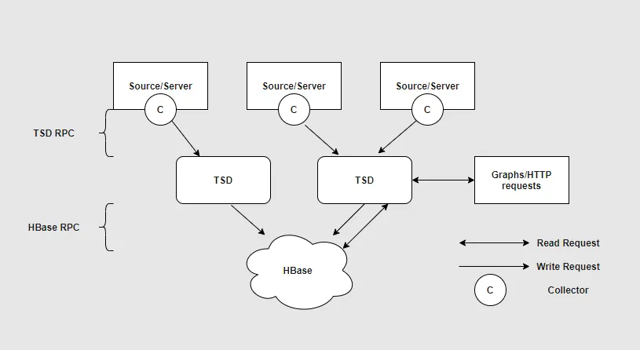
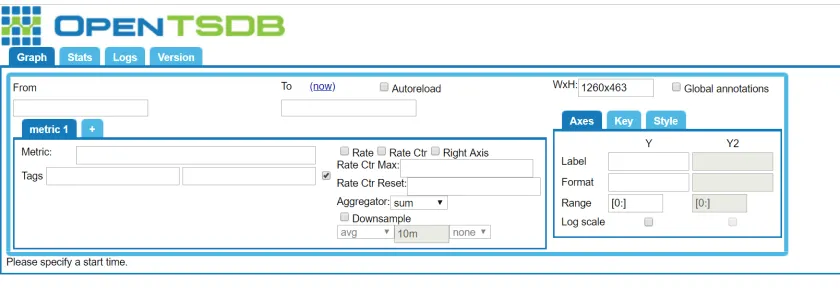

# OpenTSDB

OpenTSDB stands for Open Time Series Data Base. OpenTSDB, as the name suggests, is a time-series database built on top of HBase. It is excellent for IO operations in distributed systems.

## Terminology

- **TSD**: Stands for Time Series Daemon, this is the service that runs on the machine which is responsible for interacting with HBase and store/retrieve data
- **Epoch**: Numerical representation of time. It has two formats, 10 digits representing the number of seconds elapsed from 1st Jan 1970 and 13 digits representing the number of milliseconds elapsed from the same date. Epoch numbers are used while storing and querying data in OpenTSDB.

- **Metric**: Metric is the entity we are capturing in the time series data. Example in the case of tracking the BTC price, the cryptocurrency `price` is the metric.

- **Tags**: We can think of a tag as an annotation over time series data point. A tag describes a metric's property, sets the context of data in the named metric. Tags are `key`-`value` pairs and each data point can have more than one tag. In the case of crypto the price of cryptocurrency, the name of the crypto becomes an annotation, distinguishing each crypto's data separately. Here, `crypto price` is the metric, `name` is the tag, and `BTC`, the name of the crypto, is the value of the tag. Other tags could be `Market Capitalization`, `Trading Valume`, `Prince Change`, `Volatility`, `Hash Rate`, `Transaction Fees`. Tag values are used to filter/aggregate data while querying.

- **Time Series Data**: A time series is a series of data points indexed in time order. Examples include the continuous monitoring of a person’s heart rate, hourly readings of air temperature, the daily closing price of a company stock etc. In the context of OpenTSDB, a time series data is the information of a metric with a unique set of tags changing over time.

- **Downsampling**: Downsampling is the process of reducing the sampling rate, or resolution, of data. If data queried is for a longer duration, the number of points received will be high, this will cause slower query throughput. For example, if data is stored at a second level and if we are querying data for 1 week, we get 604800 data points. If we downsample the data and get data at a minute interval, we get 10080. This reduces query time, network latency, and overall load on the system.

- **Aggregation**: Aggregation is the collection of multiple data. OpenTSDB was designed to efficiently combine multiple, distinct time series during query execution. For example, if we wish to see the average heart rate of all male patients, then we aggregate all time-series data of male patients using average as an aggregate function. This will give us one set of points that shows the average heart rate of all male patients.

- **Interpolation**: For aggregation to work, we need data to be present for the queried time range. If we are aggregating data at a minute level, we need data 60 data points for each minute. But in the real world, there is a very good chance that data is missing in between. OpenTSDB fills in these gaps using interpolation. For example, for “zimsum” type of aggregation, OpenTSDB interpolates by filling 0 for all missing values and then aggregates it by summing up data.


## Architecture

OpenTSDB is an interface over [HBase](https://hbase.apache.org/). It stored data in 4 HBase tables namely, 

- TSDB, 
- TSDB-UID, 
- TSDB-META,
- TSDB-TREE. 

So before running OpenTSDB, HBase has to be running.



**OpenTSDB** consists of a **Time Series Daemon** (TSD) as well as a set of command-line utilities. Interaction with OpenTSDB is primarily achieved by running one or more of the TSDs. Each TSD is independent. There is no master, no shared state so you can run as many TSDs as required to handle any load you throw at it. The data schema is highly optimized for fast aggregations of similar time series to minimize storage space. Users of the TSD never need to access the underlying store directly. You can communicate with the TSD via a simple 

- telnet-style protocol, 
- an HTTP API, or a 
- simple built-in GUI. 

A collector is a program that will fetch and feed data to TSD. All communications happen on the same port (the TSD figures out the protocol of the client by looking at the first few bytes it receives).

We can write data in OpenTSDB using Telnet style API or using HTTP Post request. Reads happen using HTTP get request. OpenTSDB also has an interface which has few controls and displays graph of a metric, it looks like this:



### Writing Data in OpenTSDB

As mentioned above, there are two ways of writing data in OpenTSDB, we will briefly discuss both of them here.

#### Telnet style

Here we first make a telnet connection to TSD using any telnet client and send commands to insert data into OpenTSDB. Here is the format of the command:

```bash
<Metric Name><Timestamp in epoch> <Value> <Tag Key>=<Tag Value>
```

Example:
`telnet> room_temperature 1588334464 33 floor=1 room_number=10`


#### HTTP Style

To store data in HTTP style, use any HTTP client, and make a post request to OpenTSDB put API. We can store single or multiple data points at once using this API. It also accepts the query parameter, the two most popular query parameters are details and summary. Detail query parameter gives details of the result, how many were successfully stored, how many failed, and the reason for failure as well. And summary just gives the count of success and failure. API looks like this:

`http://<ip-address-of-machine>:<port>/api/put?summary`

###### Example

```
API : http://localhost:4242/api/put/?sumamry
Method Type: Post
Body:
[
    {
        "metric": "room_temperature",
        "timestamp": 1346846400,
        "value": 18,
        "tags": {
           "floor": "1",
           "room_no": "10"
        }
    },
    {
        "metric": "room_temperature",
        "timestamp": 1346846400,
        "value": 21,
        "tags": {
           "floor": "1",
           "room_no": "11"
        }
    }
]
Output(Expected):
{
    "failed": 0,
    "success": 2
}
```

We can also compress and send data in the post body using the gzip compression technique.


### Reading data from OpenTSDB

We can use the OpenTSDB interface which runs on port 4242 by default to view data by setting all required fields in it. Alternatively, we can use the HTTP API to read data from OpenTSDB. The query API accepts a wide range of options like aggregation method, interval, tag values, etc. We can use query parameters or send the query in the request payload. Here is an example of accessing data using query parameters:

```
http://localhost:4242/api/query?start=1h-ago&m=1m-avg-zero:room_temperature{floor=1}
Output(expected):
[
    {
        "metric": "room_temperature",
        "tags": {
            "floor": "1"
        },
        "aggregated_tags": ["room_no"],
        "tsuids": [
            "0102050101"
        ],
        "dps": {
            "1346846400": 18,
            "1346846460": 20,
                 ...
        }
    }
]
```

This example specifies the start time to be 1 hour ago relative to the current time, downsampled for getting 1 point for 1m using avg as aggregation function. We have specified to fill in zero for values that are not available, filtered to get only data for floor 1 

Output has the metric name, tags and tag values, it specifies the tags which were aggregated, tsuid (unique id assigned by TSDB), and dps (Data PointS). DPS contains key-value pairs where keys are timestamps in epoch and values are the computed values for the particular timestamp.

