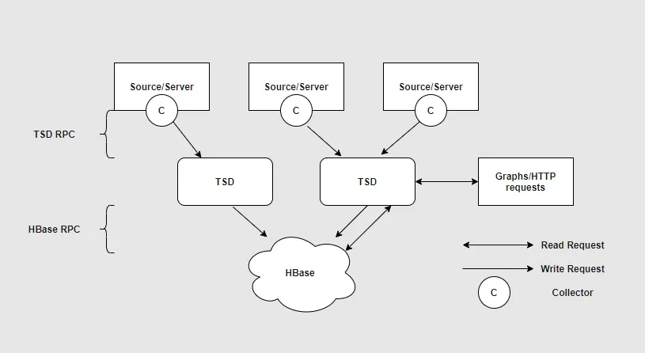
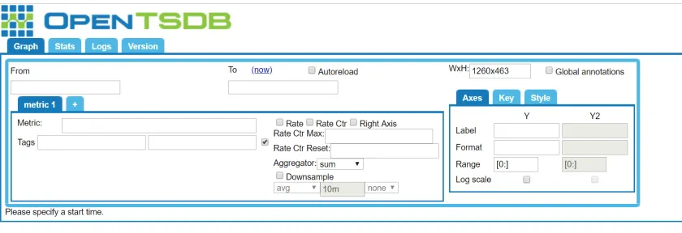

# OpenTSDB

**OpenTSDB** son las siglas de *Open Time Series Data Base*. Como su nombre indica, es una
base de datos de series de tiempo construida **sobre HBase**. Destaca por su rendimiento en
operaciones de E/S en sistemas distribuidos.

## Terminología

- **TSD** (*Time Series Daemon*). Es el servicio que corre en la máquina y se encarga de
  interactuar con HBase para almacenar y recuperar datos.

- **Epoch**. Representación numérica del tiempo. Tiene dos formatos: 10 dígitos, que
  representan los segundos transcurridos desde el 1 de enero de 1970, y 13 dígitos, que
  representan los milisegundos desde esa misma fecha. Los valores epoch se usan al
  almacenar y consultar datos en OpenTSDB.

- **Métrica** (*metric*). Es la entidad que capturamos en la serie de tiempo. Por ejemplo,
  si seguimos el precio de BTC, la métrica es el `precio` de la criptomoneda.

- **Tags**. Un tag es una **anotación sobre un punto de datos**. Describe una propiedad de
  la métrica y establece el contexto del dato. Son pares `clave`-`valor`, y cada punto
  puede tener más de uno. En el caso del precio de criptomonedas, el nombre de la moneda es
  la anotación que distingue los datos de cada una: `precio_cripto` es la métrica, `nombre`
  es el tag y `BTC` es el valor. Otros tags podrían ser capitalización de mercado, volumen
  de operaciones, cambio de precio, volatilidad, *hash rate* o comisiones de transacción.
  Los valores de los tags se usan para **filtrar y agregar** datos en las consultas.

- **Datos de series de tiempo**. Una serie de tiempo es una secuencia de puntos indexados
  en orden temporal: el monitoreo continuo del ritmo cardíaco de una persona, lecturas
  horarias de temperatura, el precio de cierre diario de una acción. En OpenTSDB, es la
  información de una métrica con un conjunto único de tags que cambia en el tiempo.

- **Downsampling**. Es el proceso de **reducir la resolución** de los datos. Si consultas un
  rango largo, el número de puntos devueltos es alto y la consulta se vuelve lenta. Por
  ejemplo, con datos almacenados al segundo, consultar una semana devuelve 604 800 puntos;
  reduciéndolos a intervalos de un minuto quedan 10 080. Esto reduce el tiempo de consulta,
  la latencia de red y la carga general del sistema.

- **Agregación**. Es la combinación de múltiples series. OpenTSDB fue diseñado para
  combinar eficientemente series distintas durante la ejecución de la consulta. Por
  ejemplo, para ver el ritmo cardíaco promedio de todos los pacientes varones, se agregan
  todas sus series usando el promedio como función de agregación, obteniendo un único
  conjunto de puntos.

- **Interpolación**. Para que la agregación funcione, hacen falta datos en todo el rango
  consultado. Si agregamos a nivel de minuto, necesitamos 60 puntos por minuto, pero en el
  mundo real es muy probable que falten datos intermedios. OpenTSDB rellena esos huecos por
  interpolación. Por ejemplo, para la agregación de tipo `zimsum`, interpola rellenando con
  0 todos los valores faltantes y después suma.

## Arquitectura

OpenTSDB es una interfaz sobre [HBase](https://hbase.apache.org/). Almacena los datos en
cuatro tablas de HBase:

- TSDB
- TSDB-UID
- TSDB-META
- TSDB-TREE

Por tanto, **HBase debe estar corriendo antes de arrancar OpenTSDB**.



OpenTSDB consta de un **Time Series Daemon** (TSD) y de un conjunto de utilidades de línea
de comandos. La interacción se realiza principalmente ejecutando uno o más TSD. Cada TSD es
**independiente**: no hay maestro ni estado compartido, así que puedes levantar tantos como
necesites para soportar la carga. El esquema de datos está muy optimizado para agregaciones
rápidas de series similares y para minimizar el espacio de almacenamiento.

Los usuarios del TSD nunca necesitan acceder directamente al almacén subyacente. La
comunicación con el TSD se hace mediante:

- un protocolo sencillo estilo telnet,
- una API HTTP, o
- una interfaz gráfica básica incorporada.

Un **colector** (*collector*) es un programa que obtiene datos y los alimenta al TSD. Toda
la comunicación ocurre en el mismo puerto: el TSD deduce el protocolo del cliente mirando
los primeros bytes que recibe.

La escritura se hace con la API estilo telnet o con peticiones HTTP POST; la lectura, con
peticiones HTTP GET. OpenTSDB también incluye una interfaz con algunos controles que grafica
una métrica:



## Escritura de datos

### Estilo telnet

Se establece una conexión telnet al TSD con cualquier cliente y se envían comandos para
insertar datos. El formato es:

```bash
<nombre_metrica> <timestamp_epoch> <valor> <clave_tag>=<valor_tag>
```

Ejemplo:

```bash
telnet> room_temperature 1588334464 33 floor=1 room_number=10
```

### Estilo HTTP

Para almacenar datos por HTTP se hace una petición POST a la API `put` de OpenTSDB. Permite
guardar uno o varios puntos a la vez. Acepta parámetros de consulta; los dos más usados son
`details` y `summary`. El primero da el detalle del resultado —cuántos se almacenaron,
cuántos fallaron y por qué—; el segundo solo devuelve el conteo de éxitos y fallos.

La API tiene esta forma:

```text
http://<ip-de-la-maquina>:<puerto>/api/put?summary
```

#### Ejemplo

```text
API : http://localhost:4242/api/put/?summary
Tipo de método: POST
Cuerpo:
[
    {
        "metric": "room_temperature",
        "timestamp": 1346846400,
        "value": 18,
        "tags": {
           "floor": "1",
           "room_no": "10"
        }
    },
    {
        "metric": "room_temperature",
        "timestamp": 1346846400,
        "value": 21,
        "tags": {
           "floor": "1",
           "room_no": "11"
        }
    }
]
Salida esperada:
{
    "failed": 0,
    "success": 2
}
```

También se pueden comprimir los datos del cuerpo de la petición usando gzip.

## Lectura de datos

Se puede usar la interfaz de OpenTSDB —que por defecto corre en el puerto 4242— rellenando
los campos necesarios, o bien la API HTTP. La API de consulta acepta un amplio abanico de
opciones: método de agregación, intervalo, valores de tags, etc. Los parámetros se pueden
pasar en la URL o en el cuerpo de la petición.

Ejemplo con parámetros en la URL:

```text
http://localhost:4242/api/query?start=1h-ago&m=1m-avg-zero:room_temperature{floor=1}
Salida esperada:
[
    {
        "metric": "room_temperature",
        "tags": {
            "floor": "1"
        },
        "aggregated_tags": ["room_no"],
        "tsuids": [
            "0102050101"
        ],
        "dps": {
            "1346846400": 18,
            "1346846460": 20,
                 ...
        }
    }
]
```

Esta consulta especifica un tiempo de inicio de una hora antes del momento actual,
*downsampling* para obtener un punto por minuto usando `avg` como función de agregación,
relleno con cero para los valores no disponibles, y filtrado para obtener solo los datos
del piso 1.

La salida contiene el nombre de la métrica, los tags y sus valores, los tags que fueron
agregados, el `tsuid` (identificador único asignado por TSDB) y `dps` (*data points*). El
campo `dps` contiene pares clave-valor donde las claves son timestamps en formato epoch y
los valores son los valores calculados para ese instante.

## Ver también

- [Goku](goku.md) — la alternativa de Pinterest a OpenTSDB.
- [Series de tiempo](../../12_TIME_SERIES/introduccion.md).
