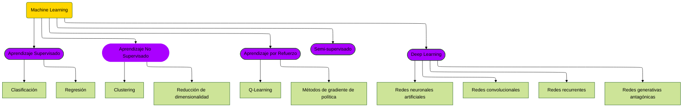
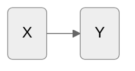

# Introducción al Aprendizaje Supervisado

El machine learning se puede dividir en dos grandes categorías:

1. Aprendizaje supervisado
2. Aprendizaje no supervisado

Aunque conviene añadir otras tres categorías "menores":

3. Aprendizaje semi-supervisado
4. [Aprendizaje por refuerzo](../03_REINFORCEMENT_LEARNING/introduccion.md)
5. Deep learning

En esta sección nos centramos en el aprendizaje supervisado.

## Aprendizaje supervisado

El **aprendizaje supervisado** es probablemente el método de machine learning más utilizado
en los últimos años. Los algoritmos más comunes incluyen:

- **regresión lineal**,
- **árboles de decisión**,
- **máquinas de vectores de soporte**, y
- **redes neuronales**.

En aprendizaje supervisado, cada punto \((X,y)\) de un conjunto de entrenamiento
\(\mathbb{X}\times Y\) asocia una entrada con una salida.

El problema de aprendizaje consiste en **inferir la función que mapea la entrada a la
salida**, de modo que la función aprendida sirva para predecir la salida a partir de entradas
futuras.

Este tipo de aprendizaje recibe su nombre porque la máquina está **supervisada** mientras
aprende: se le proporciona información que la guía. El resultado que le das son **datos
etiquetados**, y el resto de la información se usa como *features* de entrada.

El aprendizaje supervisado es efectivo para propósitos de negocio muy variados: previsión de
ventas, optimización de inventario y detección de fraude, entre otros. Algunos casos de uso
clásicos:

- Predecir precios inmobiliarios.
- Clasificar si una transacción bancaria es fraudulenta.
- Encontrar factores de riesgo de una enfermedad.
- Determinar si los solicitantes de un préstamo son de riesgo bajo o alto.
- Predecir el fallo de piezas mecánicas en equipo industrial.

El aprendizaje supervisado impulsa numerosas aplicaciones de negocio, y esa es la razón por la
que hoy se considera una de las categorías más importantes.

### Formulación de los métodos supervisados

Consideremos un conjunto \(\Omega\) y un subconjunto \(D\subset \Omega\), donde \(D\) está
completamente etiquetado.

Dado el conjunto de etiquetas \(L\) con una función de mapeo

$$\begin{array}{cccc}
\mathcal{L}: & D & \longrightarrow & L \\
& \omega & \longmapsto & l_{\omega} \\
\end{array}$$

queremos extender esta función \(\mathcal{L}\) a todo el conjunto \(\Omega\),

$$\begin{array}{cccc}
\widehat{\mathcal{L}}: & \Omega & \longrightarrow & L^{*} \\
& \omega & \longmapsto & l_{\omega} \\
\end{array}$$

de manera que $$ \widehat{\mathcal{L}}_{|_{D}} = \mathcal{L} $$

## Aplicando las matemáticas

Hay muchas formas, simples y complejas, de alcanzar este objetivo. Normalmente involucran
estadística y ecuaciones diferenciales con optimizaciones lineales o no lineales, sobre
problemas convexos o no convexos, donde se usan algoritmos deterministas y estocásticos para
crear aplicaciones en imágenes, reconocimiento de voz, sistemas de recomendación, motores de
búsqueda y más.

Los algoritmos que preferimos tienen estas características:

- **escalan bien** con el número de variables,
- **paralelizan bien**.

En problemas reales el tiempo es un factor determinante del éxito. Por eso hay que definir
umbrales entre complejidad y precisión en función del tiempo disponible: puede que una
estrategia muy compleja dé los mejores resultados, pero cueste varias veces más construirla.

El principio base del aprendizaje supervisado es la **minimización del riesgo empírico**
(*Empirical Risk Minimization*, ERM), un principio de la teoría del aprendizaje estadístico
que define una familia de algoritmos y permite dar cotas teóricas sobre su rendimiento.

La idea central es que **no podemos saber con exactitud qué tan bien funcionará un algoritmo
en la práctica** (el riesgo real), porque no conocemos la distribución verdadera de los datos
sobre los que operará. Lo que sí podemos hacer es medir su rendimiento sobre un conjunto de
entrenamiento conocido: el riesgo *empírico*.

En muchos casos, los métodos supervisados mapean cada elemento de un conjunto
\(D \subset \Omega\) hacia otro espacio donde existe algún orden, o al menos un orden parcial.
Es decir, disponemos de una estructura que nos permite agrupar elementos; ésta es una
consecuencia muy simplificada del teorema de Dvoretzky.

Consideremos una partición

$$ \Omega = \bigcup_{i=1}^{k}\Omega_{i} $$

y funciones \( \{f_{i}\} \)

$$\begin{array}{cccc}
f_{i}: & \Omega_{i} & \longrightarrow & U_{i}\\
& \omega & \longmapsto & x
\end{array}
$$

Estamos creando *features* a partir de nuestro conjunto de datos. Pueden construirse usando
únicamente valores numéricos de cada \(\omega \in \Omega_{i}\), o pueden ser valores agregados
que dependen de todos los valores en \(\Omega_{i}\).

Para lograrlo dotamos al conjunto de más estructura, añadiendo métricas o indicadores: creamos
funciones que van de nuestro conjunto de datos a otro espacio que llamaremos **espacio de
features**, donde se puede definir una medida o al menos una categorización.

Llamaremos

$$\mathbb{X}=\bigcup_{i=1}^{k}U_{i}$$

nuestro espacio de features. Idealmente, \(\mathbb{X}\) puede dotarse de una estructura
adecuada para realizar inferencia estadística.

Siempre podemos mapear categorías a valores en \(\mathbb{R}\); entonces nuestras features
\(\{f_{1}, ...,f_{m}\}\) son funciones:

$$f_{i}:D\cap \Omega_{i} \longrightarrow U_{i}\subset\mathbb{R}^{m_{i}}$$

Ahora queremos encontrar mapeos \(\{g_{i}\}\) tales que:

$$\begin{array}{cccc}
g_{i}: & U_{i}\subset \mathbb{X} & \longrightarrow & V_{i}\subset L^{*}\\
& x = f_{i}(\omega) & \longmapsto & l_{x}
\end{array}$$

y entonces

$$\widehat{\mathcal{L}}_{|_{\Omega_{i}}} = g_{i}\circ f_{i}$$

Con este enfoque hemos creado dos problemas aparentemente distintos: primero, encontrar
\(\{f_{i}\}\) adecuadas que construyan nuestro **espacio de features**; segundo, encontrar
\(\{g_{i}\}\) que mapeen esas features con las etiquetas de nuestro conjunto etiquetado \(D\).

Ambos problemas son un reto donde se aplican numerosas técnicas computacionales y
estadísticas. Algunas se apoyan en teoría matemática muy profunda; sin embargo, muchos
resultados impresionantes se obtienen mediante heurísticas.

## Flujo general de trabajo

Los datos de entrada para entrenar el modelo se preprocesan y luego se construyen las
*features*. Una vez entrenado, el modelo se usa para hacer predicciones sobre datos no vistos.

Ver [Sistemas de machine learning](../04_WORKFLOWS/sistemas_de_machine_learning.md) para el
detalle de la infraestructura que sostiene este flujo.

## El principio GIGO

Un principio que conviene tener siempre presente es **GIGO** (*Garbage In, Garbage Out*):
basura entra, basura sale.

Con demasiada frecuencia se aplican métodos supervisados sin prestar suficiente atención a la
**creación de features**, usando incorrectamente técnicas de clustering que terminan generando
efectos de solapamiento y enmascaramiento sobre las features, dejándolas incapaces de producir
buenos modelos.

Conseguir un buen proceso de etiquetado siempre es difícil, pero si además se toman malas
decisiones al construir las features, obtener un buen modelo se vuelve muchas veces más
costoso.

## Tendencias en MLOps

Para muchos científicos de datos ha quedado claro que **ignorar los datos** —y asumir que los
modelos aprenderán los patrones por su cuenta— no es viable sin prestar atención específica a
la calidad y la construcción de los datos.

De ahí que el enfoque **MLOps centrado en datos** (*data-centric*) se haya convertido en
tendencia.

## Modelos de aprendizaje supervisado

En aprendizaje supervisado hay dos grandes grupos:

- Modelos de **clasificación**
- Modelos de **regresión**

Cada grupo se divide en subgrupos. Ambos tienen versiones equivalentes, porque es factible
convertir modelos de clasificación en modelos de regresión y viceversa:

- Lineales
- Máquinas de vectores de soporte
    - SVC
    - SVM
    - SVR
- Árboles
    - Decisión
    - Extra
- Random Forest
    - Extra
    - LGBM
    - Random Forest
    - XGBRF
- Boosting
    - LGBM
    - XGB
- Otros

### Modelos disponibles en Scikit-Learn

1. **Clasificación**
    - Lineales
        - LogisticRegression
        - LogisticRegressionCV
        - PassiveAggressiveClassifier
        - Perceptron
        - RidgeClassifier
        - RidgeClassifierCV
        - SGDClassifier
2. **Regresión**
    - Lineales
        - ARDRegression
        - BayesianRidge
        - ElasticNet
        - ElasticNetCV
        - GammaRegressor
        - HuberRegressor
        - Lars
        - LarsCV
        - Lasso
        - LassoCV
        - LassoLars
        - LassoLarsCV
        - LassoLarsIC
        - LinearRegression
        - OrthogonalMatchingPursuit
        - OrthogonalMatchingPursuitCV
        - PassiveAggressiveRegressor
        - PoissonRegressor
        - RANSACRegressor
        - Ridge
        - RidgeCV
        - SGDRegressor
        - TheilSenRegressor
        - TweedieRegressor

### Familias de modelos a cubrir

- [Regresión lineal](regresion_lineal.md)
- Regresión logística
- Árboles de decisión
- Random Forest
- Algoritmos de *gradient boosting*
- [Máquinas de vectores de soporte](support_vector_machines.md)
- Redes neuronales
- [Redes neuronales de grafos](../09_SYSTEMS/REC_SYSTEM/gnn_y_transformers.md)
