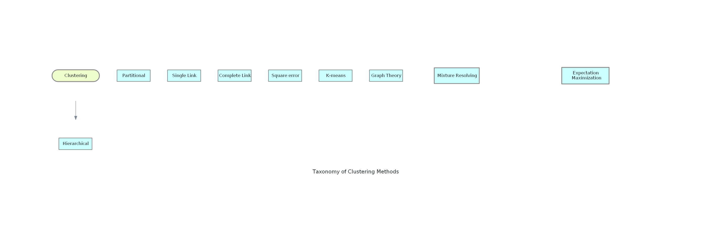

# Introducción al Aprendizaje No Supervisado

Mientras que el [aprendizaje supervisado](../01_SUPERVISED_LEARNING/introduccion.md) requiere
que el usuario ayude a la máquina a aprender **etiquetando datos**, el **aprendizaje no
supervisado** no usa conjuntos de entrenamiento etiquetados. En su lugar, la máquina busca
**patrones menos evidentes** en los datos.

Este tipo de machine learning es muy útil cuando necesitas identificar patrones y usar los
datos para tomar decisiones. Los algoritmos más comunes incluyen **modelos ocultos de Markov**,
**k-means**, **clustering jerárquico** y **modelos de mezcla de gaussianas**.

Retomando el ejemplo del aprendizaje supervisado: supongamos que **no sabes** qué clientes
incumplieron o no el pago de sus préstamos. En ese caso proporcionas a la máquina la
información de los prestatarios, y ella busca patrones entre ellos para agruparlos en varios
*clusters*.

Este tipo de aprendizaje se usa ampliamente para crear modelos predictivos. Sus aplicaciones
habituales incluyen el **clustering**, que agrupa objetos según propiedades específicas, y la
**asociación**, que identifica las reglas existentes entre los grupos. Algunos casos de uso:

- Crear **grupos de clientes** basados en su comportamiento de compra.
- Agrupar el **inventario** según métricas de ventas o de fabricación.
- Identificar **asociaciones** en los datos de clientes (por ejemplo, quienes compran un cierto
  estilo de bolso podrían interesarse por un cierto estilo de zapato).

Son los ejemplos clásicos que encontrarás al buscar sobre el tema.

## Clusters

Un **cluster** es un conjunto de grupos de instancias de un dataset que se han clasificado
automáticamente según una **medida de distancia** calculada sobre los campos del dataset.

Los clusters pueden manejar campos numéricos, categóricos, de texto y de ítems como entrada:

- **Campos numéricos**: se calcula la distancia euclídea entre los valores numéricos de las
  instancias.
- **Campos categóricos**: una forma común de tratarlos es convertir cada categoría en un campo
  nuevo y asignar 0 o 1 según corresponda.
- **Campos de texto e ítems**: a cada instancia se le asigna un vector de términos y se calcula
  la **similitud del coseno** para determinar la cercanía entre instancias.

Un campo categórico con 20 categorías se convertirá en 20 campos binarios separados. En Big
Data suele usarse una técnica llamada **k-prototypes**, que modifica la función de distancia
para operar como si las categorías se hubieran transformado a valores binarios.

Cada grupo se representa por un **centroide** o centro, calculado usando la media de cada campo
numérico y la moda de cada campo categórico. Para campos de texto e ítems, cada centroide
contiene los términos o ítems que minimizan la distancia coseno promedio entre el centroide y
los puntos de su vecindario.

Para crear un cluster puedes elegir un número arbitrario de grupos y también un subconjunto
arbitrario de campos del dataset como `input_fields`. Las escalas permiten controlar cuánto
influye cada campo en la medida de distancia usada para agrupar las instancias.

## Taxonomía de métodos de clustering

Diagrama generado por el script `docs/diagrams/clustering_types.py`.
Ver `docs/diagrams/README.md` para regenerarlo.

## En esta sección

- [Clustering en Big Data](clustering_en_big_data.md)
- [Detección de anomalías](deteccion_de_anomalias.md)
- [Isolation Forest](isolation_forest.md)
