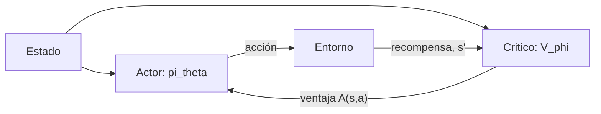

# Deep Reinforcement Learning

El **deep reinforcement learning** sustituye las tablas de valor por **redes neuronales**.
Eso permite atacar espacios de estados enormes o continuos, a cambio de perder las
garantías de convergencia del caso tabular.

## Por qué es inestable

Combinar RL con aproximación de funciones rompe los supuestos del caso tabular por tres
motivos que Sutton y Barto llaman la **tríada mortal**:

1. **Aproximación de funciones** — actualizar un estado modifica los demás.
2. **Bootstrapping** — el objetivo depende de la propia estimación, que va cambiando.
3. **Entrenamiento off-policy** — los datos vienen de una política distinta a la evaluada.

Cuando las tres coinciden, el entrenamiento puede diverger. Casi todo el diseño de los
algoritmos que siguen consiste en mitigar esto.

## DQN (Deep Q-Network)

DQN aproxima $Q(s,a;\theta)$ con una red y minimiza el error TD como si fuera regresión:

$$\mathcal{L}(\theta) = \mathbb{E}\left[ \big( \underbrace{r + \gamma \max_{a'} Q(s',a';\theta^{-})}_{\text{objetivo}} - Q(s,a;\theta) \big)^2 \right]$$

Aporta dos ideas que hicieron viable el enfoque:

**Experience replay.** Las transiciones $(s,a,r,s')$ se guardan en un búfer y se entrena
sobre lotes muestreados al azar. Rompe la correlación temporal de los datos consecutivos
—que viola el supuesto i.i.d. del descenso de gradiente— y permite reutilizar cada
transición muchas veces.

**Red objetivo.** El $\theta^{-}$ del objetivo es una **copia congelada** de la red, que se
sincroniza cada $N$ pasos. Sin ella, el objetivo se mueve a la vez que la predicción y el
entrenamiento oscila.

```python
import torch
import torch.nn as nn
import random
from collections import deque

class RedQ(nn.Module):
    def __init__(self, dim_estado, n_acciones, oculta=128):
        super().__init__()
        self.red = nn.Sequential(
            nn.Linear(dim_estado, oculta), nn.ReLU(),
            nn.Linear(oculta, oculta), nn.ReLU(),
            nn.Linear(oculta, n_acciones),
        )

    def forward(self, x):
        return self.red(x)


class BufferDeRepeticion:
    def __init__(self, capacidad=100_000):
        self.buffer = deque(maxlen=capacidad)

    def guardar(self, transicion):
        self.buffer.append(transicion)

    def muestrear(self, tam_lote):
        lote = random.sample(self.buffer, tam_lote)
        estados, acciones, recompensas, siguientes, terminados = zip(*lote)
        return (torch.tensor(estados, dtype=torch.float32),
                torch.tensor(acciones, dtype=torch.int64),
                torch.tensor(recompensas, dtype=torch.float32),
                torch.tensor(siguientes, dtype=torch.float32),
                torch.tensor(terminados, dtype=torch.float32))

    def __len__(self):
        return len(self.buffer)


def paso_de_entrenamiento(red, red_objetivo, buffer, optimizador,
                          tam_lote=64, gamma=0.99):
    if len(buffer) < tam_lote:
        return None

    s, a, r, s_sig, fin = buffer.muestrear(tam_lote)

    q = red(s).gather(1, a.unsqueeze(1)).squeeze(1)

    with torch.no_grad():                       # el objetivo no propaga gradiente
        q_sig = red_objetivo(s_sig).max(dim=1).values
        objetivo = r + gamma * q_sig * (1 - fin)

    perdida = nn.functional.smooth_l1_loss(q, objetivo)

    optimizador.zero_grad()
    perdida.backward()
    nn.utils.clip_grad_norm_(red.parameters(), max_norm=10.0)
    optimizador.step()
    return perdida.item()
```

### Variantes de DQN

- **Double DQN** — usa la red en línea para *elegir* la acción y la objetivo para
  *evaluarla*, corrigiendo el sesgo de sobreestimación.
- **Dueling DQN** — separa la red en valor de estado $V(s)$ y ventaja $A(s,a)$, con
  $Q(s,a) = V(s) + A(s,a) - \frac{1}{|A|}\sum_{a'} A(s,a')$.
- **Prioritized replay** — muestrea con más frecuencia las transiciones con error TD alto.
- **Rainbow** — combina seis de estas mejoras; durante años fue el estado del arte en Atari.

DQN solo funciona con **acciones discretas**: necesita el $\max_a$ sobre un conjunto finito.

## Métodos de gradiente de política

En lugar de aprender valores, parametrizan la política $\pi_\theta(a \mid s)$ y suben por
el gradiente del retorno esperado. El **teorema del gradiente de política** da:

$$\nabla_\theta J(\theta) = \mathbb{E}_{\pi_\theta}\left[ \nabla_\theta \log \pi_\theta(a \mid s)\, Q^{\pi}(s,a) \right]$$

La intuición: aumenta la probabilidad de las acciones que salieron bien, redúcela para las
que salieron mal, en proporción a lo bien o mal que salieron.

**REINFORCE** es la versión más simple, usando el retorno $G_t$ como estimador de $Q$. Es
insesgado pero de varianza altísima. Restar una **línea base** $b(s)$ —típicamente
$V(s)$— reduce la varianza sin introducir sesgo, y da lugar a la **ventaja**:

$$A(s,a) = Q(s,a) - V(s)$$

## Actor-Critic

Combina ambos mundos: un **actor** $\pi_\theta$ que elige acciones y un **crítico**
$V_\phi$ que las evalúa. El crítico proporciona la línea base, y el actor aprende con la
ventaja estimada.



### PPO

**Proximal Policy Optimization** es hoy el algoritmo por defecto para la mayoría de casos.
Su idea central es impedir que la política cambie demasiado en una sola actualización,
recortando el ratio de probabilidades $r_t(\theta) = \frac{\pi_\theta(a_t|s_t)}{\pi_{\theta_{old}}(a_t|s_t)}$:

$$L^{CLIP}(\theta) = \mathbb{E}\left[ \min\big( r_t(\theta) \hat{A}_t,\; \text{clip}(r_t(\theta), 1-\epsilon, 1+\epsilon) \hat{A}_t \big) \right]$$

Es estable, funciona con acciones discretas y continuas, y tiene pocos hiperparámetros
críticos. Es el algoritmo que se usa en **RLHF** para alinear
[modelos de lenguaje](../10_LLM/introduccion.md).

### Otros

- **A2C / A3C** — actor-critic con múltiples entornos en paralelo.
- **DDPG / TD3** — off-policy para acciones continuas, con política determinista.
- **SAC** — *soft actor-critic*, añade un término de entropía que premia la exploración.
  Muy eficiente en muestras; el estándar en control continuo.

## Cómo elegir

| Situación | Algoritmo |
|---|---|
| Acciones discretas, hay simulador rápido | DQN / Rainbow |
| Acciones continuas (robótica, control) | SAC, TD3 |
| Necesitas estabilidad y simplicidad | PPO |
| Muestras caras, hay que reutilizarlas | SAC, DQN (off-policy) |
| Ajuste fino de un LLM | PPO, DPO |

## Consejos prácticos

- **Normaliza las observaciones**; las recompensas, escálalas a un rango razonable.
- **Recorta los gradientes** — evita que un lote atípico rompa la red.
- **Fija semillas y promedia varias corridas**: la varianza entre semillas en RL es enorme
  y una sola corrida no demuestra nada.
- **Empieza por un entorno resuelto** (CartPole, Pendulum) para validar tu implementación
  antes de pasar al problema real.
- **Vigila el reward hacking**: si el agente obtiene una recompensa altísima, sospecha de
  la función de recompensa antes de celebrar.

## Herramientas

- [Gymnasium](https://gymnasium.farama.org/) — la API estándar de entornos.
- [Stable-Baselines3](https://stable-baselines3.readthedocs.io/) — implementaciones
  probadas de PPO, SAC, DQN y otros. Es el punto de partida recomendado.
- [CleanRL](https://docs.cleanrl.dev/) — implementaciones de un solo archivo, ideales para
  leer y entender.

## Referencias

- Mnih, V. et al. *Human-level control through deep reinforcement learning*, Nature (2015).
- Hasselt, H. van et al. *Deep Reinforcement Learning with Double Q-learning*, AAAI (2016).
- Schulman, J. et al. *Proximal Policy Optimization Algorithms* (2017).
- Haarnoja, T. et al. *Soft Actor-Critic* (2018).
- Hessel, M. et al. *Rainbow: Combining Improvements in Deep RL*, AAAI (2018).
