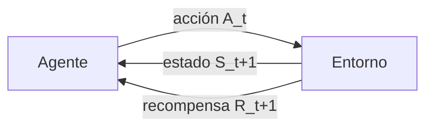
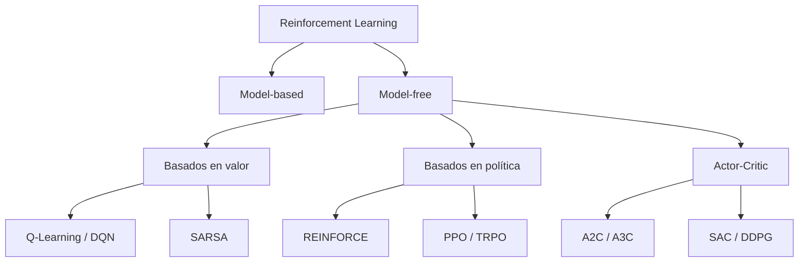

# Introducción al Aprendizaje por Refuerzo

El **aprendizaje por refuerzo** (*reinforcement learning*, RL) es el tercer gran paradigma
del machine learning, junto con el [aprendizaje supervisado](../01_SUPERVISED_LEARNING/introduccion.md)
y el [no supervisado](../02_UNSUPERVISED_LEARNING/introduccion.md).

La diferencia es de fondo. En aprendizaje supervisado alguien te da la respuesta correcta
para cada ejemplo; en no supervisado no hay respuesta y buscas estructura. En RL **no hay
respuesta correcta, sino consecuencias**: un agente toma acciones en un entorno, el entorno
le devuelve una recompensa numérica, y el agente tiene que descubrir por sí mismo qué
secuencia de acciones maximiza la recompensa acumulada a largo plazo.

| Paradigma | Señal de aprendizaje | Pregunta que responde |
|---|---|---|
| Supervisado | Etiqueta correcta por ejemplo | ¿Qué es esto? |
| No supervisado | Ninguna | ¿Qué estructura hay aquí? |
| Por refuerzo | Recompensa escalar diferida | ¿Qué debo hacer ahora? |

## El bucle agente–entorno

Todo problema de RL se formula igual: en cada paso de tiempo $t$ el agente observa un
estado $S_t$, elige una acción $A_t$, y el entorno responde con una recompensa $R_{t+1}$
y un nuevo estado $S_{t+1}$.



Esa interacción genera una **trayectoria**:

$$S_0, A_0, R_1, S_1, A_1, R_2, S_2, \ldots$$

## Elementos de un sistema de RL

- **Política** ($\pi$). El comportamiento del agente: un mapeo de estados a acciones.
  Puede ser determinista, $a = \pi(s)$, o estocástica, $\pi(a \mid s)$. Es lo que
  realmente se aprende.
- **Señal de recompensa** ($R$). Define el objetivo. Es el único canal por el que le
  decimos al agente qué queremos. Diseñarla mal es la fuente más común de fracaso.
- **Función de valor** ($V$ o $Q$). Estima la recompensa **acumulada futura** esperada.
  La recompensa dice qué es bueno *ahora*; el valor dice qué es bueno *a largo plazo*.
- **Modelo del entorno** (opcional). Predice cómo responderá el entorno. Distingue los
  métodos *model-based* de los *model-free*.

## El retorno y el factor de descuento

El agente no maximiza la recompensa inmediata, sino el **retorno** $G_t$: la suma
descontada de recompensas futuras.

$$G_t = R_{t+1} + \gamma R_{t+2} + \gamma^2 R_{t+3} + \cdots = \sum_{k=0}^{\infty} \gamma^k R_{t+k+1}$$

El **factor de descuento** $\gamma \in [0, 1]$ controla cuánto pesa el futuro:

- $\gamma \to 0$: agente miope, solo le importa la recompensa inmediata.
- $\gamma \to 1$: agente previsor, valora casi igual el futuro lejano.

Además de expresar una preferencia temporal, $\gamma < 1$ garantiza que la serie converja
en tareas continuas que nunca terminan.

## El dilema exploración–explotación

Es el problema central y no tiene análogo en aprendizaje supervisado.

- **Explotar**: elegir la acción que, según lo que sabes ahora, da más recompensa.
- **Explorar**: probar algo distinto para descubrir si hay algo mejor.

Explotar siempre te deja atrapado en un óptimo local; explorar siempre nunca aprovecha lo
aprendido. La estrategia más simple es **$\varepsilon$-greedy**: con probabilidad
$\varepsilon$ actúa al azar, con probabilidad $1-\varepsilon$ toma la mejor acción
conocida, y se reduce $\varepsilon$ con el tiempo.

```python
import numpy as np

def epsilon_greedy(valores_q, epsilon):
    """Elige una accion balanceando exploracion y explotacion."""
    if np.random.random() < epsilon:
        return np.random.randint(len(valores_q))   # explorar
    return int(np.argmax(valores_q))               # explotar
```

Alternativas más sofisticadas: **UCB** (*upper confidence bound*), que favorece acciones
poco probadas, y **muestreo de Thompson**, que mantiene una distribución sobre el valor de
cada acción.

## Taxonomía de métodos



- **Basados en valor**: aprenden $Q(s,a)$ y derivan la política tomando el máximo.
  Ver [Q-Learning](q_learning.md).
- **Basados en política**: parametrizan $\pi_\theta$ directamente y ascienden por el
  gradiente. Manejan naturalmente acciones continuas.
- **Actor-Critic**: combinan ambos. Un *actor* propone acciones, un *crítico* las evalúa.

## On-policy vs. off-policy

- **On-policy**: aprende sobre la política que está ejecutando (SARSA, PPO).
- **Off-policy**: aprende sobre una política distinta de la que genera los datos
  (Q-Learning, DQN). Permite reutilizar experiencia pasada, lo que da mucha mejor
  eficiencia de muestras.

## Cuándo usar RL

RL encaja cuando se cumplen varias de estas condiciones:

- Las decisiones son **secuenciales** y afectan a estados futuros.
- No existen etiquetas de "acción correcta", pero sí se puede medir el resultado.
- Hay un simulador barato, o el coste de equivocarse en producción es tolerable.

Aplicaciones reales: recomendadores que optimizan engagement a largo plazo (relacionado
con los [sistemas de recomendación](../09_SYSTEMS/REC_SYSTEM/introduccion_recomendadores_con_kg.md)),
gestión de inventario, *trading*, control de robots, refrigeración de centros de datos,
y **RLHF** para alinear [modelos de lenguaje](../10_LLM/introduccion.md).

## Limitaciones

Conviene tenerlas presentes antes de elegir RL:

- **Eficiencia de muestras**: suele necesitar millones de interacciones. Sin simulador, a
  menudo es inviable.
- **Diseño de la recompensa**: el agente optimiza *literalmente* lo que escribes, no lo
  que quieres. El *reward hacking* es la regla, no la excepción.
- **Inestabilidad**: combinar aproximación de funciones, *bootstrapping* y entrenamiento
  off-policy es la llamada **tríada mortal**, que puede hacer diverger el entrenamiento.
- **Reproducibilidad**: los resultados son muy sensibles a semillas e hiperparámetros.

## Contenido de esta sección

1. [Procesos de decisión de Markov](procesos_de_decision_de_markov.md) — el marco formal.
2. [Q-Learning](q_learning.md) — aprendizaje por diferencia temporal.
3. [Deep Reinforcement Learning](deep_reinforcement_learning.md) — RL con redes neuronales.

## Referencias

- Sutton, R. y Barto, A. *Reinforcement Learning: An Introduction*, 2ª ed. (2018).
  Disponible gratis en [incompleteideas.net](http://incompleteideas.net/book/the-book.html).
- Mnih, V. et al. *Human-level control through deep reinforcement learning*, Nature (2015).
- Schulman, J. et al. *Proximal Policy Optimization Algorithms* (2017).
