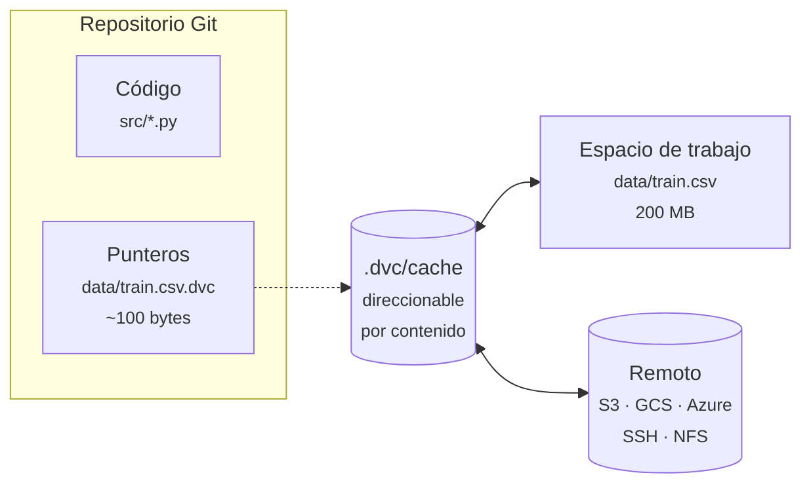

# DVC: Control de Versiones de Datos

**DVC** (*Data Version Control*) lleva el flujo de trabajo de Git a los datos y a los modelos:
archivos demasiado grandes para un repositorio, pero que necesitan versionarse igual que el
código.

Es de código abierto, desarrollado por Iterative, con licencia Apache 2.0.

## El problema

Git funciona mal con archivos binarios grandes. Guarda una copia completa por versión, así que un
CSV de 2 GB modificado diez veces son 20 GB de historial que todo el mundo se descarga al clonar.

Las soluciones improvisadas son peores:

- `datos_final.csv`, `datos_final_v2.csv`, `datos_final_BUENO.csv`
- Una carpeta compartida en la nube sin relación con el commit del código
- Un `README` que dice qué versión usar, desactualizado desde marzo

El resultado es siempre el mismo: **no puedes reproducir un resultado de hace tres meses** porque
no sabes con qué datos exactos se generó.

## La idea

DVC separa las dos cosas que Git mezcla:

- **Git versiona un puntero**: un archivo de texto diminuto con el hash del contenido.
- **DVC almacena el contenido**: en una caché local y, opcionalmente, en un almacenamiento remoto.



Como el commit de Git contiene el hash del dato, **cada commit apunta a una versión exacta del
dataset**. Volver atrás es un `git checkout` seguido de un `dvc checkout`.

## Empezar

```bash
pip install dvc                 # dvc[s3], dvc[gs], dvc[azure]… según el remoto
```

```bash
git init
dvc init
git commit -m "Inicializa DVC"
```

`dvc init` crea `.dvc/config`, `.dvc/.gitignore` y un `.dvcignore`.

### Versionar un dataset

```bash
dvc add data/train.csv
git add data/train.csv.dvc data/.gitignore
git commit -m "Añade el dataset de entrenamiento"
```

Dos cosas ocurren. Se genera el puntero:

```yaml
# data/train.csv.dvc
outs:
- md5: 040ab54880e4cf0372f3f74590ec496c
  size: 43297
  hash: md5
  path: train.csv
```

Y el archivo real se añade a `data/.gitignore`, para que Git no intente rastrearlo. **El puntero
va al repositorio; el dato, no.**

El contenido se guarda en una caché direccionable por contenido, con los dos primeros caracteres
del hash como directorio:

```text
.dvc/cache/files/md5/04/0ab54880e4cf0372f3f74590ec496c
```

Que la caché sea direccionable por contenido tiene una consecuencia útil: **dos datasets
idénticos se almacenan una sola vez**, aunque estén en ramas o proyectos distintos.

### Almacenamiento remoto

La caché es local. Para compartir con el equipo hace falta un remoto:

```bash
dvc remote add -d almacen s3://mi-bucket/dvcstore
git add .dvc/config && git commit -m "Configura el remoto"

dvc push          # sube los datos que faltan
dvc pull          # los descarga
```

DVC soporta S3, Google Cloud Storage, Azure, SSH, HDFS, WebDAV y un simple directorio local o
NFS. La estructura en el remoto es la misma que en la caché.

El flujo para quien clona el repositorio es:

```bash
git clone https://github.com/org/proyecto
cd proyecto
dvc pull                 # trae los datos correspondientes a este commit
```

## Cambiar de versión

Aquí es donde se ve el valor. Modificamos el dataset y lo versionamos:

```bash
# data/train.csv pasa de 2000 a 5000 filas
dvc add data/train.csv
git commit -am "train.csv v2 (5000 filas)"
```

El puntero ahora tiene otro hash:

```yaml
- md5: f0c69a9b5c1843c0c92db1bc1696b9ec
```

Y volver a la versión anterior son dos comandos:

```bash
git checkout HEAD~1 -- data/train.csv.dvc
dvc checkout
```

Comprobado sobre el repositorio de ejemplo:

```text
filas tras el checkout a v1:  2000
filas al volver a v2:         5000
```

`git checkout` mueve el puntero; `dvc checkout` materializa el contenido correspondiente desde la
caché. Si el dato no está en la caché local, `dvc pull` lo trae del remoto.

## Qué acaba en Git y qué no

En el repositorio de ejemplo, tras montar el pipeline completo:

| En Git | En disco pero fuera de Git |
|---|---|
| `data/train.csv.dvc` | `data/train.csv` |
| `data/.gitignore` | `data/prep_train.csv` |
| `dvc.yaml`, `dvc.lock` | `data/prep_test.csv` |
| `.dvc/config`, `.dvcignore` | |
| `src/*.py`, `params.yaml` | |

El repositorio se mantiene ligero —solo texto— mientras que los datos viajan por su propio canal.

## DVC frente a Git LFS

Git LFS resuelve un problema parecido, pero con diferencias que importan en ML:

| | **DVC** | **Git LFS** |
|---|---|---|
| Almacenamiento | Cualquier remoto: S3, GCS, SSH, NFS | Un servidor LFS |
| Deduplicación | Por contenido, entre proyectos | Por objeto |
| Descarga | Selectiva: solo lo que necesitas | Suele traerlo todo |
| Pipelines | Sí, con reproducción incremental | No |
| Experimentos y métricas | Sí | No |

DVC es un gestor de flujo de trabajo de ML que además versiona datos; LFS solo hace lo segundo.

## Ver también

- [Pipelines y experimentos con DVC](dvc_pipelines_y_experimentos.md)
- [Kedro](kedro.md) — estructura del proyecto; se complementan bien.
- [OpenLineage](openlineage.md) — DVC dice **qué versión** se usó; OpenLineage, **qué proceso** la
  leyó y la transformó.
- [Feature stores](feature_stores.md)

## Referencias

- [dvc.org](https://dvc.org/) · [documentación](https://dvc.org/doc)
- [iterative/dvc](https://github.com/iterative/dvc)
