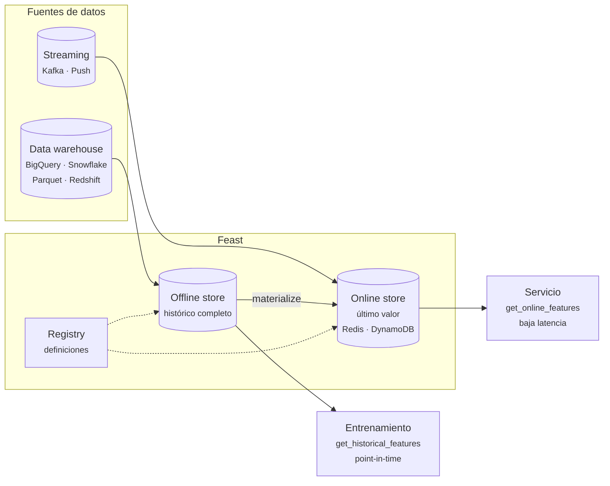

# Feast

**Feast** (*Feature Store*) es la implementación de código abierto más extendida del concepto
descrito en [Feature stores](feature_stores.md). Es un proyecto de la Linux Foundation
(LF AI & Data), con licencia Apache 2.0.

Conviene entender qué **no** es antes de nada: Feast **no calcula features**. No transforma datos
ni ejecuta agregaciones. Es una capa de **acceso y servicio** que se coloca sobre datos que ya
existen, y que resuelve dos problemas concretos: la corrección temporal al construir conjuntos de
entrenamiento, y la consistencia entre entrenamiento y producción.

## Los dos problemas que resuelve

### 1. Fuga de datos temporal

Es el error más caro y más silencioso del machine learning aplicado.

Supongamos que entrenamos un modelo de impago. Tenemos una tabla con el `score_riesgo` de cada
cliente, que **cambia con el tiempo**, y un histórico de impagos. Si al construir el conjunto de
entrenamiento hacemos un `JOIN` normal por `cliente_id`, cada fila recibe el **valor actual** del
score.

El problema: para predecir un impago ocurrido el 5 de enero estaríamos usando un score calculado
el 21 de enero, **posterior al hecho que queremos predecir**. El modelo aprende de información
del futuro, obtiene métricas excelentes en validación, y fracasa en producción.

Feast resuelve esto con un **join *point-in-time***: cada fila recibe el valor de la feature tal
como era **en su propia marca temporal**.

### 2. Inconsistencia entre entrenamiento y servicio

El otro clásico: las features de entrenamiento se calculan con un script de pandas, y las de
producción con una consulta SQL escrita por otra persona seis meses después. Divergen en algún
detalle —el manejo de nulos, la ventana de agregación, el redondeo— y el modelo rinde peor de lo
esperado sin que nadie sepa por qué.

Es el *training-serving skew* que se menciona en [feature stores](feature_stores.md). Feast lo
ataca haciendo que **ambos caminos lean de la misma definición**.

## Arquitectura



La idea central es la **doble ruta**. Los mismos datos, definidos una sola vez, se sirven de dos
formas:

| | **Offline store** | **Online store** |
|---|---|---|
| Contiene | Todo el histórico | Solo el último valor por entidad |
| Se usa para | Construir conjuntos de entrenamiento | Servir predicciones |
| Latencia | Minutos | Milisegundos |
| Tecnología | Parquet, BigQuery, Snowflake | Redis, DynamoDB, SQLite, Postgres |
| Operación | `get_historical_features` | `get_online_features` |

## Conceptos

| Concepto | Qué es |
|---|---|
| **Entity** | La clave de negocio por la que se buscan features: `cliente_id`, `driver_id` |
| **Data source** | De dónde salen los datos: un Parquet, una tabla de BigQuery, un tópico de Kafka |
| **Feature View** | Un grupo de features de una fuente, asociado a entidades, con un **TTL** |
| **Field** | Una feature concreta, con su tipo |
| **Feature Service** | La agrupación de features que consume **un modelo concreto** |
| **Registry** | El catálogo de todas estas definiciones |

Dos matices que importan:

- El **TTL** define cuánto tiempo se considera válida una feature. Si el valor más reciente es
  anterior al TTL respecto al momento consultado, Feast devuelve nulo en vez de un dato rancio.
- El **Feature Service** es la unidad de versionado frente a los modelos. Un modelo pide
  `scoring_v1`, no una lista suelta de features, lo que permite evolucionar las features sin
  romper los modelos desplegados.

## Definir un repositorio

```bash
pip install feast
feast init demo            # genera un proyecto de ejemplo
```

La configuración vive en `feature_store.yaml`:

```yaml
project: riesgo
registry: data/registry.db
provider: local
online_store:
    type: sqlite
    path: data/online_store.db
entity_key_serialization_version: 3
```

`provider: local` usa Parquet como offline store y SQLite como online store. En producción se
cambia a `gcp`, `aws` o una configuración explícita con BigQuery y Redis; **el código Python no
cambia**.

Las definiciones son Python declarativo:

```python
from datetime import timedelta

from feast import Entity, FeatureService, FeatureView, Field, FileSource, Project
from feast.types import Float32

project = Project(name="riesgo", description="Features de riesgo crediticio")

cliente = Entity(name="cliente", join_keys=["cliente_id"])

fuente_stats = FileSource(
    name="clientes_stats_source",
    path="data/clientes_stats.parquet",
    timestamp_field="event_timestamp",     # imprescindible para el join point-in-time
)

clientes_stats_fv = FeatureView(
    name="clientes_stats",
    entities=[cliente],
    ttl=timedelta(days=90),
    schema=[
        Field(name="score_riesgo", dtype=Float32),
        Field(name="ingresos_medios", dtype=Float32),
    ],
    source=fuente_stats,
    online=True,
)

servicio_scoring = FeatureService(name="scoring_v1", features=[clientes_stats_fv])
```

El `timestamp_field` es lo que hace posible todo lo demás: sin él Feast no puede saber cuándo era
válido cada valor.

```bash
feast apply
```

```text
Created project riesgo
Created entity cliente
Created feature view clientes_stats
Created feature service scoring_v1
Created sqlite table riesgo_clientes_stats
```

Y el registro queda consultable:

```bash
feast feature-services list
```

```text
NAME        FEATURES
scoring_v1  clientes_stats:score_riesgo, clientes_stats:ingresos_medios
```

## Ver también

- [Feast en la práctica](feast_en_practica.md) — entrenamiento, servicio y despliegue.
- [Feature stores](feature_stores.md) — el concepto general.
- [Descubrimiento de datos](descubrimiento_de_datos.md)
- [DVC](dvc.md) — versionar los datos de los que salen las features.

## Referencias

- [feast.dev](https://feast.dev/) · [documentación](https://docs.feast.dev/)
- [feast-dev/feast](https://github.com/feast-dev/feast)
