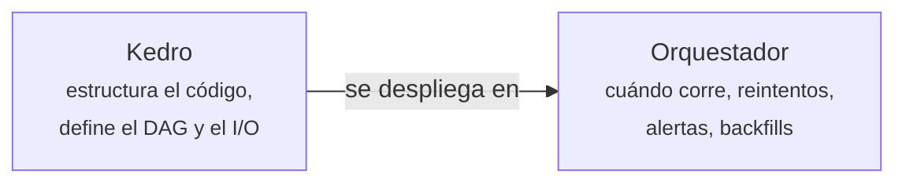

# Kedro en Producción

Los conceptos básicos están en [Kedro](kedro.md). Esta página cubre lo que hace falta cuando el
pipeline deja de correr solo en tu portátil: entornos de configuración, ejecución selectiva,
runners y despliegue.

## Entornos de configuración

El mismo pipeline debe correr con datos de juguete en desarrollo y con el conjunto completo en
producción. Kedro lo resuelve con **entornos**: directorios bajo `conf/` que se superponen sobre
`conf/base`.

```text
conf/
├── base/            # valores comunes, versionados
│   ├── catalog.yml
│   └── parameters.yml
├── local/           # tu máquina — en .gitignore
│   └── credentials.yml
└── produccion/      # sobrescribe lo que necesite
    ├── catalog.yml
    └── parameters.yml
```

```bash
kedro run                       # usa base + local (el entorno por defecto)
kedro run --env=produccion      # usa base + produccion
```

Solo hay que declarar **lo que cambia**: el entorno se fusiona sobre `base`. Comprobado con un
entorno `produccion` que únicamente altera `test_size` de 0.25 a 0.1: el tamaño del conjunto de
prueba pasó de 125 a 50 registros sin tocar el código ni el catálogo base.

!!! danger "`conf/local` está en `.gitignore` por una razón"
    Es donde van credenciales y rutas de tu máquina. Si pones una contraseña en `conf/base`, la
    estás commiteando. La plantilla ya deja `credentials.yml` en `local`; respétalo.

## Ejecución selectiva

Durante el desarrollo rara vez interesa correr el pipeline entero.

```bash
kedro run --pipeline=credito              # un pipeline registrado concreto
kedro run --nodes=construir_features      # solo esos nodos
kedro run --to-nodes=construir_features   # todo hasta ese nodo, inclusive
kedro run --from-nodes=entrenar_modelo    # desde ese nodo en adelante
kedro run --to-outputs=features           # hasta producir ese dataset
kedro run --tags=entrenamiento            # solo los nodos con esa etiqueta
```

`--to-nodes=construir_features` sobre el pipeline de ejemplo ejecuta exactamente dos nodos,
`limpiar_datos` y `construir_features`, y se detiene.

### Sobrescribir parámetros

```bash
kedro run --params=modelo.test_size=0.4
```

Verificado: cambia `n_test` de 125 a 200 sin tocar ningún archivo. Va bien para barridos rápidos;
para búsquedas serias de hiperparámetros, [Ray Tune](ray_bibliotecas_ia.md#ray-tune); para
registrar cada prueba con sus métricas, [experimentos de DVC](dvc_pipelines_y_experimentos.md#experimentos).

### Ejecución incremental

```bash
kedro run --only-missing-outputs
```

Salta los nodos cuyas salidas **ya existen y están persistidas**. Con todos los artefactos
presentes ejecuta **cero nodos**.

!!! warning "No propaga hacia abajo: no es `make`"
    Al borrar `features.parquet` y relanzar con `--only-missing-outputs`, se reejecutó
    **únicamente** `construir_features`. Los nodos posteriores —`entrenar_modelo` y
    `evaluar_modelo`— **no** se volvieron a ejecutar, porque `metricas.json` seguía existiendo.

    El resultado es que `metricas.json` quedó calculado a partir de un `features.parquet`
    anterior. La opción mira si el artefacto **existe**, no si está **actualizado**. Úsala para
    reanudar una ejecución interrumpida, nunca como sistema de compilación incremental.

## Runners

```bash
kedro run --runner=SequentialRunner    # por defecto
kedro run --runner=ThreadRunner        # hilos: útil con I/O y con Spark
kedro run --runner=ParallelRunner      # multiproceso
kedro run --async                      # carga y guarda datasets en hilos aparte
```

`ParallelRunner` usa `multiprocessing`, así que todo lo que cruce entre nodos debe ser
serializable, y los `MemoryDataset` no se comparten entre procesos. `ThreadRunner` es la opción
adecuada cuando el trabajo pesado ocurre fuera de Python —consultas a
[Spark](../00_DATA/spark/pyspark.md) o llamadas a red—, porque ahí el GIL no estorba.

Para paralelismo real sobre un clúster, la vía no es el runner: es delegar el cómputo dentro de
los nodos a [Spark](../00_DATA/spark/spark.md) o [Ray](ray.md).

## Visualización

```bash
pip install kedro-viz
kedro viz
```

Levanta una interfaz web con el DAG completo: nodos, datasets, tipos y parámetros, navegable y
filtrable. Es la forma más rápida de explicarle el pipeline a alguien que no lo escribió, y de
detectar dependencias que no esperabas.

## Hooks

Los **hooks** son puntos de extensión que se ejecutan en momentos concretos del ciclo de vida,
sin tocar los nodos:

```python
# src/demo/hooks.py
import logging

from kedro.framework.hooks import hook_impl

logger = logging.getLogger(__name__)     # logger de modulo, no el root


class HooksDeMetricas:
    @hook_impl
    def before_node_run(self, node, inputs):
        logger.info("Empieza %s", node.name)

    @hook_impl
    def after_node_run(self, node, outputs):
        logger.info("Termina %s", node.name)
```

Usa `logging.getLogger(__name__)`, no `logging.info()` directamente: la configuración de logging
de Kedro filtra el logger raíz y no verías nada.

```python
# src/demo/settings.py
from demo.hooks import HooksDeMetricas

HOOKS = (HooksDeMetricas(),)
```

Es el mecanismo estándar para integrar **[MLflow](mlflow_en_practica.md#integracion-con-kedro)**,
enviar métricas a un sistema de monitoreo,
validar datos con Great Expectations, medir tiempos por nodo o
[emitir linaje con OpenLineage](openlineage_en_practica.md#con-kedro). Los hooks se ejecutan en
orden LIFO.

## Despliegue a orquestadores

Kedro **no programa nada**. En producción se despliega sobre un orquestador, y hay plugins que
traducen el pipeline al formato de cada uno:

| Destino | Plugin | Qué genera |
|---|---|---|
| Airflow | `kedro-airflow` | Un DAG de Airflow con una tarea por nodo |
| Docker | `kedro-docker` | Una imagen con el proyecto empaquetado |
| Databricks | `kedro-databricks` | Un job de Databricks |
| Argo, Prefect, Kubeflow, Vertex AI, SageMaker | plugins de la comunidad | Manifiestos equivalentes |

```bash
pip install kedro-airflow
kedro airflow create
```

La división de responsabilidades queda así:



Un error frecuente es elegir **entre** Kedro y Airflow. Resuelven problemas distintos y se usan
juntos: Kedro te da un proyecto testeable y reproducible; Airflow lo ejecuta cada noche a las 3 y
avisa si falla.

## Testear los nodos

Que las funciones de los nodos no importen Kedro es lo que hace esto trivial:

```python
# tests/test_nodes.py
import pandas as pd

from demo.pipelines.credito.nodes import limpiar


def test_limpiar_imputa_la_mediana():
    entrada = pd.DataFrame({"ingresos": [10.0, None, 30.0]})
    salida = limpiar(entrada)
    assert salida["ingresos"].isna().sum() == 0
    assert salida.loc[1, "ingresos"] == 20.0
```

No hace falta catálogo, ni sesión, ni configuración. Es una función y un `DataFrame`.

## Cuándo usar Kedro

Compensa cuando:

- El proyecto lo tocan **varias personas**, o alguien tendrá que retomarlo dentro de seis meses.
- El pipeline tiene suficientes pasos como para que el orden importe.
- Hay que correr **lo mismo en entornos distintos** con configuración diferente.

No compensa para un análisis exploratorio de un solo uso, ni para un script de veinte líneas: la
estructura de un proyecto Kedro es sobrecarga si no hay nada que mantener.

## Ver también

- [Kedro](kedro.md) — nodes, pipelines y catálogo.
- [Ray](ray.md) — para el cómputo distribuido dentro de los nodos.
- [ONNX](onnx.md) — para empaquetar el modelo que sale del pipeline.
- [Feature stores](feature_stores.md)

## Referencias

- [Documentación de Kedro](https://docs.kedro.org/)
- [Kedro-Viz](https://github.com/kedro-org/kedro-viz)
- [kedro-airflow](https://github.com/kedro-org/kedro-plugins/tree/main/kedro-airflow)
