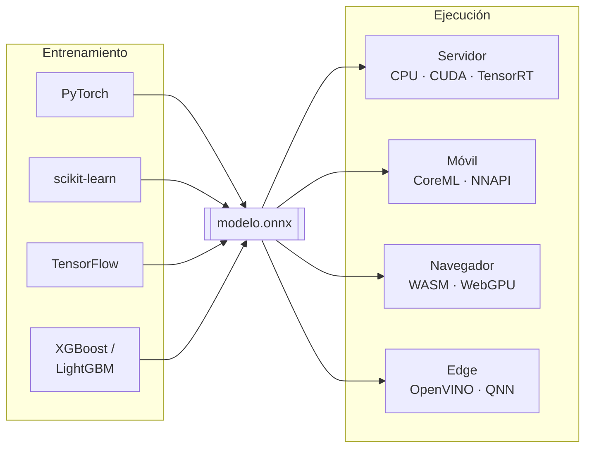

# ONNX: Formato Abierto para Modelos de ML

**ONNX** (*Open Neural Network Exchange*) es un formato abierto para representar modelos de
machine learning. Su propósito es desacoplar **dónde se entrena** un modelo de **dónde se
ejecuta**.

El problema que resuelve es concreto. Entrenas en PyTorch sobre GPU, pero tienes que servir en
un backend C++, en un móvil, o en el navegador. Sin un formato común, cada destino obliga a
reimplementar el modelo y a arrastrar el framework de entrenamiento entero como dependencia de
producción. Con ONNX exportas una vez y ejecutas en cualquier runtime compatible.

Nació en 2017 impulsado por Microsoft y Facebook, y hoy es un proyecto de la **Linux
Foundation** (LF AI & Data).



## Qué hay dentro de un archivo `.onnx`

Un archivo ONNX es un **Protocol Buffer** serializado. No es código: es un **grafo de cómputo
declarativo**, un DAG donde los nodos son operaciones y las aristas son tensores.

Su estructura jerárquica:

| Nivel | Contiene |
|---|---|
| **Model** | Metadatos, versión de IR, y los *opset* que importa |
| **Graph** | El DAG en sí: nodos, entradas, salidas, inicializadores |
| **Node** | Una operación: su tipo (`Gemm`, `Relu`, `Conv`), entradas, salidas y atributos |
| **Initializer** | Los **pesos** del modelo, como tensores constantes |
| **ValueInfo** | Nombres, tipos y formas de los tensores intermedios |

Dos números de versión que conviene no confundir:

- **IR version** — la versión del formato del contenedor. Avanza muy despacio.
- **Opset version** — la versión del **conjunto de operadores**. Es la que importa en la
  práctica: determina qué operaciones puedes usar y con qué semántica.

Un modelo declara qué opset importa, y el runtime debe soportarlo. Exportar con un opset más
alto del que soporta tu runtime de destino es la causa número uno de fallos al desplegar.

## Operadores y dominios

Los operadores viven en **dominios**. Los relevantes son:

| Dominio | Contenido | Nº de operadores |
|---|---|---|
| `ai.onnx` (dominio por defecto) | Operaciones de redes neuronales: `Conv`, `Gemm`, `Relu`, `MatMul`, `LSTM`, `Attention`… | ~202 |
| `ai.onnx.ml` | Machine learning clásico: `TreeEnsemble`, `LinearClassifier`, `Scaler`, `LabelEncoder`… | ~19 |
| `ai.onnx.preview.training` | Operadores de entrenamiento, aún experimentales | — |

El dominio `ai.onnx.ml` es la razón por la que ONNX **no es solo para deep learning**: un Random
Forest de scikit-learn o un modelo XGBoost también se exportan y se sirven igual.

El conjunto de operadores es deliberadamente **pequeño y de bajo nivel**. Una capa
`nn.Linear` de PyTorch no existe como tal en ONNX: se traduce a un `Gemm` (*general matrix
multiply*) con sus pesos como inicializadores. Esa reducción es lo que permite que tantos
runtimes distintos lo implementen.

## Exportar desde PyTorch

Desde PyTorch 2.x el exportador recomendado es el basado en **TorchDynamo**, que traza el modelo
con `torch.export` en vez de con TorchScript. En versiones recientes `dynamo=True` ya es el
**valor por defecto** de `torch.onnx.export`, y la antigua función `torch.onnx.dynamo_export` fue
eliminada.

Requiere el paquete `onnxscript`, que no viene con PyTorch:

```bash
pip install onnx onnxruntime onnxscript
```

```python
import torch
import torch.nn as nn

class Clasificador(nn.Module):
    def __init__(self, n_entrada=10, n_oculta=32, n_clases=3):
        super().__init__()
        self.red = nn.Sequential(
            nn.Linear(n_entrada, n_oculta), nn.ReLU(),
            nn.Linear(n_oculta, n_clases),
        )

    def forward(self, x):
        return self.red(x)


modelo = Clasificador().eval()          # eval() importa: fija dropout y batchnorm
ejemplo = torch.randn(1, 10)            # entrada de ejemplo para trazar el grafo

lote = torch.export.Dim("lote")         # eje de lote dinamico

torch.onnx.export(
    modelo,
    (ejemplo,),
    "modelo.onnx",
    input_names=["entrada"],
    output_names=["logits"],
    dynamic_shapes={"x": {0: lote}},    # la clave es el nombre del argumento de forward()
    opset_version=18,
    dynamo=True,
)
```

Cuatro detalles que suelen morder:

- **`model.eval()` antes de exportar.** Si no, se congela el comportamiento de entrenamiento:
  dropout activo y batchnorm usando estadísticas del lote.
- **La entrada de ejemplo solo sirve para trazar.** Sus valores dan igual; su **forma** no,
  porque los ejes que no declares dinámicos quedan fijados a ese tamaño.
- **`dynamic_shapes` usa los nombres de los argumentos de `forward()`**, no los de
  `input_names`. En el ejemplo la clave es `"x"` aunque la entrada se llame `"entrada"` en el
  grafo. Es una fuente clásica de confusión. (El exportador antiguo usaba `dynamic_axes`, que
  sí toma los nombres de `input_names`.)
- **Fija `opset_version` explícitamente** al máximo que soporte tu runtime de destino. El valor
  por defecto sube con cada versión de PyTorch.

### Otros frameworks

| Origen | Herramienta |
|---|---|
| scikit-learn | `skl2onnx` |
| TensorFlow / Keras | `tf2onnx` |
| XGBoost, LightGBM | `onnxmltools` |
| Hugging Face Transformers | `optimum` (`optimum-cli export onnx`) |

## Inspeccionar y validar

Exportar no garantiza que el resultado sea correcto. El flujo mínimo de validación:

```python
import onnx

m = onnx.load("modelo.onnx")

onnx.checker.check_model(m)             # lanza excepcion si el grafo es invalido

print("ir_version:", m.ir_version)
print("opsets:", [(o.domain or "ai.onnx", o.version) for o in m.opset_import])
print("operadores:", sorted({n.op_type for n in m.graph.node}))
print("inicializadores:", len(m.graph.initializer))

entrada = m.graph.input[0]
forma = [d.dim_param or d.dim_value for d in entrada.type.tensor_type.shape.dim]
print("entrada:", entrada.name, forma)
```

Sobre el modelo del ejemplo anterior esto imprime:

```text
ir_version: 10
opsets: [('ai.onnx', 18)]
operadores: ['Gemm', 'Relu']
inicializadores: 4
entrada: entrada ['lote', 10]
```

Las dos capas `nn.Linear` se convirtieron en dos `Gemm`, los 4 inicializadores son los pesos y
sesgos de ambas, y el eje 0 aparece como `'lote'`: **es dinámico**. Si en su lugar vieras un
`1`, el modelo solo aceptaría lotes de tamaño uno.

### Comparar contra el original

La validación que de verdad importa es numérica: ejecutar ambos modelos con la misma entrada y
comparar.

```python
import numpy as np
import onnxruntime as ort

sesion = ort.InferenceSession("modelo.onnx", providers=["CPUExecutionProvider"])

x = np.random.randn(4, 10).astype(np.float32)      # lote 4, distinto del de trazado
salida_onnx = sesion.run(None, {"entrada": x})[0]
salida_torch = modelo(torch.from_numpy(x)).detach().numpy()

print("diferencia máxima:", np.abs(salida_onnx - salida_torch).max())
```

Con este modelo la diferencia máxima es de **6e-08**, ruido de coma flotante. Una discrepancia
mayor que ~1e-4 indica que algo se tradujo mal.

!!! warning "Nunca des por buena una exportación sin comparar salidas"
    Un modelo puede exportarse sin errores, pasar `check_model`, ejecutarse sin excepciones y
    producir números equivocados. Ocurre con operaciones que dependen del modo entrenamiento o
    con formas que quedaron fijadas sin querer.

### Visualizar

[**Netron**](https://netron.app/) abre archivos `.onnx` y muestra el grafo de forma
interactiva, con las formas de cada tensor. Es la herramienta más rápida para entender qué
produjo realmente un exportador.

## Limitaciones

ONNX no es una traducción universal y gratuita:

- **No todo operador tiene equivalente.** Si tu modelo usa una operación exótica o un kernel
  propio, hará falta un operador personalizado, implementado además en cada runtime de destino.
- **El control de flujo se aplana.** Los `if` y bucles de Python que dependen de valores de
  tensores desaparecen en el trazado: se graba **la rama que se ejecutó** con la entrada de
  ejemplo. ONNX tiene operadores `If`, `Loop` y `Scan`, pero conviene revisar que el exportador
  los haya generado si tu modelo los necesita.
- **El preprocesamiento no viaja.** Tokenización, normalización de imágenes o escalado de
  features quedan fuera salvo que los incluyas explícitamente en el grafo. Es una fuente
  frecuente de *training-serving skew*; ver [feature stores](feature_stores.md) y
  [Feast](feast.md).
- **El grafo es estático.** Los modelos con arquitectura verdaderamente dinámica encajan mal.

## Ver también

- [ONNX Runtime](onnx_runtime.md) — cómo ejecutar y optimizar estos modelos.
- [Sistemas de machine learning](sistemas_de_machine_learning.md)
- [Proyectos generales de ML](../09_SYSTEMS/proyectos_generales_de_ml.md)

## Referencias

- [onnx.ai](https://onnx.ai/) — sitio oficial.
- [Especificación de operadores](https://onnx.ai/onnx/operators/) — la referencia de `ai.onnx`
  y `ai.onnx.ml`.
- [Documentación de `torch.onnx`](https://docs.pytorch.org/docs/stable/onnx.html)
- [Netron](https://netron.app/) — visualizador de modelos.
