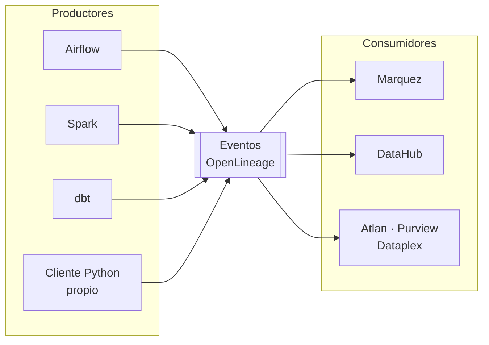

# OpenLineage

**OpenLineage** es un estándar abierto para recolectar metadatos de **linaje de datos**: qué
proceso leyó qué datasets, qué produjo, cuándo y con qué resultado.

No es una herramienta ni un servidor: es una **especificación** —un esquema JSON y una API— que
las herramientas emiten y los catálogos consumen. Es un proyecto de la Linux Foundation
(LF AI & Data), con licencia Apache 2.0.

## El problema

En cualquier plataforma de datos madura acaban apareciendo las mismas preguntas, y nadie sabe
responderlas rápido:

- *"Este dashboard muestra cifras raras. ¿De dónde salen estos números?"*
- *"Vamos a cambiar el esquema de esta tabla. ¿Qué se rompe?"*
- *"El job de las 3 falló. ¿Qué informes de esta mañana están mal?"*
- *"Esta columna tiene datos personales. ¿A dónde ha llegado?"*

La [sección de descubrimiento de datos](descubrimiento_de_datos.md) señalaba el linaje como algo
que hay que registrar. El problema práctico es **quién lo registra**. Documentarlo a mano no
funciona: queda obsoleto en semanas.

La respuesta de OpenLineage es que **el linaje lo emita quien ejecuta el trabajo**, de forma
automática. Airflow sabe qué DAG corrió; Spark sabe qué leyó y qué escribió; dbt sabe qué
modelos construyó. Si todos hablan el mismo idioma, el linaje se construye solo.



Antes de OpenLineage cada catálogo tenía sus propios extractores para cada motor: un problema de
$N \times M$ integraciones. El estándar lo reduce a $N + M$.

## El modelo: RunEvent

La unidad de información es el **RunEvent**. Se emiten varios por ejecución —al menos uno al
empezar y otro al terminar— y describen tres entidades:

| Entidad | Qué es | Identidad |
|---|---|---|
| **Job** | El proceso, definido de forma estable | `namespace` + `name` |
| **Run** | Una ejecución concreta de ese Job | `runId` (UUID) |
| **Dataset** | Un conjunto de datos leído o escrito | `namespace` + `name` |

La distinción **Job / Run** es la clave del modelo: el Job es la definición —`credito.construir_features`—
y persiste en el tiempo; el Run es una instancia concreta con su propio identificador y estado.
Eso permite responder tanto "qué hace este proceso" como "qué pasó el martes a las 3".

Los estados posibles de un Run son `START`, `RUNNING`, `COMPLETE`, `ABORT`, `FAIL` y `OTHER`.

Un detalle de diseño importante: los eventos son **acumulativos**. El evento de `START` declara
lo que se sabe al empezar —normalmente las entradas—, y el de `COMPLETE` añade lo que solo se
conoce al terminar: las salidas, las filas escritas, los errores. El consumidor los fusiona por
`runId`.

## Facets: metadatos extensibles

El núcleo del evento es deliberadamente pequeño. Todo lo demás va en **facets**, bloques de
metadatos que se adjuntan al run, al job o a los datasets. Los facets estándar más útiles:

| Facet | Se adjunta a | Contiene |
|---|---|---|
| `schema` | Dataset | Nombres y tipos de las columnas |
| `columnLineage` | Dataset de salida | **De qué columnas de entrada deriva cada columna de salida** |
| `dataSource` | Dataset | Origen físico del dato |
| `dataQualityMetrics` | Dataset de entrada | Filas, bytes, nulos, valores distintos |
| `outputStatistics` | Dataset de salida | Filas y bytes escritos |
| `sql` | Job | La consulta ejecutada |
| `sourceCodeLocation` | Job | Repositorio, rama y commit |
| `ownership` | Job o Dataset | Quién es responsable |
| `nominalTime` | Run | La ventana temporal lógica, no la de ejecución |
| `errorMessage` | Run | El fallo y su traza |
| `parent` | Run | El run que lo lanzó, para anidar DAG y tareas |

Cualquiera puede definir facets propios: el esquema es abierto, y los consumidores ignoran los
que no entienden. Es lo que permite que el estándar evolucione sin romper implementaciones.

### Linaje a nivel de columna

El facet `columnLineage` es el que distingue a OpenLineage de un simple grafo de tablas. No solo
dice "esta tabla deriva de aquella", sino **qué columna concreta alimenta a qué otra columna, y
con qué transformación**.

Es lo que permite responder con precisión a "¿a dónde ha llegado este campo con datos
personales?", sin revisar el código a mano.

## Convenciones de nombres

Para que el linaje de dos herramientas distintas encaje, ambas deben **nombrar igual el mismo
dataset**. De ahí que la especificación fije convenciones de nombres:

| Origen | `namespace` | `name` |
|---|---|---|
| PostgreSQL | `postgres://host:puerto` | `base.esquema.tabla` |
| S3 | `s3://bucket` | `ruta/al/objeto` |
| Kafka | `kafka://host:puerto` | `topico` |
| HDFS | `hdfs://host:puerto` | `/ruta` |
| Archivo local | `file` | `/ruta/absoluta` |

Si Spark llama a una tabla `postgres://db:5432` + `banca.public.clientes` y Airflow la llama de
otra forma, el catálogo verá **dos datasets distintos** y el grafo quedará roto por la mitad. En
la práctica, esta es la principal fuente de linaje inservible.

## Emitir eventos

Cualquier proceso puede emitir linaje con el cliente de Python:

```bash
pip install openlineage-python
```

```python
import datetime as dt
import uuid

from openlineage.client import OpenLineageClient
from openlineage.client.event_v2 import (Job, OutputDataset, InputDataset,
                                         Run, RunEvent, RunState)
from openlineage.client.facet_v2 import (column_lineage_dataset, nominal_time_run,
                                         schema_dataset, sql_job)
from openlineage.client.transport.file import FileConfig, FileTransport

cliente = OpenLineageClient(
    transport=FileTransport(FileConfig(log_file_path="linaje.jsonl", append=True))
)

PRODUCER = "https://github.com/mi-org/mi-repo"
run = Run(
    runId=str(uuid.uuid4()),
    facets={"nominalTime": nominal_time_run.NominalTimeRunFacet(
        nominalStartTime="2026-08-30T00:00:00Z")},
)
job = Job(
    namespace="ml-notes",
    name="credito.construir_features",
    facets={"sql": sql_job.SQLJobFacet(
        query="SELECT edad, ingresos FROM clientes", dialect="postgres")},
)

entrada = InputDataset(
    namespace="postgres://db:5432",
    name="banca.public.clientes",
    facets={"schema": schema_dataset.SchemaDatasetFacet(fields=[
        schema_dataset.SchemaDatasetFacetFields(name="edad", type="INTEGER"),
        schema_dataset.SchemaDatasetFacetFields(name="ingresos", type="DOUBLE"),
        schema_dataset.SchemaDatasetFacetFields(name="antiguedad", type="INTEGER"),
    ])},
)

salida = OutputDataset(
    namespace="s3://datalake",
    name="features/clientes.parquet",
    facets={"columnLineage": column_lineage_dataset.ColumnLineageDatasetFacet(fields={
        "ingresos_por_anio": column_lineage_dataset.Fields(
            inputFields=[
                column_lineage_dataset.InputField(
                    namespace="postgres://db:5432",
                    name="banca.public.clientes", field="ingresos"),
                column_lineage_dataset.InputField(
                    namespace="postgres://db:5432",
                    name="banca.public.clientes", field="antiguedad"),
            ],
            transformationDescription="ingresos / (antiguedad + 1)",
            transformationType="INDIRECT",
        )})},
)

ahora = lambda: dt.datetime.now(dt.timezone.utc).isoformat()

cliente.emit(RunEvent(eventType=RunState.START, eventTime=ahora(), run=run, job=job,
                      inputs=[entrada], outputs=[], producer=PRODUCER))
cliente.emit(RunEvent(eventType=RunState.COMPLETE, eventTime=ahora(), run=run, job=job,
                      inputs=[entrada], outputs=[salida], producer=PRODUCER))
```

El evento `COMPLETE` que sale de ahí, recortado a lo esencial:

```json
{
  "eventType": "COMPLETE",
  "job": { "namespace": "ml-notes", "name": "credito.construir_features" },
  "run": { "runId": "e08437c6-46cf-434a-9807-d8dca1f07ebb" },
  "inputs": [
    { "namespace": "postgres://db:5432", "name": "banca.public.clientes" }
  ],
  "outputs": [
    {
      "namespace": "s3://datalake",
      "name": "features/clientes.parquet",
      "facets": {
        "columnLineage": {
          "ingresos_por_anio": {
            "inputFields": [
              { "namespace": "postgres://db:5432",
                "name": "banca.public.clientes", "field": "ingresos" },
              { "namespace": "postgres://db:5432",
                "name": "banca.public.clientes", "field": "antiguedad" }
            ],
            "transformationDescription": "ingresos / (antiguedad + 1)",
            "transformationType": "INDIRECT"
          }
        }
      }
    }
  ]
}
```

Nótese que ambos eventos comparten el mismo `runId`: es lo que permite al consumidor unirlos.

### Transportes

Adónde se envían los eventos se configura con el **transporte**, sin tocar el código que los
emite:

| Transporte | Uso |
|---|---|
| `ConsoleTransport` | Depuración: los imprime |
| `FileTransport` | Los escribe a un `.jsonl`; útil para pruebas |
| `HttpTransport` | A un servidor compatible, como Marquez |
| `KafkaTransport` | A un tópico, para arquitecturas orientadas a eventos |
| `CompositeTransport` | A varios destinos a la vez |

## Ver también

- [OpenLineage en la práctica](openlineage_en_practica.md) — integraciones, Marquez y despliegue.
- [Descubrimiento de datos](descubrimiento_de_datos.md)
- [Feature stores](feature_stores.md) — el linaje de features.
- [Kedro](kedro.md) — pipelines cuya estructura conviene registrar.
- [DVC](dvc.md) — complementario: DVC versiona el dato, OpenLineage registra qué proceso lo usó.

## Referencias

- [openlineage.io](https://openlineage.io/) · [documentación](https://openlineage.io/docs/)
- [Convenciones de nombres de datasets](https://openlineage.io/docs/spec/naming)
- [OpenLineage/OpenLineage](https://github.com/OpenLineage/OpenLineage) — la especificación y los
  clientes.
