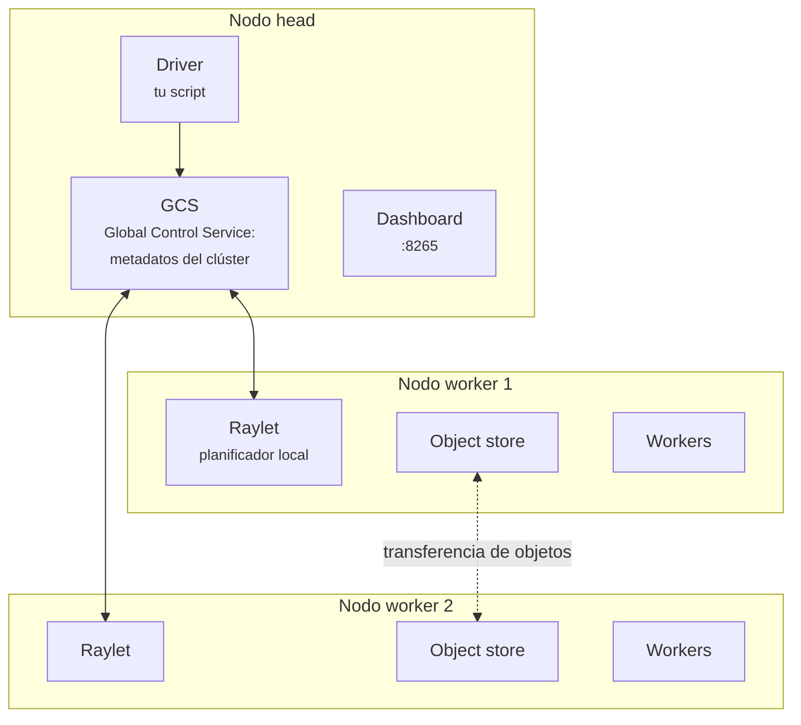

# Ray

**Ray** es un framework de cómputo distribuido para Python. Su propuesta es que **paralelizar
no debería obligarte a reescribir el programa**: se anota una función o una clase con un
decorador y pasa a ejecutarse en el clúster.

Nació en el RISELab de UC Berkeley, hoy lo mantiene Anyscale, y es de código abierto con
licencia Apache 2.0.

Se distingue de [Spark](../00_DATA/spark/spark.md) en el tipo de trabajo que modela bien. Spark
está construido alrededor de un flujo de datos sobre colecciones estructuradas; Ray está
construido alrededor de **funciones y objetos Python arbitrarios**, con tareas heterogéneas,
dinámicas y que pueden lanzar otras tareas.

## Ray Core

Toda la API se apoya en tres primitivas: **tasks**, **actors** y **objects**.

### Tasks: funciones remotas

Un decorador convierte una función normal en una que se ejecuta en el clúster:

```python
import ray
import time

ray.init(num_cpus=4)

@ray.remote
def cuadrado(x):
    time.sleep(0.2)
    return x * x

refs = [cuadrado.remote(i) for i in range(8)]   # no bloquea: devuelve ObjectRef
resultados = ray.get(refs)                      # aqui si se espera
```

Dos cosas ocurren aquí:

- **`.remote()` devuelve inmediatamente** un `ObjectRef`, una promesa del resultado. Las ocho
  tareas se lanzan sin esperar a que ninguna termine.
- **`ray.get()` es la única llamada bloqueante.** Recoge los resultados en el orden de la lista.

Ejecutado con 4 CPUs, las 8 tareas de 0.2 s tardaron **0.74 s** en total, frente a los 1.6 s
que costarían en secuencia.

### Actors: clases remotas

Cuando el trabajo necesita **estado** —un modelo cargado en memoria, un contador, una conexión—
el decorador se aplica a una clase. Cada instancia es un proceso propio que persiste entre
llamadas.

```python
@ray.remote
class Contador:
    def __init__(self):
        self.n = 0

    def incrementar(self, k=1):
        self.n += k
        return self.n

    def valor(self):
        return self.n


c = Contador.remote()
ray.get([c.incrementar.remote() for _ in range(5)])
print(ray.get(c.valor.remote()))        # 5
```

La diferencia con las tasks es fundamental: **una task no recuerda nada entre invocaciones; un
actor sí.** Los métodos de un mismo actor se ejecutan en serie, lo que evita condiciones de
carrera sobre su estado interno.

El caso de uso canónico en ML es cargar un modelo pesado una sola vez y reutilizarlo, en lugar de
deserializarlo en cada tarea.

### Objects: el almacén compartido

Los resultados y los datos grandes viven en un **object store** distribuido, uno por nodo. Para
meter algo explícitamente se usa `ray.put()`:

```python
import numpy as np

grande = np.ones((1000, 1000), dtype=np.float32)
ref = ray.put(grande)                      # se guarda una vez

@ray.remote
def suma(a):
    return float(a.sum())

ray.get([suma.remote(ref) for _ in range(3)])   # las 3 tareas comparten el mismo objeto
```

Los objetos son **inmutables**, y para arrays de NumPy el acceso dentro del mismo nodo es
**zero-copy**: los procesos trabajadores leen directamente de memoria compartida, sin
deserializar. Esa es la razón por la que pasar un array grande a muchas tareas es barato,
siempre que se pase la referencia y no el array.

### `ray.wait`: procesar según van terminando

`ray.get()` sobre una lista espera a que **todas** terminen. Cuando quieres ir consumiendo
resultados conforme llegan:

```python
pendientes = [tarea.remote(i) for i in range(6)]
while pendientes:
    listos, pendientes = ray.wait(pendientes, num_returns=1)
    procesar(ray.get(listos[0]))
```

Es el patrón adecuado cuando las tareas tardan tiempos muy distintos: evita que la más lenta
bloquee el procesamiento de las demás.

### Recursos

Cada task o actor declara lo que necesita, y el planificador coloca el trabajo en consecuencia:

```python
@ray.remote(num_cpus=2)
def pesada(): ...

@ray.remote(num_gpus=1)
def entrenar(): ...

@ray.remote(num_gpus=0.25)          # 4 tareas comparten una GPU
def inferir(): ...
```

Las **GPUs fraccionarias** son una de las razones prácticas para elegir Ray: permiten empaquetar
varios modelos pequeños en una sola tarjeta, algo que otros planificadores no modelan.

Los recursos son **lógicos**, no una barrera física: declarar `num_cpus=2` reserva dos ranuras en
la contabilidad del planificador, no impide que el proceso use más hilos.

### Tareas anidadas

Una task puede lanzar otras tasks. Es lo que permite expresar paralelismo **dinámico**, cuya
forma no se conoce hasta la ejecución:

```python
@ray.remote
def padre(n):
    hijas = [cuadrado.remote(i) for i in range(n)]
    return sum(ray.get(hijas))
```

Este patrón —recursivo, con forma dependiente de los datos— es incómodo de expresar en el modelo
de dataflow de Spark, y natural en Ray.

## Arquitectura del clúster



- El **GCS** guarda los metadatos del clúster: qué actores existen, dónde están los objetos, qué
  recursos hay libres.
- El **raylet** de cada nodo planifica localmente y gestiona su object store. La mayoría de las
  decisiones de planificación son **locales**, lo que evita convertir al head en cuello de
  botella.
- El **driver** es tu script; puede correr dentro o fuera del clúster.

Levantar un clúster manualmente:

```bash
# En el nodo head
ray start --head --port=6379

# En cada worker
ray start --address='IP_DEL_HEAD:6379'

ray status                      # estado y recursos del clúster
```

En producción lo habitual es **KubeRay**, el operador de Kubernetes, que además gestiona el
autoescalado. El dashboard corre por defecto en el puerto **8265**.

## Ray, Spark y Dask

| | **Ray** | **Spark** | **Dask** |
|---|---|---|---|
| Unidad | Funciones y clases Python | DataFrames y RDDs | Arrays, DataFrames, delayed |
| Modelo | Tareas y actores dinámicos | Dataflow con DAG | Grafo de tareas |
| Estado | Actores de primera clase | Sin estado entre etapas | Limitado |
| Fuerte en | ML, RL, serving, cargas heterogéneas | ETL, SQL, datos estructurados | Escalar NumPy y pandas |
| Débil en | ETL sobre tablas enormes | Paralelismo irregular o con estado | Cargas con estado |

La regla práctica: si tu trabajo se expresa como **transformaciones sobre tablas**, usa
[Spark](../00_DATA/spark/pyspark.md). Si se expresa como **muchas funciones Python heterogéneas
que además necesitan GPU o estado**, usa Ray. No compiten tanto como parece, y coexisten: es
común que Spark prepare los datos y Ray entrene.

## Antipatrones

Los errores que más rendimiento cuestan:

- **Llamar a `ray.get()` dentro del bucle que lanza las tareas.** Serializa todo y elimina el
  paralelismo. Lanza primero todas las tareas, recoge después.

  ```python
  # MAL: espera cada resultado antes de lanzar el siguiente
  res = [ray.get(f.remote(i)) for i in range(100)]

  # BIEN: lanza todo y luego recoge
  res = ray.get([f.remote(i) for i in range(100)])
  ```

- **Tareas demasiado pequeñas.** Cada task tiene una sobrecarga de cientos de microsegundos. Si
  el trabajo dura menos que eso, agrúpalo en lotes.
- **Pasar objetos grandes como argumento repetidamente** en vez de usar `ray.put()` una vez y
  pasar la referencia.
- **Crear un actor por elemento.** Los actores son procesos: mantén un grupo fijo y repártele
  trabajo.

## Ver también

- [Bibliotecas de IA de Ray](ray_bibliotecas_ia.md) — Data, Train, Tune, Serve y RLlib.
- [Sistemas de machine learning](sistemas_de_machine_learning.md)
- [Spark](../00_DATA/spark/spark.md) y [PySpark](../00_DATA/spark/pyspark.md)
- [Workflows, máquinas de estado y colas](workflows_maquinas_de_estado_y_colas.md)

## Referencias

- [Documentación de Ray](https://docs.ray.io/)
- [ray-project/ray](https://github.com/ray-project/ray)
- Moritz, P. et al. [*Ray: A Distributed Framework for Emerging AI Applications*](https://arxiv.org/abs/1712.05889),
  OSDI (2018).
