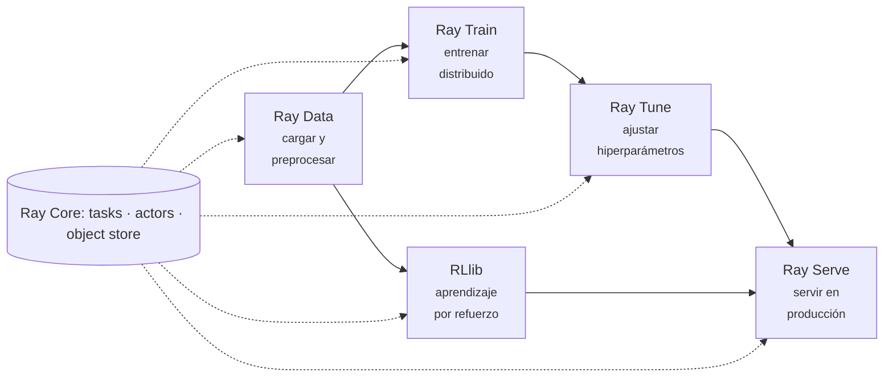

# Bibliotecas de IA de Ray

Sobre [Ray Core](ray.md) se construyen cinco bibliotecas que cubren el ciclo de vida completo de
un proyecto de machine learning. La idea de diseño es que todas comparten el mismo clúster y el
mismo almacén de objetos, así que **los datos no salen de Ray** entre una etapa y la siguiente.



## Ray Data

Carga y transformación distribuida, pensada específicamente para alimentar entrenamiento. Su
diferencia con [Spark](../00_DATA/spark/pyspark.md) es que **transmite en streaming** hacia los
workers de entrenamiento en vez de materializar cada etapa completa.

```python
import ray

ds = ray.data.range(1000)
print(ds.count())              # 1000
print(ds.schema())             # id: int64

def escalar(lote):
    lote["doble"] = lote["id"] * 2
    return lote

ds2 = ds.map_batches(escalar, batch_size=128)
print(ds2.take(3))             # [{'id': 0, 'doble': 0}, {'id': 1, 'doble': 2}, ...]

pares = ds2.filter(lambda fila: fila["id"] % 2 == 0)
print(pares.count())           # 500
print(ds2.mean("doble"))       # 999.0
```

**`map_batches` es la operación principal**, no `map`. Trabajar por lotes amortiza la sobrecarga
por tarea y permite aprovechar vectorización de NumPy o inferencia en GPU. Usar `map` fila a fila
sobre millones de registros es el error de rendimiento más común.

Lee de Parquet, CSV, JSON, imágenes, S3 y bases de datos, y su API es perezosa: nada se ejecuta
hasta que una acción —`take`, `count`, `iter_batches`, `write_parquet`— lo fuerza.

## Ray Train

Entrenamiento distribuido para PyTorch, TensorFlow, XGBoost y LightGBM. Se le pasa **el bucle de
entrenamiento de siempre** y él se encarga de replicarlo entre workers y coordinar los
gradientes.

```python
import torch
import torch.nn as nn
import ray.train.torch
from ray.train import ScalingConfig
from ray.train.torch import TorchTrainer


def bucle_entrenamiento(config):
    modelo = nn.Sequential(nn.Linear(10, 32), nn.ReLU(), nn.Linear(32, 1))
    modelo = ray.train.torch.prepare_model(modelo)     # envuelve en DDP y coloca en el device
    opt = torch.optim.Adam(modelo.parameters(), lr=config["lr"])

    X = torch.randn(256, 10)
    y = X.sum(1, keepdim=True)

    for epoca in range(config["epocas"]):
        opt.zero_grad()
        perdida = nn.functional.mse_loss(modelo(X), y)
        perdida.backward()
        opt.step()
        ray.train.report({"perdida": perdida.item(), "epoca": epoca})


trainer = TorchTrainer(
    bucle_entrenamiento,
    train_loop_config={"lr": 1e-2, "epocas": 20},
    scaling_config=ScalingConfig(num_workers=2, use_gpu=False),
    run_config=ray.train.RunConfig(storage_path="/tmp/ray_train"),
)
resultado = trainer.fit()
```

Con dos workers, la pérdida bajó de 4.89 a 0.33 a lo largo de las 20 épocas, con ambos rangos
reportando métricas.

Las tres piezas que hay que entender:

- **`prepare_model()`** envuelve el modelo en `DistributedDataParallel` y lo mueve al dispositivo
  correcto. Es lo que evita escribir a mano la inicialización del grupo de procesos.
- **`ScalingConfig`** declara cuántos workers y si usan GPU. Pasar de 2 CPUs a 8 GPUs es cambiar
  esta línea.
- **`ray.train.report()`** envía métricas al coordinador y es también el punto donde se guardan
  los *checkpoints*.

## Ray Tune

Búsqueda de hiperparámetros. Lo que la distingue de un bucle de búsqueda casero es que **corta
pronto las pruebas que van mal**, en lugar de dejarlas terminar.

```python
from ray import tune
from ray.tune.schedulers import ASHAScheduler


def entrenar(config):
    for paso in range(30):
        perdida = calcular_perdida(config["lr"], paso)
        tune.report({"perdida": perdida, "paso": paso})


tuner = tune.Tuner(
    entrenar,
    param_space={"lr": tune.loguniform(1e-4, 1e-1)},
    tune_config=tune.TuneConfig(
        num_samples=12,
        metric="perdida",
        mode="min",
        scheduler=ASHAScheduler(max_t=30, grace_period=3, reduction_factor=2),
    ),
    run_config=tune.RunConfig(storage_path="/tmp/ray_tune"),
)

resultados = tuner.fit()
print(resultados.get_best_result().config)
```

**ASHA** (*Asynchronous Successive Halving*) es el motivo de usar Tune. Ejecuta todas las pruebas
un mínimo de pasos (`grace_period`), descarta la mitad peor, deja continuar al resto, y repite.

En una ejecución real de 12 pruebas con presupuesto máximo de 30 pasos cada una, los pasos
efectivamente ejecutados fueron:

```text
[3, 3, 3, 3, 3, 3, 6, 6, 12, 12, 30, 30]

114 pasos de los 360 posibles  ->  68 % de cómputo ahorrado
```

Seis pruebas murieron a los 3 pasos, dos llegaron a 6, dos a 12, y solo las dos mejores agotaron
el presupuesto. La mejor configuración encontrada fue prácticamente la óptima del problema.

Tune se integra con Optuna, HyperOpt y BayesOpt como algoritmos de búsqueda, y con ASHA,
*Population Based Training* y *median stopping* como planificadores. Búsqueda y planificación son
ejes independientes: el algoritmo decide **qué** probar, el planificador decide **cuánto tiempo**
darle.

## Ray Serve

Servicio de modelos en producción. Cada *deployment* es un grupo de actores con réplicas, y se
exponen por HTTP.

```python
import ray
from ray import serve


@serve.deployment(num_replicas=2, ray_actor_options={"num_cpus": 0.5})
class Modelo:
    def __init__(self, factor: float):
        self.factor = factor                 # el modelo se carga una sola vez por replica

    async def __call__(self, request):
        datos = await request.json()
        return {"prediccion": datos["x"] * self.factor}


serve.run(Modelo.bind(factor=3.0), route_prefix="/predecir")
```

```bash
curl -X POST http://127.0.0.1:8000/predecir -H 'Content-Type: application/json' -d '{"x": 7}'
# {"prediccion": 21.0}
```

El constructor se ejecuta **una vez por réplica**, no por petición: ahí se carga el modelo. Y como
las réplicas son actores, admiten `num_gpus` fraccionarios, lo que permite alojar varios modelos
en una misma tarjeta.

Su rasgo diferencial frente a un servidor de modelos convencional es la **composición**: un
*deployment* puede llamar a otros, así que un pipeline de preprocesamiento, ensamblado de varios
modelos y postprocesamiento se expresa en Python, con cada pieza escalando por separado.

Para servir modelos ya exportados, se combina bien con [ONNX Runtime](onnx_runtime.md) dentro del
deployment.

## RLlib

Biblioteca de [aprendizaje por refuerzo](../03_REINFORCEMENT_LEARNING/introduccion.md) construida
sobre Ray. Trae implementaciones probadas de PPO, SAC, DQN, IMPALA y APPO, y distribuye la parte
más costosa del RL: **la recolección de experiencia**.

Encaja de forma natural en el modelo de actores: cada *rollout worker* es un actor con su propia
copia del entorno, generando trayectorias en paralelo mientras el aprendiz consume el lote
resultante. Es exactamente el cuello de botella descrito en
[Deep Reinforcement Learning](../03_REINFORCEMENT_LEARNING/deep_reinforcement_learning.md): la
eficiencia de muestras.

## Cuándo merece la pena

Ray justifica su complejidad operativa cuando:

- El entrenamiento **no cabe en una máquina**, o la búsqueda de hiperparámetros es demasiado
  lenta en serie.
- La carga es **heterogénea**: unas tareas necesitan GPU, otras solo CPU, con duraciones muy
  distintas.
- Quieres **una sola infraestructura** para datos, entrenamiento, ajuste y servicio, en lugar de
  cuatro sistemas que hay que pegar entre sí.

No lo justifica cuando el trabajo cabe cómodamente en un servidor. Un `multiprocessing.Pool`, o
un bucle bien escrito, tiene cero coste operativo y no hay que depurar un clúster.

## Ver también

- [Ray](ray.md) — las primitivas sobre las que se apoya todo esto.
- [Sistemas de machine learning](sistemas_de_machine_learning.md)
- [ONNX Runtime](onnx_runtime.md) — para servir modelos exportados desde Ray Serve.
- [Deep Reinforcement Learning](../03_REINFORCEMENT_LEARNING/deep_reinforcement_learning.md)

## Referencias

- [Documentación de Ray](https://docs.ray.io/)
- Liaw, R. et al. [*Tune: A Research Platform for Distributed Model Selection and Training*](https://arxiv.org/abs/1807.05118) (2018).
- Li, L. et al. [*A System for Massively Parallel Hyperparameter Tuning*](https://arxiv.org/abs/1810.05934) (2018) — el artículo de ASHA.
- Liang, E. et al. [*RLlib: Abstractions for Distributed Reinforcement Learning*](https://arxiv.org/abs/1712.09381), ICML (2018).
