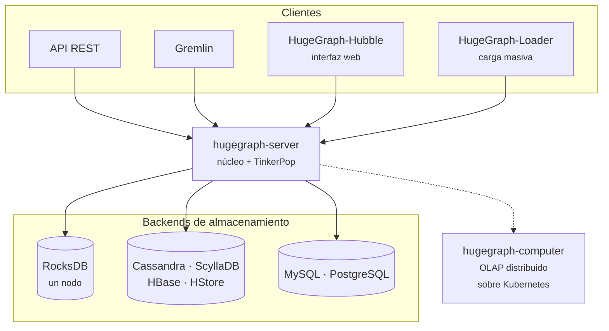

# Apache HugeGraph

**Apache HugeGraph** es una base de datos de grafos distribuida, de código abierto y proyecto
*Top-Level* de la Apache Software Foundation. Nació en Baidu y hoy se desarrolla en la comunidad
Apache bajo licencia Apache 2.0.

Es una de las implementaciones de [Apache TinkerPop](apache_tinkerpop.md), así que habla
[Gremlin](gremlin.md). Pero lo que la distingue de otras implementaciones son dos cosas: un
**esquema fuerte y obligatorio**, y una **API REST de recorrido** con algoritmos de grafo
integrados.

## Esquema fuerte

La mayoría de las bases de grafos son *schema-free*: insertas un vértice con las propiedades que
quieras y ya está. HugeGraph hace lo contrario: **hay que declarar el esquema antes de insertar
nada**.

Son cuatro tipos de definición, y se crean en este orden:

| Elemento | Qué declara |
|---|---|
| **PropertyKey** | Una propiedad: su nombre, tipo de dato y cardinalidad |
| **VertexLabel** | Un tipo de vértice: qué propiedades admite y cómo se genera su ID |
| **EdgeLabel** | Un tipo de arista: qué vértices conecta y qué propiedades lleva |
| **IndexLabel** | Un índice sobre propiedades, con su tipo |

```bash
BASE=http://localhost:8080/graphs/hugegraph/schema

# 1. Propiedades
curl -X POST $BASE/propertykeys -H 'Content-Type: application/json' \
  -d '{"name":"nombre","data_type":"TEXT","cardinality":"SINGLE"}'
curl -X POST $BASE/propertykeys -H 'Content-Type: application/json' \
  -d '{"name":"edad","data_type":"INT","cardinality":"SINGLE"}'

# 2. Tipos de vértice
curl -X POST $BASE/vertexlabels -H 'Content-Type: application/json' -d '{
  "name":"persona","id_strategy":"CUSTOMIZE_STRING",
  "properties":["nombre","edad"],"nullable_keys":["edad"]}'

# 3. Tipos de arista
curl -X POST $BASE/edgelabels -H 'Content-Type: application/json' -d '{
  "name":"conoce","source_label":"persona","target_label":"persona",
  "properties":["peso"]}'
```

La consecuencia es inmediata. Intentar insertar una propiedad no declarada **falla**:

```bash
curl -X POST $BASE/../graph/vertices -H 'Content-Type: application/json' -d '{
  "label":"persona","id":"x","properties":{"nombre":"test","inventada":"boom"}}'
```

```text
Undefined property key: 'inventada'
```

Esto es una decisión de diseño con un compromiso claro:

- **A favor**: los datos no se degradan solos. En un grafo *schema-free* que lleva dos años en
  producción es normal encontrar la misma propiedad escrita de tres formas distintas, y nadie se
  entera hasta que una consulta devuelve la mitad de lo que debería.
- **En contra**: menos flexibilidad. Cada campo nuevo exige una migración del esquema, lo que
  hace la exploración inicial más lenta.

Encaja bien con el enfoque de
[desarrollo orientado a ontologías](../11_JARVIS/desarrollo_orientado_a_ontologias.md): el modelo
se define primero y el sistema lo hace cumplir.

## Índices

Los índices también son explícitos, y cada tipo sirve para una cosa distinta:

| Tipo | Para qué |
|---|---|
| `SECONDARY` | Igualdad exacta sobre una propiedad |
| `RANGE_INT`, `RANGE_DOUBLE`… | Comparaciones y rangos numéricos |
| `SEARCH` | Búsqueda de texto completo por palabras |
| `SHARD` | Consultas por prefijo y rangos compuestos |
| `UNIQUE` | Restricción de unicidad |

```bash
curl -X POST $BASE/indexlabels -H 'Content-Type: application/json' -d '{
  "name":"personaPorNombre","base_type":"VERTEX_LABEL","base_value":"persona",
  "index_type":"SECONDARY","fields":["nombre"]}'

curl -X POST $BASE/indexlabels -H 'Content-Type: application/json' -d '{
  "name":"personaPorEdad","base_type":"VERTEX_LABEL","base_value":"persona",
  "index_type":"RANGE_INT","fields":["edad"]}'
```

Y las consultas los usan directamente:

```bash
curl -G --compressed http://localhost:8080/graphs/hugegraph/graph/vertices \
  --data-urlencode 'label=persona' --data-urlencode 'properties={"edad":"P.gt(30)"}'
```

```text
[('josh', 32), ('peter', 35)]
```

!!! tip "Usa `--compressed` con curl"
    El servidor responde con gzip. Sin esa opción, `curl` devuelve binario y cualquier intento de
    parsear el JSON falla con un error confuso.

## Algoritmos de recorrido por REST

Esta es la parte más distintiva. Además de Gremlin, HugeGraph expone algoritmos de grafo como
**endpoints REST**, sin escribir una sola traversal.

Sobre un grafo de personas y software con seis vértices y seis aristas:

**Vecinos a K saltos**

```bash
curl -G --compressed .../traversers/kneighbor \
  --data-urlencode 'source="marko"' --data-urlencode 'max_depth=2' \
  --data-urlencode 'direction=OUT'
```

```json
{"vertices": ["lop", "ripple", "josh", "vadas"],
 "measure": {"edge_iterations": 5, "vertice_iterations": 4, "cost(ns)": 96432198}}
```

**Camino más corto**

```bash
curl -G --compressed .../traversers/shortestpath \
  --data-urlencode 'source="marko"' --data-urlencode 'target="ripple"' \
  --data-urlencode 'max_depth=5'
```

```json
{"path": ["marko", "josh", "ripple"], ...}
```

**Todos los caminos**

```json
{"paths": [{"objects": ["marko", "josh", "lop"]},
           {"objects": ["marko", "lop"]}]}
```

**Puntos de cruce** — qué conecta a dos vértices:

```json
{"crosspoints": [{"crosspoint": "lop", "objects": ["marko", "lop", "peter"]},
                 {"crosspoint": "lop", "objects": ["marko", "josh", "lop", "peter"]}]}
```

Hay más: `kout`, `rings` (ciclos), `rays`, `customizedpaths`, `sameneighbors`, `jaccardsimilarity`.

Un detalle que se agradece: **cada respuesta incluye un bloque `measure`** con las iteraciones de
vértices y aristas y el coste en nanosegundos. El perfilado viene de serie, sin activar nada.

## Arquitectura



El **backend es intercambiable**: RocksDB por defecto para un solo nodo, y Cassandra, ScyllaDB o
HBase cuando hace falta distribuir. El modelo de datos y las consultas no cambian.

Para analítica sobre el grafo completo —PageRank, componentes conexas, propagación de etiquetas—
está **hugegraph-computer**, un motor OLAP distribuido sobre Kubernetes con modelo BSP, el mismo
paradigma que el [GraphComputer de TinkerPop](apache_tinkerpop.md#graphcomputer-oltp-frente-a-olap).

## Arrancar

```bash
docker run -d --name hugegraph -p 8080:8080 hugegraph/hugegraph:latest
```

Arranca en unos segundos y crea un grafo llamado `hugegraph`:

```bash
curl -s --compressed http://localhost:8080/versions
```

```json
{"versions": {"version": "v1", "core": "1.7.0", "gremlin": "3.5.1", "api": "0.72.0.0"}}
```

!!! warning "Gremlin por HTTP en la imagen por defecto"
    HugeGraph es una implementación de TinkerPop y el servidor anuncia Gremlin 3.5.1. Sin
    embargo, en la imagen `hugegraph/hugegraph:latest` (1.7.0) **no conseguí que el endpoint
    `/gremlin` resolviera el binding del grafo**, ni con `curl` ni con el SDK oficial de Python:

    ```text
    Could not rebind [g] to [hugegraph] as [hugegraph] not in the
    Graph or TraversalSource global bindings
    ```

    El `gremlin-server.yaml` de la imagen trae la sección `graphs: {}` vacía, lo que apunta a
    configuración del contenedor y no a una limitación del producto. **La API REST funciona
    perfectamente** y es la vía documentada aquí. Si vas a depender de Gremlin, verifícalo en tu
    despliegue antes de comprometerte.

## Ver también

- [HugeGraph con IA](hugegraph_ai.md) — GraphRAG y construcción de grafos con LLMs.
- [Apache TinkerPop](apache_tinkerpop.md) y [Gremlin](gremlin.md)
- [Proyectos Apache para KG](proyectos_apache_para_kg.md)
- [Definiciones de Knowledge Graph](definiciones_knowledge_graph.md)

## Referencias

- [hugegraph.apache.org](https://hugegraph.apache.org/) ·
  [documentación](https://hugegraph.apache.org/docs/)
- [apache/hugegraph](https://github.com/apache/hugegraph) — el servidor.
- [apache/hugegraph-toolchain](https://github.com/apache/hugegraph-toolchain) — loader, hubble y
  clientes.
- [apache/hugegraph-computer](https://github.com/apache/hugegraph-computer) — motor OLAP.
