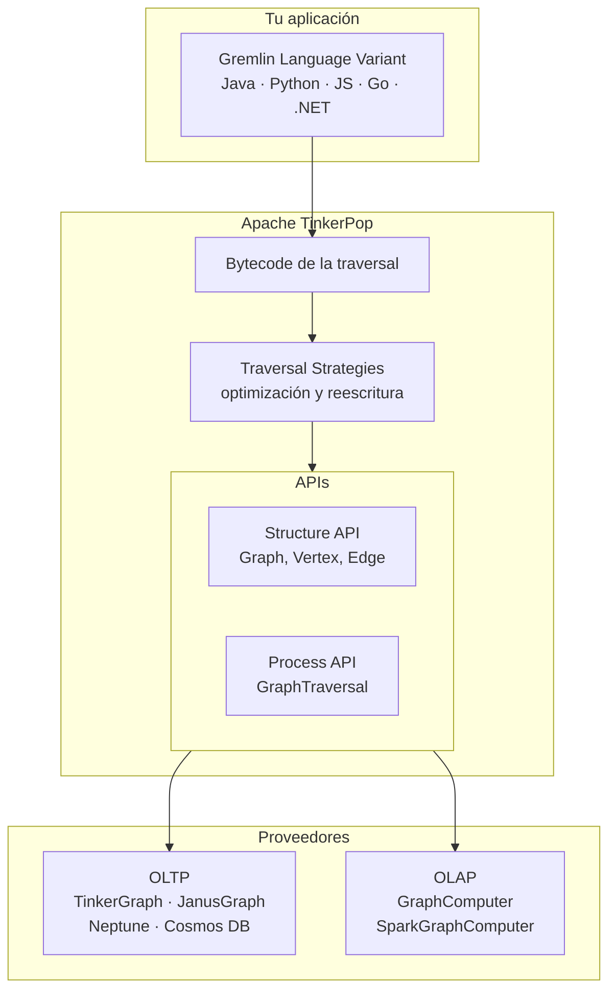
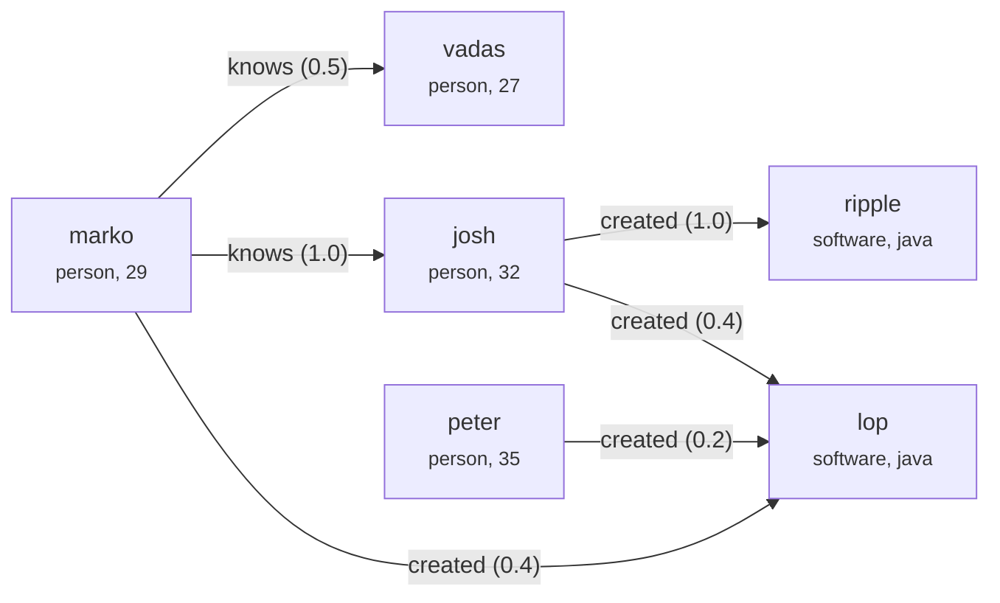

# Apache TinkerPop

**Apache TinkerPop** es un *framework* de cómputo sobre grafos. Su aportación principal no es
una base de datos, sino una **capa de abstracción**: define un modelo de grafo común y un
lenguaje de consulta —[Gremlin](gremlin.md)— que funcionan igual sobre motores distintos.

La analogía útil es **JDBC para bases de datos relacionales**: escribes contra la interfaz, no
contra el proveedor. Si mañana cambias JanusGraph por Amazon Neptune, tus consultas siguen
siendo válidas.

## El modelo: property graph

TinkerPop trabaja sobre un **grafo de propiedades** (*property graph*), no sobre RDF. Sus
elementos son:

| Elemento | Descripción |
|---|---|
| **Vertex** | Un nodo. Tiene un identificador, una etiqueta y propiedades. |
| **Edge** | Una arista **dirigida** entre dos vértices. Tiene identificador, etiqueta y propiedades. |
| **Property** | Un par clave-valor sobre una arista. |
| **VertexProperty** | Un par clave-valor sobre un vértice, que a su vez **puede tener sus propias propiedades** (metapropiedades) y admitir múltiples valores. |

Esa última fila es la diferencia real con otros modelos: en TinkerPop una propiedad de vértice
puede ser multivaluada y llevar metadatos. Un vértice `persona` puede tener dos direcciones de
correo, y cada una anotada con desde cuándo es válida.

Esto contrasta con el modelo RDF de tripletas que se describe en
[Definiciones de Knowledge Graph](definiciones_knowledge_graph.md): RDF descompone todo en
tripletas y consulta con SPARQL; el property graph agrupa atributos en el propio elemento y
consulta recorriéndolo.

## Arquitectura



### Structure API

Define **cómo se representa** el grafo: las interfaces `Graph`, `Vertex`, `Edge`, `Property` y
`VertexProperty`. Cada proveedor la implementa a su manera —sobre Cassandra, sobre HBase, en
memoria— pero expone la misma interfaz.

### Process API

Define **cómo se consulta**: la `GraphTraversal` y el `TraversalSource`, que es el objeto `g`
del que parte toda consulta Gremlin. Es el tema de la [página sobre Gremlin](gremlin.md).

### GraphComputer: OLTP frente a OLAP

TinkerPop distingue dos formas muy distintas de ejecutar una consulta, y elegir mal es la causa
más común de que algo tarde horas en vez de milisegundos.

| | **OLTP** | **OLAP** |
|---|---|---|
| Punto de partida | Unos pocos vértices concretos | **Todos** los vértices |
| Recorrido | Localizado, sigue aristas | Global, en paralelo |
| Latencia | Milisegundos | Minutos u horas |
| Cómo se invoca | `graph.traversal()` | `graph.traversal().withComputer(...)` |
| Caso típico | "¿Qué compró este usuario?" | "PageRank de todo el grafo" |

El motor OLAP funciona con el modelo **BSP** (*bulk-synchronous parallel*), el mismo de Pregel:
cada vértice ejecuta un `VertexProgram`, intercambia mensajes con sus vecinos y se sincroniza
al final de cada iteración. TinkerPop trae implementaciones de PageRank, *peer pressure* para
detección de comunidades y componentes conexas.

El proveedor OLAP habitual es **Spark**, mediante `SparkGraphComputer`. Ver
[PySpark](../00_DATA/spark/pyspark.md) para el motor subyacente.

## Implementaciones disponibles

TinkerPop no almacena nada por sí mismo. Los motores que implementan su interfaz son:

| Motor | Tipo | Notas |
|---|---|---|
| **TinkerGraph** | En memoria | Implementación de referencia. Ideal para pruebas y grafos pequeños. Viene incluido. |
| **JanusGraph** | Distribuido | Código abierto. Almacena en Cassandra, HBase o BerkeleyDB; indexa con Elasticsearch o Solr. |
| **Amazon Neptune** | Gestionado | Servicio de AWS. Soporta Gremlin y también SPARQL. |
| **Azure Cosmos DB** | Gestionado | A través de su API de Gremlin. |
| **ArcadeDB**, **HugeGraph**, **OrientDB** | Variados | Otras implementaciones de la especificación. |
| **Neo4j** | Vía adaptador | Su lenguaje nativo es [Cypher](../10_LLM/RAGS/cypher.md); Gremlin funciona mediante el plugin `neo4j-gremlin`. |

## Cómo se usa

### Gremlin Console

La forma más rápida de empezar. Es un REPL basado en Groovy que trae TinkerGraph incorporado,
así que no necesitas levantar ninguna base de datos.

```bash
# Descarga desde https://tinkerpop.apache.org/download.html
unzip apache-tinkerpop-gremlin-console-3.8.1-bin.zip
cd apache-tinkerpop-gremlin-console-3.8.1
bin/gremlin.sh
```

Dentro de la consola, carga el grafo de ejemplo y lanza una consulta:

```groovy
gremlin> graph = TinkerFactory.createModern()
==>tinkergraph[vertices:6 edges:6]

gremlin> g = graph.traversal()
==>graphtraversalsource[tinkergraph[vertices:6 edges:6], standard]

gremlin> g.V().has('person', 'name', 'marko').out('knows').values('name')
==>vadas
==>josh
```

El **grafo `modern`** es el ejemplo canónico de TinkerPop y aparece en toda su documentación.
Tiene 6 vértices —4 personas y 2 programas— y 6 aristas de tipo `knows` y `created`:



### Gremlin Server

Para uso real, el grafo vive en un servidor y las aplicaciones se conectan por red. **Gremlin
Server** expone cualquier implementación de TinkerPop sobre WebSockets o HTTP.

```bash
docker run -p 8182:8182 tinkerpop/gremlin-server
```

El puerto por defecto es el **8182**. La serialización entre cliente y servidor usa
**GraphBinary** (binario, la opción por defecto en drivers recientes) o **GraphSON** (JSON, más
legible y útil para depurar).

Desde la consola, para conectar a un servidor remoto:

```groovy
gremlin> :remote connect tinkerpop.server conf/remote.yaml
gremlin> :> g.V().count()
```

El prefijo `:>` envía la línea al servidor en vez de ejecutarla localmente.

### Desde Python

Gremlin no es exclusivo de la JVM. Los **GLV** (*Gremlin Language Variants*) permiten escribir
traversals en el lenguaje anfitrión, con su sintaxis nativa.

```bash
pip install gremlinpython
```

```python
from gremlin_python.process.anonymous_traversal import traversal
from gremlin_python.driver.driver_remote_connection import DriverRemoteConnection

conexion = DriverRemoteConnection('ws://localhost:8182/gremlin', 'g')
g = traversal().with_remote(conexion)

# Las mismas consultas que en la consola, con nombres en snake_case
amigos = (g.V()
           .has('person', 'name', 'marko')
           .out('knows')
           .values('name')
           .to_list())
print(amigos)          # ['vadas', 'josh']

conexion.close()
```

Dos detalles de la variante Python que causan tropiezos:

- Los pasos que en Groovy son `camelCase` aquí son **`snake_case`**: `to_list()`, `has_label()`,
  `value_map()`, `with_remote()`. Las versiones `camelCase` existen como alias obsoletos.
- Algunas palabras chocan con reservadas de Python y llevan sufijo de guion bajo: `in_()`,
  `as_()`, `is_()`, `not_()`, `from_()`.

Hay GLVs equivalentes para **JavaScript**, **Go**, **.NET** y, por supuesto, **Java**.

## Cuándo usar TinkerPop

Encaja bien cuando:

- Quieres **no atarte a un proveedor** concreto de base de datos de grafos.
- Necesitas **la misma consulta en OLTP y en OLAP**, cambiando solo el `TraversalSource`.
- Trabajas con un property graph y las consultas son fundamentalmente **recorridos**: caminos,
  vecindarios, patrones de conexión.

No encaja cuando:

- Tu modelo es **RDF y semántico**, con ontologías y razonamiento. Ahí van
  [Apache Jena o RDF4J](proyectos_apache_para_kg.md) con SPARQL y OWL. Ver también
  [Sistema de ontologías](../11_JARVIS/sistema_de_ontologias.md).
- Tus consultas son **agregaciones sobre tablas** y no recorridos. Un motor columnar será más
  rápido y más simple; ver [bases de datos](../00_DATA/introduccion_bases_de_datos.md).

## Ver también

- [Gremlin](gremlin.md) — cómo funciona el lenguaje de consulta.
- [Proyectos Apache para KG](proyectos_apache_para_kg.md)
- [Algoritmos de grafos para ciencia de datos](introduccion.md)
- [Cypher](../10_LLM/RAGS/cypher.md) — el lenguaje alternativo, de Neo4j.

## Referencias

- [Sitio oficial de Apache TinkerPop](https://tinkerpop.apache.org/) ·
  [descargas](https://tinkerpop.apache.org/download.html)
- [TinkerPop 3 Reference Documentation](https://tinkerpop.apache.org/docs/current/reference/)
- [The Gremlin Graph Traversal Machine and Language](https://arxiv.org/abs/1508.03843) —
  Rodriguez, M. A. (2015).
