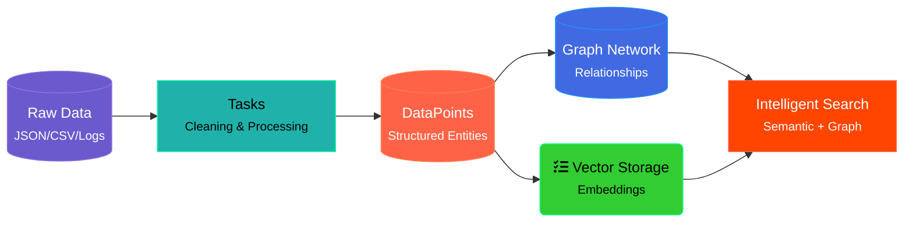

# Code Graph

Enabling Large Language Models (LLMs) to reason over selected code snippets within their context size is relatively straightforward. By copying and pasting the code snippet with some prompt engineering, LLMs often handle the request quite well. For example, GitHub Coplit Chat already allows you to generate 
- unit test, 
- fixing bugs, or 
- explain a manually selected code snippet. 

However, how can we extend it to the scope of the whole codebase? Can we also skip the manual selection of code snippet and allow the LLM to figure it out? Building a knowledge graph over the codebase has the potential to tackle these challenges.

## CodeGraph Context for Coding Copilots

The flow will be something like:

## Custom Ontologies and Reasoners for Domain "awareness"

Let mix some domain driven development with LLMs and code guidelines.

### Code "awarness"

Different static and dynamic analysis of the source code already build graph over source code for machine code optimization or vulnerability detection. 

### Simple Knowledge Graph

Here, we will showcase how a simple knowledge graph over a codebase can be built that allows a LLM to reason over the whole codebase. 

In the example graph, we use blue node to represent a file/directory, and green node to represent an AST node. Between file nodes we have HAS_FILE edges between the parent directory and the child file. Between file nodes and AST nodes we have HAS_AST edges between the source code files and the root AST node. Between the AST nodes we have HAS_PARENT edges between the parent and child AST nodes. 

Lets start to test [Cognee](https://github.com/topoteretes/cognee) which has develppe a Data to Memory process.

In thisc ase **data to memory** is the process of converting and ingesting your raw data into Cognee’s memory system.

Node Sets provide a simple yet powerful tagging mechanism that helps in managing the growing complexity of your knowledge base as you add more content.

- **Chunking** is how cognee breaks down large datasets into manageable pieces for efficient processing and analysis.
- **Memory Processing** encompasses the computational workflows that transform raw data into structured, queryable knowledge.
- **Tasks** are the building blocks of cognee’s data processing pipeline.
- **Pipelines** are the data processing workflows that transform raw information into structured knowledge graphs.
- **DataPoints** are the fundamental units of information that carry 
metadata and relationships.
- **Search Memory** enables you to query and retrieve information from your knowledge graphs.

