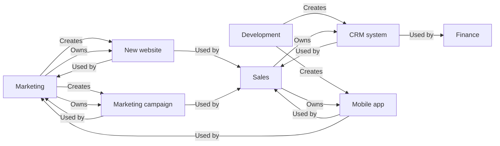
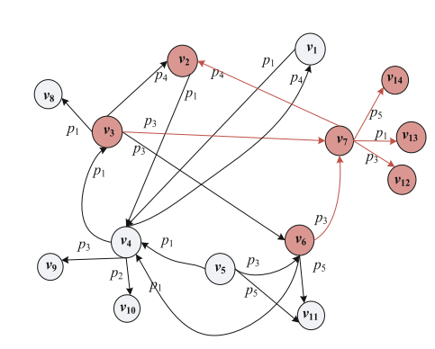

# Definiciones de Knowledge Graph

Un **knowledge graph** ($KG$) se define como $G = (V, P, R, L_{V} , \varphi)$, donde

- $V$ es el conjunto de **nodos** o entidades,
- $P$ es un conjunto de **tipos de relación**, es decir, propiedades,
- $R \subset V \times P \times V$ es un conjunto de **relaciones** o tripletas entre nodos,
- $L_{V}$ es un conjunto de **etiquetas** o tipos de nodo, y
- $\varphi: V \rightarrow \rho(L_{V})$ es una función que mapea cada nodo al conjunto de sus tipos.

**Definición 1** (*feature* de un nodo). Dado $G = (V, P, R, L_{V} , \varphi)$, la feature de un nodo
$v \in V$ se define como un conjunto finito de elementos que caracterizan a $v$, denotado como

$$ F(v) = \{f_{1}, f_{2},\ldots, f_{s}\}. $$

## Ejemplo: departamentos y proyectos

Consideremos $V$ como los departamentos y proyectos de una organización:

### Nodos

- Departamentos:
    - Marketing
    - Sales
    - Development
    - Finance
- Proyectos:
    - Website
    - Marketing campaign
    - CRM
    - Mobile App

$$V = \{Marketing, Sales, Development, Finance, Website, Marketing\, campaign, CRM, Mobile\, App\}$$

### Propiedades

- Propiedades
    - create by
    - owned by
    - used by

$$P=\{created\,by, owned\,by, used\,by\}$$

### Relaciones

$R \subset V\times P \times V$

- "Created by"
    - Website - created by Development
    - Marketing campaign - created by Marketing
    - CRM - created by Development
    - Mobile App - created by Development
- "Owned by"
    - Website - owned by Marketing
    - Marketing campaign - owned by Marketing
    - CRM - owned by Sales
    - Mobile App - owned by Sales
- "Used by"
    - New website - used by Marketing, Sales
    - Marketing campaign - used by Marketing, Sales
    - CRM - used by Sales, Finance
    - Mobile App - used by Sales, Marketing

| Cabeza | Relación | Cola |
| --- | --- | --- |
| Website | created by | Development |
| Marketing campaign | created by | Marketing |
| CRM | created by | Development |
| Mobile App | created by | Development |
| Website | owned by | Marketing |
| Marketing campaign | owned by | Marketing |
| CRM | owned by | Sales |
| Mobile App | owned by | Sales |

En este ejemplo el knowledge graph muestra cómo se relacionan entre sí los distintos departamentos y proyectos. El nodo "Marketing", por ejemplo, está conectado con el nodo "Marketing campaign" mediante la relación "created by". Esto significa que el departamento de marketing es responsable de la creación de ese proyecto.

**Definición 2** (patrón de features, $FP$). Dado $G = (V, P, R, L_{V} , \varphi)$, un *feature pattern*
($FP$) se define como una tupla $c = (W, T)$, donde $W$ es un subconjunto de $V$ y $T$ un
subconjunto de $P$, y satisface:

- $\forall v \in W, F(v) = T$, y
- para cualquier subconjunto de $V$ que incluya a $W$, es decir $W' \subset V$ y $W ⊆ W'$, la condición (i) no se cumple para todos los nodos de $W'$.

La definición 2 establece que un $FP$ es un **conjunto máximo de features comunes** a un conjunto de nodos. La $T$ de un $FP$ $c$ se llama *conjunto de features*.

**Definición 3** (resumen del $KG$ basado en $FP$). Dado $G = (V, P, R, L_{V} , \varphi)$, sea $C$ el conjunto de $FPs$ formados por todos los nodos de $G$. El **resumen** de $G$ es el diagrama de Hasse ($HD$) formado por $(C, \subset)$, donde $\subset$ es la relación de subconjunto entre los conjuntos de features de $C$. Denotamos el resumen de $G$ como $L = (C, E)$, donde $E$ describe las relaciones de cobertura entre los elementos de $C$.

### Ejemplo

#### 

$KG = (V, P, R, L_{V})$ where

- $V = \{v_{1}, v_{2}, v_{3}, v_{4}, v_{5}, v_{6}, v_{7}, v_{8}, v_{9}, v_{10}, v_{11}, v_{12}, v_{13}, v_{14}\}$
- $P = \{p_{1}, p_{2}, p_{3}, p_{4}, p_{5}\}$
- $R =$

| V inicial | R | V final | | V inicial | R | V final |
| --- | --- | --- | --- | --- | --- | --- | 
| $v_{1}$ | $p_{1}$ | $v_{4}$ | | $v_{5}$ | $p_{1}$ | $v_{4}$ | 
| $v_{2}$ | $p_{1}$ | $v_{4}$ | | $v_{6}$ | $p_{1}$ | $v_{4}$ | 
| $v_{3}$ | $p_{4}$ | $v_{2}$ | | $v_{6}$ | $p_{3}$ | $v_{7}$ | 
| $v_{3}$ | $p_{3}$ | $v_{7}$ | | $v_{6}$ | $p_{5}$ | $v_{11}$ | 
| $v_{3}$ | $p_{3}$ | $v_{6}$ | | $v_{7}$ | $p_{4}$ | $v_{2}$ | 
| $v_{3}$ | $p_{1}$ | $v_{8}$ | | $v_{7}$ | $p_{3}$ | $v_{12}$ |
| $v_{4}$ | $p_{1}$ | $v_{3}$ | | $v_{7}$ | $p_{1}$ | $v_{13}$ | 
| $v_{4}$ | $p_{3}$ | $v_{9}$ | | $v_{7}$ | $p_{5}$ | $v_{14}$ | 
| $v_{4}$ | $p_{2}$ | $v_{10}$ | | | |

Definamos $F(v) =$ propiedades salientes; entonces:

| $F(v)$ | propiedades salientes de $v$ | | $F(v)$ | propiedades salientes de $v$ |
| --- | --- | --- | --- | --- |
| $F(v_{1})$ | $\{p_{1}\}$ | | $F(v_{8})$ | $\{\emptyset\}$ |
| $F(v_{2})$ | $\{p_{1}\}$ | | $F(v_{9})$ | $\{\emptyset\}$ |
| $F(v_{3})$ | $\{p_{1}, p_{3}, p_{4}\}$ | | $F(v_{10})$ | $\{\emptyset\}$ |
| $F(v_{4})$ | $\{p_{1}, p_{2}, p_{3}\}$ | | $F(v_{11})$ | $\{\emptyset\}$ |
| $F(v_{5})$ | $\{p_{1}\}$ | | $F(v_{12})$ | $\{\emptyset\}$ |
| $F(v_{6})$ | $\{p_{1}, p_{3}, p_{5}\}$ | | $F(v_{13})$ | $\{\emptyset\}$ |
| $F(v_{7})$ | $\{p_{1}, p_{3}, p_{4}, p_{5}\}$ | | $F(v_{14})$ | $\{\emptyset\}$ |

Con esto, el resumen $L$ basado en el diagrama de Hasse $C$ tiene 6 elementos distintos:

| $C$ | valor | Cardinalidad | Capa |
| --- | --- | --- | --- |
| $c_{1}$ | $(\{v_{8}, v_{9}, v_{10}, v_{11}, v_{12}, v_{13}, v_{14}\}, \emptyset)$ | 0 | 1 |
| $c_{2}$ | $(\{v_{1}, v_{2}, \{p_{1}\})$ | 1 | 2 |
| $c_{3}$ | $(\{v_{3}\}, \{p_{1}, p_{3}, p_{4}\})$ | 3 | 3 |
| $c_{4}$ | $(\{v_{5}, v_{6}\}, \{p_{1}, p_{3}, p_{5}\})$ | 3 | 3 |
| $c_{5}$ | $(\{v_{4}\}, \{p_{1}, p_{2}, p_{3}, p_{4}\})$ | 4 | 4 |
| $c_{6}$ | $(\{v_{7}\}, \{p_{1}, p_{3}, p_{4}, p_{5}\})$ | 4 | 4 |

La **altura** de este resumen $L$ es 4.

**Definición 4** (grafo base de un $FP$). Dados $G = (V, P, R, L_{V} , \varphi)$, un resumen
$L = (C,E)$ y un $FP$ $c = (W, T) \in C$, el **grafo base** de $c$ es un subgrafo de $G$

$$ g_{b} = (V_{b}, P_{b}, R_{b}, L^{b}_{V}, \varphi_{b})$$ 

donde:

- (1) $V_{b} = V_{\sigma} \cup V_{N}$, con $V_{\sigma} = \bigcup_{ W \in c}W$ y $V_{N}$ incluyendo todos los vecinos a un salto de los nodos de $V_{\sigma}$;
- (2) $R_{b} = \left\{(u, p, v)|u \in V_{\sigma}\, or\, v \in V_{\sigma}\right\}$;
- (3) $P_{b} = \left\{p| p \in P\, y\, (u, p, v) \in Rb\right\}$;
- (4) $L^{b}_{V}$ es un subconjunto de $L_{V}$ que incluye las etiquetas de nodo de $V_{b}$; y
- (5) $\varphi_{b}$ es una función de etiquetado que mapea cada nodo de $V_{b}$ a sus tipos.

**Definición 5** (grafo base de un resumen). Dados $G = (V, P, R, L_{V} , \varphi)$ y un resumen
$L = (C, E)$, el grafo base $G_{L} = (V_{s}, P_{s}, R_{s}, L^{s}_{V}, \varphi_{s})$ de $L$ es la unión de los grafos base de todos sus $FPs$:

- (1) $V_{s} = V_{\sigma} \cup V_{N}$, con $V_{\sigma} = \bigcup_{W \in c}W$ y $V_{N}$ incluyendo todos los vecinos a un salto de los nodos de $V_{\sigma}$;
- (2) $P_{s} = \bigcup_{T\in c} T$;
- (3) $R_{s} = \left\{(u, p, v)| u \in V_{\sigma}\, or\, v \in V_{\sigma}\right\}$; 
- (4) $L^{s}_{V}$ es un subconjunto de $L_{V}$ que incluye las etiquetas de nodo de $V_{s}$; y
- (5) $\varphi_{s}$ es una función de etiquetado que mapea cada nodo de $V_{s}$ a sus tipos.

## ¿Por qué un knowledge graph?

En los últimos años se han construido varios knowledge graphs, entre ellos:
- [DBpedia](https://www.dbpedia.org/), 
- [Wikidata](https://www.wikidata.org/) and
- [YAGO](https://yago-knowledge.org/)

Estos grafos han aportado ventajas significativas en diversas áreas de aplicación:
- análisis semántico (*semantic parsing*),
- sistemas de recomendación,
- recuperación de información, y
- respuesta a preguntas (*question answering*).

Hay además varias aplicaciones en torno al código que podrían beneficiarse de este tipo de grafos:
- búsqueda de código,
- automatización de código,
- refactorización,
- detección de bugs, y
- optimización de código.

Los hechos se pueden representar en forma de tripletas de dos maneras:
- **HRT**: `<head, relation, tail>` — cabeza, relación, cola.
- **SPO**: `<subject, predicate, object>` — sujeto, predicado, objeto.

## HRT

- **Cabeza o cola**: entidades que son objetos del mundo real o conceptos abstractos, representados como nodos.
- **Relación**: la conexión entre entidades, representada como arista.

## Comparación con grafos normales

- **Datos heterogéneos**: soporta distintos tipos de entidades (persona, fecha, pintura, etc.) y de relaciones (le gusta, nació en, etc.).
- **Modela información del mundo real**: se acerca al modelo mental que tenemos del mundo, representando la información como lo haría una persona.
- **Permite razonamiento lógico**: recorrer el grafo por un camino para establecer conexiones lógicas (el padre de A es B, y el padre de B es C; por tanto C es el abuelo de A).

## Crear un knowledge graph propio

A pesar de existir varios KGs de código abierto, puede que necesitemos crear uno específico de dominio para nuestro caso de uso. Los datos base a partir de los cuales queremos construirlo pueden ser de varios tipos: tabulares, en forma de grafo, o texto libre.

- **Creación de hechos**: el primer paso, donde analizamos el texto u objeto y extraemos hechos en formato de tripleta `<H, R, T>`. Si procesamos texto, podemos apoyarnos en pasos de preprocesamiento como tokenización, *stemming* o lematización para limpiarlo. Después extraemos las entidades y relaciones: para las entidades podemos usar algoritmos de **reconocimiento de entidades nombradas** (NER); para las relaciones, técnicas de **análisis de dependencias** que encuentren el vínculo entre cada par de entidades.
- **Selección de hechos**: una vez extraídos, los siguientes pasos evidentes son:
    - eliminar duplicados, e
    - identificar los hechos relevantes que merecen añadirse al KG.

Para identificar duplicados podemos usar técnicas de **desambiguación** de entidades y relaciones. La idea es consolidar los hechos idénticos —o los elementos repetidos de un hecho— en uno solo.

## Resumen automático de código fuente

El *source code summarization* es el proceso de generar un resumen conciso y generalizado, en lenguaje natural, a partir de un código fuente dado, de modo que facilite a los desarrolladores comprenderlo y usarlo mejor.

Actualmente, la mayor parte de la investigación se centra en convertir el código en secuencias de **árbol de sintaxis abstracta** (AST), o bien directamente en segmentos de código, para después alimentar esas representaciones a modelos de deep learning. Sin embargo, estos enfoques de representación única **ignoran las características semánticas** del código y destruyen la estructura del AST, lo que afecta a la calidad del resumen generado. 

