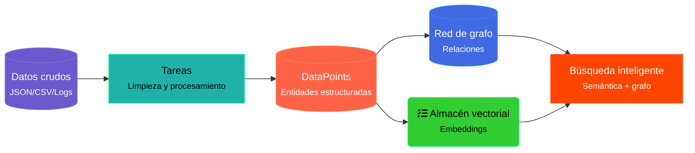

# Grafo de Código

Conseguir que un [LLM](../10_LLM/introduccion.md) razone sobre fragmentos de código
seleccionados dentro de su ventana de contexto es relativamente sencillo. Copiando y pegando el
fragmento con algo de *prompt engineering*, los LLMs suelen resolver la petición bastante bien.
Por ejemplo, GitHub Copilot Chat ya permite:

- generar **tests unitarios**,
- **corregir bugs**, o
- **explicar** un fragmento de código seleccionado manualmente.

Pero, ¿cómo extendemos esto al alcance de **toda la base de código**? ¿Podemos además evitar la
selección manual del fragmento y dejar que el LLM lo averigüe por su cuenta? Construir un
**knowledge graph sobre la base de código** tiene el potencial de resolver ambos retos.

## Contexto de grafo de código para copilotos

El flujo sería algo así:

## Ontologías y razonadores propios para "conciencia" del dominio

Se trata de mezclar algo de desarrollo dirigido por el dominio con LLMs y guías de estilo de
código.

### "Conciencia" del código

Distintos análisis estáticos y dinámicos del código fuente ya construyen grafos sobre él, sea
para optimización de código máquina o para detección de vulnerabilidades.

### Un knowledge graph sencillo

Aquí mostramos cómo se puede construir un knowledge graph sencillo sobre una base de código que
permita a un LLM razonar sobre el conjunto completo.

En el grafo de ejemplo usamos **nodos azules** para representar un archivo o directorio, y
**nodos verdes** para representar un nodo del AST. Las relaciones son:

- Entre nodos de archivo: aristas `HAS_FILE` entre el directorio padre y el archivo hijo.
- Entre nodos de archivo y nodos del AST: aristas `HAS_AST` entre el archivo de código fuente y
  el nodo raíz del AST.
- Entre nodos del AST: aristas `HAS_PARENT` entre nodos padre e hijo.

## Cognee: de datos a memoria

Vamos a probar [Cognee](https://github.com/topoteretes/cognee), que ha desarrollado un proceso
de *data to memory*.

En este caso, **data to memory** es el proceso de convertir e ingerir tus datos crudos en el
sistema de memoria de Cognee.

Los **node sets** proporcionan un mecanismo de etiquetado sencillo pero potente, que ayuda a
gestionar la complejidad creciente de tu base de conocimiento a medida que añades contenido.

Conceptos clave:

- **Chunking** — cómo Cognee divide grandes conjuntos de datos en piezas manejables para
  procesarlos y analizarlos de forma eficiente.
- **Memory processing** — los flujos computacionales que transforman datos crudos en
  conocimiento estructurado y consultable.
- **Tasks** — los bloques de construcción del pipeline de procesamiento de datos.
- **Pipelines** — los flujos de trabajo que transforman información cruda en knowledge graphs
  estructurados.
- **DataPoints** — las unidades fundamentales de información, que portan metadatos y
  relaciones.
- **Search memory** — permite consultar y recuperar información de tus knowledge graphs.

## Ver también

- [Knowledge Graph para developers](../PROYECTOS/KG_CODE/knowledge_graph_para_developers.md)
- [Servidores MCP con KGs](servidores_mcp_con_kgs.md)
