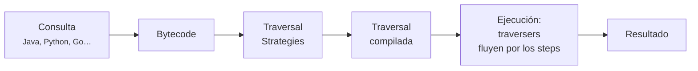

# Gremlin

**Gremlin** es el lenguaje de consulta de [Apache TinkerPop](apache_tinkerpop.md). A diferencia
de SQL o [Cypher](../10_LLM/RAGS/cypher.md), que son declarativos —describes *qué* quieres y el
motor decide cómo obtenerlo—, Gremlin es fundamentalmente **un lenguaje de flujo de datos**:
describes un **recorrido** (*traversal*), paso a paso, por el grafo.

Una consulta Gremlin se lee de izquierda a derecha como un itinerario:

```groovy
g.V().has('person','name','marko').out('knows').values('name')
//    ↑                             ↑            ↑
//    empieza en los vértices        sal por      quédate con
//    filtra por nombre              'knows'      la propiedad name
```

Se traduce como: *parte de todos los vértices, quédate con la persona llamada marko, sal por sus
aristas `knows`, y devuelve el nombre de los vértices a los que llegues.*

## Cómo funciona por dentro

Aquí está la idea que explica el resto del lenguaje. Gremlin **no es solo una sintaxis**: es una
**máquina de recorrido** (*traversal machine*), análoga a la JVM. Igual que Java compila a
bytecode que la JVM ejecuta, una consulta Gremlin compila a bytecode que la máquina de recorrido
ejecuta sobre el proveedor que sea.



### Steps y traversers

Una traversal es una **cadena de pasos** (*steps*). Por ella circulan **traversers**: objetos
que representan "algo que está atravesando el grafo en este momento".

Un traverser no es solo una referencia a un vértice. Lleva consigo:

| Atributo | Qué guarda |
|---|---|
| **Localización** | El objeto actual: un vértice, una arista, un valor |
| **Path** | El historial del recorrido, si se está registrando |
| **Bulk** | Cuántos traversers idénticos representa (optimización clave) |
| **Sack** | Un valor local que el traverser transporta y puede modificar |
| **Loops** | El contador de iteraciones dentro de un `repeat()` |

El **bulking** merece atención: si mil traversers llegan al mismo vértice por el mismo camino y
no se está registrando el path, la máquina los fusiona en uno solo con `bulk = 1000`. Es lo que
evita la explosión combinatoria en grafos densos.

### Los cinco tipos de step

Todo paso de Gremlin cae en una de estas categorías. Saber cuál es cuál predice qué le pasa al
flujo de traversers:

| Tipo | Efecto | Ejemplos |
|---|---|---|
| **map** | Transforma cada traverser en exactamente uno | `values()`, `count()`, `id()` |
| **flatMap** | Transforma cada traverser en 0, 1 o muchos | `out()`, `in()`, `both()`, `outE()` |
| **filter** | Deja pasar o descarta; nunca transforma | `has()`, `where()`, `dedup()`, `limit()` |
| **sideEffect** | Deja pasar sin tocar, pero produce un efecto | `aggregate()`, `store()`, `group()` |
| **branch** | Bifurca el flujo según una condición | `repeat()`, `choose()`, `union()`, `local()` |

### Traversal strategies

Antes de ejecutarse, la traversal pasa por un conjunto de **estrategias** que la reescriben. Es
la fase equivalente a un optimizador de consultas SQL, y es donde Gremlin recupera buena parte
de lo que parece perder por ser imperativo.

Las categorías, en orden de aplicación:

1. **Decoration** — añaden comportamiento. `PartitionStrategy` restringe la vista a una
   partición del grafo; `ReadOnlyStrategy` bloquea las escrituras; `SubgraphStrategy` limita el
   recorrido a un subgrafo.
2. **Optimization** — reescriben la traversal a una equivalente más barata, sin depender del
   proveedor. `IncidentToAdjacentStrategy` convierte `outE().inV()` en el más directo `out()`.
3. **Provider optimization** — específicas del motor. JanusGraph, por ejemplo, reescribe
   `has()` para que use sus índices en vez de escanear.
4. **Finalization** — ajustes finales antes de ejecutar.
5. **Verification** — rechazan traversals no permitidas, como una escritura bajo
   `ReadOnlyStrategy`.

Puedes ver el resultado con `explain()`:

```groovy
gremlin> g.V().outE().inV().explain()
```

Y medir la ejecución real, paso a paso, con `profile()`:

```groovy
gremlin> g.V().out('knows').profile()
```

`profile()` es la herramienta que hay que usar cuando una consulta va lenta: muestra cuántos
traversers entraron y salieron de cada step y cuánto tiempo consumió cada uno.

## El objeto `g`

Toda consulta parte de un **`TraversalSource`**, convencionalmente llamado `g`. No es el grafo:
es un punto de partida **configurado** para recorrerlo.

```groovy
g = graph.traversal()                              // OLTP, local
g = traversal().withRemote(conexion)               // OLTP, servidor remoto
g = graph.traversal().withComputer(SparkGraphComputer)  // OLAP
g = graph.traversal().withStrategies(ReadOnlyStrategy.instance())
```

La misma consulta escrita después funciona igual sobre cualquiera de estos `g`. Esa separación
entre *qué recorres* y *cómo se ejecuta* es el punto fuerte del diseño.

## Pasos fundamentales

### Punto de partida

```groovy
g.V()              // todos los vértices
g.E()              // todas las aristas
g.V(1)             // el vértice con id 1
g.V().hasLabel('person')
```

### Moverse por el grafo

```groovy
g.V(1).out()           // vecinos siguiendo aristas salientes
g.V(1).in()            // vecinos siguiendo aristas entrantes
g.V(1).both()          // vecinos en cualquier dirección
g.V(1).out('knows')    // solo por aristas con etiqueta 'knows'

g.V(1).outE()          // las aristas salientes (no los vértices)
g.V(1).outE().inV()    // equivalente a out(), pero pasando por la arista
```

La distinción entre `out()` y `outE().inV()` importa cuando necesitas **filtrar por propiedades
de la arista**:

```groovy
// Solo los 'knows' con peso mayor que 0.8
g.V().has('name','marko').outE('knows').has('weight', gt(0.8)).inV().values('name')
```

### Filtrar

```groovy
g.V().has('age', gt(30))                    // comparadores: gt, lt, gte, between, within
g.V().has('name', within('marko','josh'))
g.V().hasLabel('person').has('age')         // que tenga la propiedad
g.V().hasNot('age')                         // que no la tenga
g.V().where(out('created').count().is(gt(1)))   // filtro por sub-traversal
```

### Obtener valores

```groovy
g.V().values('name')            // solo el valor
g.V().valueMap()                // todas las propiedades como mapa
g.V().valueMap(true)            // incluyendo id y label
g.V().elementMap()              // forma recomendada en 3.4+
```

### Agrupar y contar

```groovy
g.V().hasLabel('person').count()
g.V().hasLabel('person').values('age').mean()
g.V().group().by(label).by(count())          // cuántos vértices por etiqueta
g.V().groupCount().by('lang')
g.V().hasLabel('person').order().by('age', desc).limit(3).values('name')
```

### Recorridos de profundidad variable

Es aquí donde Gremlin brilla frente a SQL. `repeat()` recorre en profundidad hasta cumplir una
condición:

```groovy
// Amigos de amigos, exactamente a 2 saltos
g.V(1).repeat(out('knows')).times(2).values('name')

// Todo lo alcanzable, emitiendo cada paso, sin repetir vértices
g.V(1).repeat(out().simplePath()).emit().values('name')

// Camino más corto hasta un vértice concreto
g.V(1).repeat(out().simplePath()).until(has('name','ripple')).path().limit(1)
```

Tres modificadores que cambian por completo el comportamiento:

- **`times(n)`** — repite exactamente *n* veces.
- **`until(cond)`** — repite hasta que se cumpla la condición. Si va **antes** de `repeat()` se
  comporta como un `while` (comprueba primero); si va **después**, como un `do-while`.
- **`emit()`** — devuelve los resultados intermedios, no solo los finales.

### Caminos

```groovy
g.V(1).out().out().path()                    // el recorrido completo
g.V(1).out().out().path().by('name')         // proyectado por una propiedad
g.V(1).repeat(out().simplePath()).times(3).path()   // evita ciclos
```

Registrar el path **desactiva el bulking**, porque cada traverser pasa a tener historia propia.
En grafos grandes es la causa habitual de que una consulta agote la memoria.

### Proyecciones

```groovy
g.V().hasLabel('person').project('nombre','edad','creaciones')
     .by('name')
     .by('age')
     .by(out('created').count())
```

`by()` es un **modulador**: no es un paso independiente, sino que configura al paso anterior.
Aparece por todas partes —en `order()`, `group()`, `path()`, `project()`— y su posición importa,
ya que se aplican en orden.

### Escritura

```groovy
g.addV('person').property('name','ana').property('age',30)

g.V().has('name','ana').as('a')
 .V().has('name','marko').as('b')
 .addE('knows').from('a').to('b').property('weight', 0.7)

g.V().has('name','ana').property('age', 31)     // actualizar
g.V().has('name','ana').drop()                  // borrar
```

## Estilo imperativo y declarativo

Gremlin admite los dos. La forma imperativa es la vista hasta ahora. La declarativa usa
`match()`, y se parece más a SPARQL o Cypher:

```groovy
g.V().match(
  __.as('a').out('created').as('b'),
  __.as('b').has('name','lop'),
  __.as('b').in('created').as('c'),
  __.as('c').has('age', gt(30))
).select('a','c').by('name')
```

En `match()` **el orden de los patrones no determina el orden de ejecución**: la estrategia
correspondiente los reordena según su selectividad. Es preferible cuando el patrón tiene varias
restricciones cruzadas y no está claro por dónde conviene empezar.

El `__` es la **traversal anónima**: una traversal que no parte de `g` sino del traverser que
llega en ese punto. En Python se importa explícitamente:

```python
from gremlin_python.process.graph_traversal import __
```

## Pasos terminales

Una traversal es **perezosa**: no se ejecuta hasta que un paso terminal la consume.

| Paso | Devuelve |
|---|---|
| `next()` | El siguiente resultado |
| `toList()` / `to_list()` | Todos los resultados como lista |
| `toSet()` | Todos, sin duplicados |
| `hasNext()` | Si queda algún resultado |
| `iterate()` | Nada; ejecuta por sus efectos (escrituras) |

Olvidar `iterate()` tras una escritura es un error frecuente: la traversal se construye pero
**nunca llega a ejecutarse**.

## Ejemplo completo

Sobre el grafo `modern` descrito en [Apache TinkerPop](apache_tinkerpop.md):

```python
from gremlin_python.process.anonymous_traversal import traversal
from gremlin_python.process.graph_traversal import __
from gremlin_python.process.traversal import P, Order
from gremlin_python.driver.driver_remote_connection import DriverRemoteConnection

conexion = DriverRemoteConnection('ws://localhost:8182/gremlin', 'g')
g = traversal().with_remote(conexion)

# Recomendacion sencilla por colaboracion:
# software creado por las personas que conoce marko, y que el aun no creo.
recomendaciones = (
    g.V().has('person', 'name', 'marko').as_('yo')
     .out('knows')
     .out('created')
     .where(__.not_(__.in_('created').as_('yo')))
     .dedup()
     .values('name')
     .to_list()
)

# Los 3 programas con mas colaboradores
populares = (
    g.V().has_label('software')
     .project('nombre', 'colaboradores')
     .by('name')
     .by(__.in_('created').count())
     .order().by(__.select('colaboradores'), Order.desc)
     .limit(3)
     .to_list()
)

conexion.close()
```

## Comparación con otros lenguajes

| | **Gremlin** | **Cypher** | **SPARQL** |
|---|---|---|---|
| Modelo | Property graph | Property graph | RDF (tripletas) |
| Estilo | Imperativo (y declarativo con `match()`) | Declarativo | Declarativo |
| Portabilidad | Muchos motores | Neo4j y openCypher | Cualquier *triple store* |
| Profundidad variable | `repeat()`, muy expresivo | `*1..5`, más limitado | Property paths |
| Curva de aprendizaje | Más pronunciada | Suave, sintaxis ASCII-art | Media |

La razón de peso para elegir Gremlin es la **portabilidad entre motores** y la potencia de los
recorridos de profundidad variable. La razón para no elegirlo suele ser que Cypher se lee mucho
más fácil en consultas sencillas.

## Errores frecuentes

- **Olvidar `iterate()`** en escrituras: la traversal no se ejecuta.
- **Usar `path()` sin necesidad**: desactiva el bulking y dispara el consumo de memoria.
- **`out()` cuando querías filtrar por la arista**: usa `outE().has(...).inV()`.
- **`repeat()` sin `simplePath()`** en grafos con ciclos: recorrido infinito.
- **Empezar con `g.V()` sin filtro indexado**: escaneo completo. Comprueba con `profile()` que
  el proveedor está usando su índice.
- **Confundir `until()` antes y después** de `repeat()`: cambia entre semántica `while` y
  `do-while`.

## Ver también

- [Apache TinkerPop](apache_tinkerpop.md) — el framework que ejecuta Gremlin.
- [Cypher](../10_LLM/RAGS/cypher.md) — el lenguaje alternativo.
- [Definiciones de Knowledge Graph](definiciones_knowledge_graph.md)
- [Grafo de código](grafo_de_codigo.md) — un caso de uso concreto.

## Referencias

- [Gremlin Reference Documentation](https://tinkerpop.apache.org/docs/current/reference/#traversal)
- [Practical Gremlin](https://www.kelvinlawrence.net/book/Gremlin-Graph-Guide.html) —
  Kelvin Lawrence. El manual práctico de referencia, gratuito.
- Rodriguez, M. A. [*The Gremlin Graph Traversal Machine and Language*](https://arxiv.org/abs/1508.03843) (2015).
