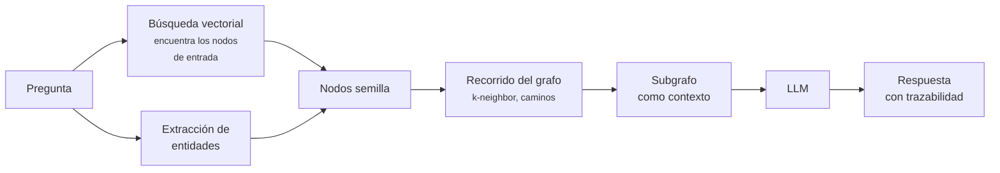

# HugeGraph con IA

Sobre [Apache HugeGraph](apache_hugegraph.md) se construye **hugegraph-ai**, el subproyecto que
conecta la base de datos de grafos con [LLMs](../10_LLM/introduccion.md). Su componente principal
se publica en PyPI como **`hugegraph-llm`**.

La idea que persigue es **GraphRAG**: combinar la recuperación vectorial clásica con el recorrido
del grafo, para responder preguntas que ninguna de las dos técnicas resuelve por separado.

## Por qué GraphRAG

El [RAG clásico](../10_LLM/RAGS/chatbot_rag_con_langchain.md) recupera fragmentos de texto por
similitud semántica. Funciona bien para preguntas cuya respuesta está **contenida en un
fragmento**:

> *"¿Cuál es la política de devoluciones?"*

Falla cuando la respuesta exige **conectar hechos dispersos**:

> *"¿Qué proveedores de los componentes del producto X se ven afectados por la nueva regulación
> del país Y?"*

Ningún chunk contiene esa respuesta. Está repartida entre el despiece del producto, la ficha de
cada proveedor y el texto de la regulación. La similitud vectorial recupera fragmentos
*parecidos* a la pregunta, no la *cadena de hechos* que la responde. Es la crítica que ya recoge
[De RAGs a LLM-Wiki](../10_LLM/RAGS/de_rags_a_llm_wiki.md).

Un grafo sí puede recorrer esa cadena. GraphRAG combina ambos:



El paso clave es el del medio: **la búsqueda vectorial solo sirve para encontrar por dónde
empezar**; el grafo aporta las relaciones. Y como el contexto es un subgrafo con aristas
etiquetadas, la respuesta es **auditable**: se puede mostrar el camino que la sustenta, cosa que
un montón de chunks no permite.

## Qué incluye hugegraph-llm

```bash
pip install hugegraph-llm
```

El subproyecto agrupa varias capacidades:

| Capacidad | Qué hace |
|---|---|
| **Construcción de KG desde texto** | Un LLM extrae entidades y relaciones de documentos y las inserta como vértices y aristas |
| **GraphRAG** | El flujo de la figura: vectorial + recorrido + generación |
| **Text2Gremlin** | Traduce preguntas en lenguaje natural a consultas [Gremlin](gremlin.md) |
| **Integraciones** | LangChain, LlamaIndex y otros frameworks |

### Construcción del grafo desde texto

Es el paso que más trabajo ahorra. Construir un knowledge graph a mano —el proceso descrito en
[Creación de Knowledge Graphs](creacion_de_knowledge_graphs.md)— es lento y caro. Un LLM puede
proponer las tripletas a partir del texto:

```text
Texto:  "Marko, de 29 años, desarrolló el componente lop junto con Josh."

Extracción propuesta:
  (marko:persona {edad: 29}) -[:creo]-> (lop:software)
  (josh:persona)             -[:creo]-> (lop:software)
  (marko:persona)            -[:conoce]-> (josh:persona)
```

Aquí es donde el [esquema fuerte de HugeGraph](apache_hugegraph.md#esquema-fuerte) resulta una
ventaja inesperada: **la base de datos rechaza lo que no encaja en el modelo**. Si el LLM inventa
una propiedad o un tipo de relación que no existe, la inserción falla en vez de contaminar el
grafo en silencio. El esquema actúa como validación de la salida del modelo.

### Text2Gremlin

Traducir lenguaje natural a consultas de grafo tiene una propiedad valiosa frente a la generación
libre de respuestas: **la consulta es inspeccionable**. Se puede mostrar al usuario, revisar y
ejecutar de forma determinista. Si está mal, se ve; si el LLM alucina en una respuesta en prosa,
no.

Es el mismo argumento que sostiene los [servidores MCP con KGs](servidores_mcp_con_kgs.md).

## Encaje con el resto del curso

GraphRAG no sustituye a la búsqueda vectorial: **la usa como primer paso**. En una arquitectura
completa conviven las dos piezas:

- [Docling](../10_LLM/DOCUMENTOS/docling.md) convierte los documentos preservando su estructura.
- Una [base vectorial](../00_DATA/databases/milvus.md) indexa los fragmentos y localiza los nodos
  de entrada.
- HugeGraph guarda las entidades y sus relaciones, y recorre la cadena de hechos.
- El LLM redacta la respuesta con ese subgrafo como contexto.

Ver [Recomendadores basados en KG](../09_SYSTEMS/REC_SYSTEM/introduccion_recomendadores_con_kg.md)
para otro uso del mismo tipo de estructura.

## Consideraciones antes de adoptarlo

- **La extracción con LLM no es fiable sin revisión.** Los modelos inventan relaciones plausibles.
  Para un grafo que va a sustentar decisiones hace falta validación humana, o al menos un esquema
  restrictivo y métricas de calidad sobre lo insertado.
- **La resolución de entidades es el problema difícil.** Decidir que "Marko", "M. Rodriguez" y
  "marko@empresa.com" son la misma persona no lo resuelve el LLM de forma fiable. Es el mismo
  reto de desambiguación descrito en
  [Definiciones de Knowledge Graph](definiciones_knowledge_graph.md#crear-un-knowledge-graph-propio).
- **`hugegraph-llm` es joven.** Está en la versión 1.3.0 y evoluciona rápido; conviene fijar la
  versión y revisar los cambios entre releases.
- **GraphRAG cuesta más que RAG.** Hay que construir y mantener el grafo, además del índice
  vectorial. Solo compensa si las preguntas realmente exigen encadenar hechos; si no, el RAG
  clásico es más simple y más barato.

## Ver también

- [Apache HugeGraph](apache_hugegraph.md) — la base de datos.
- [Servidores MCP con KGs](servidores_mcp_con_kgs.md)
- [Docling](../10_LLM/DOCUMENTOS/docling.md) · [Milvus](../00_DATA/databases/milvus.md)
- [De RAGs a LLM-Wiki](../10_LLM/RAGS/de_rags_a_llm_wiki.md)

## Referencias

- [apache/incubator-hugegraph-ai](https://github.com/apache/incubator-hugegraph-ai)
- [hugegraph-llm en PyPI](https://pypi.org/project/hugegraph-llm/)
- [Documentación de HugeGraph](https://hugegraph.apache.org/docs/)
