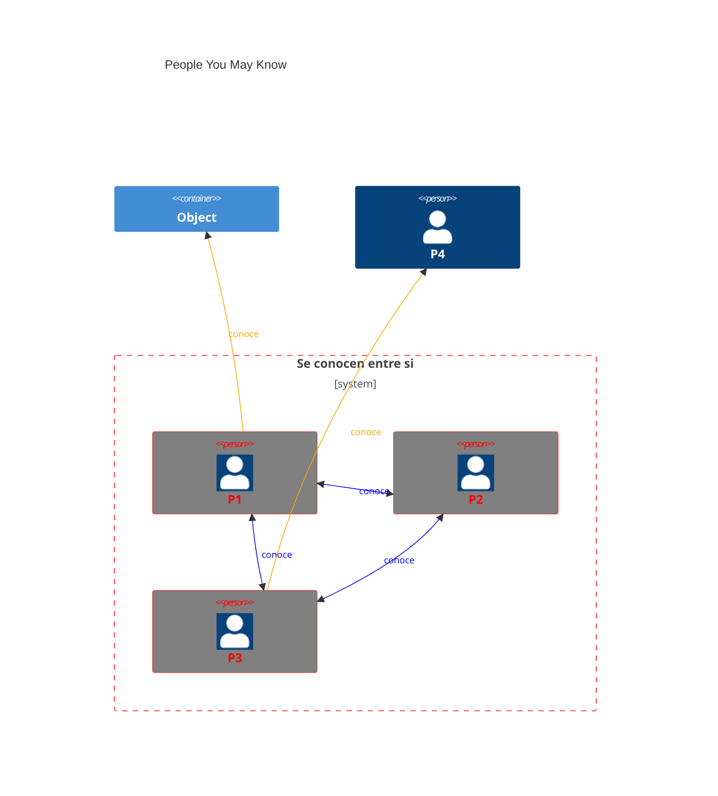

# PYMK — People You May Know

**People You May Know** es una lista de usuarios o entidades con los que podrías querer
conectar, basada en cosas que tienen en común contigo: un amigo mutuo, la escuela o el lugar de
trabajo.

### 1. Formulación del problema

Recomendar una lista de usuarios o entidades con los que podrías querer conectar. En cualquier
sistema recomendador de ML conviene responder antes estas preguntas:

* **Preguntas de clarificación**
  * ¿Cuál es el objetivo de negocio principal del sistema?
  * ¿Cuál es el caso de uso principal?
  * ¿Hay factores específicos que deban considerarse en las recomendaciones?
  * ¿Las amistades o conexiones son simétricas?
  * ¿Cuál es la escala del sistema? (usuarios, conexiones)
  * ¿Podemos asumir que el grafo social no es muy dinámico?
  * ¿Necesitamos entrenamiento continuo?
  * ¿Cómo recolectamos las muestras negativas? (no clicadas, feedback negativo)
  * ¿Qué tan rápido tiene que ser el sistema?
  * ¿Hace falta personalización? Sí.

### Caso de uso y objetivo de negocio

* **Caso de uso**: recomendar una lista de usuarios con los que conectar en una app social
  (Facebook, LinkedIn).
* **Objetivo de negocio**: maximizar el número de conexiones formadas.

* **Requisitos**
    * Escalabilidad: 1 000 M de usuarios en total, con una media de 10 000 conexiones por
      usuario.

* **Restricciones**
    * Privacidad y cumplimiento de la normativa de protección de datos.

* **Supuestos**
    * Amistades simétricas.

* **Formulación como problema de ML**
    * Objetivo: maximizar el número de conexiones formadas.
    * Entrada/salida: entrada `user_id`; salida, lista ordenada de usuarios recomendados por
      relevancia.
    * Categoría de ML — dos opciones:
      * **Problema de ranking**
        * *Pointwise learning to rank*: clasificador binario `(user_i, user_j) -> p(conexión)`.
        * Inconveniente: no captura la estructura social.
      * **Representación de grafo** (predicción de aristas)
        * Complementa con información del grafo (nodos, aristas).
        * Entrada: el grafo social; se predice la arista entre nodos.

### 2. Métricas

* **Offline**
  * Modelo GNN: clasificación binaria → ROC-AUC.
  * Sistema de recomendación: relaciones binarias → mAP.

* **Online**
  * Número de solicitudes de amistad enviadas en un periodo X.
  * Número de solicitudes de amistad aceptadas en un periodo X.

### 3. Componentes arquitectónicos

* Arquitectura de alto nivel
  * Predicciones a nivel de nodo.
  * Predicciones a nivel de arista.

### 4. Recolección y preparación de datos

* **Fuentes de datos**
  * Usuarios
    * Demografía, formación académica y experiencia laboral, habilidades, etc.
    * Nota: datos estandarizados (por ejemplo, *cs* / *computer science*).
  * Conexiones usuario-usuario.
  * Interacciones usuario-usuario.

* **Etiquetado**

### 5. Ingeniería de features

* **Selección de features**

  * **Usuario**
    * ID, nombre de usuario.
    * Demografía (edad, género, ubicación).
    * Información de cuenta y red: número de conexiones, seguidores, seguidos, solicitudes,
      antigüedad de la cuenta.
    * Historial de interacción (número de *likes*, compartidos, comentarios).
    * Contexto (dispositivo, hora del día, etc.).

  * **Conexiones usuario-usuario**
    * Conexión: IDs (`user1`, `user2`), tipo de conexión, timestamp, ubicación.
    * Afinidad académica y laboral: similitud de carrera, empresas en común, similitud de
      sector, etc.
    * Afinidad social: número de conexiones mutuas (descontado por tiempo).
  * **Interacciones usuario-usuario**
    * IDs (`user1`, `user2`), tipo de interacción, timestamp.

### 6. Desarrollo del modelo y evaluación offline

* **Selección del modelo**
  * Elegimos una [GNN](../REC_SYSTEM/gnn_y_transformers.md)
    * Opera sobre datos de grafo.
    * Predice la probabilidad de una arista.
    * Entrada: el grafo (features de nodo y de arista).
    * Salida: el *embedding* de cada nodo.
    * Se usan las similitudes entre embeddings de nodos para predecir aristas.

* **Entrenamiento**
  * Instantánea del grafo $G$ en el instante $t$; el modelo predice las conexiones en $t+1$.
  * **Dataset**
    * Crear una instantánea en el instante $t$.
    * Calcular features de nodo y de arista.
    * Crear las etiquetas usando la instantánea en $t+1$ (si se formó la conexión, positivo).
  * Evaluación del modelo y ajuste de hiperparámetros.
  * Iteraciones.

### 7. Servicio de predicción

* **Pipeline de predicción**
  * **Generación de candidatos**
    * *Friends of Friends* (FoF), basado en reglas: de 1 000 M a 1 000 × 1 000 = 1 M de
      candidatos → servicio FoF.
  * **Servicio de scoring** (modelo GNN → embeddings → puntuaciones de similitud).
  * Ordenar por puntuación.
* Precalcular tablas PYMK para cada usuario activo y almacenarlas en base de datos.
* Reordenar según la lógica de negocio.

### 8. Pruebas online y despliegue

* Test A/B.
* Despliegue y publicación.

### 9. Escalado, monitoreo y actualizaciones

* Escalado (sistemas de software y de ML).
* Monitoreo.
* Actualizaciones.

### 10. Otros temas

* Añadir un *ranker* ligero.
* Problema de sesgo.
* Problema de feedback diferido (el usuario acepta días después).
* *Random walk* personalizado (como línea base).

## El caso de LinkedIn

1. **Conexiones existentes**: el algoritmo analiza tus conexiones actuales y **sugiere personas
   que tienen conexiones en común contigo**.
2. **Historial laboral y académico**: LinkedIn tiene en cuenta tu trayectoria. Puede sugerir
   personas que trabajaron en las mismas empresas o estudiaron en las mismas instituciones.
3. **Habilidades y experiencia**: se consideran las habilidades y experiencias profesionales de
   tu perfil. LinkedIn puede sugerir personas con habilidades similares o experiencias
   relacionadas.
4. **Grupos y eventos**: la participación en grupos y eventos de LinkedIn influye en las
   sugerencias. Si perteneces a los mismos grupos o has asistido a eventos similares, se
   pueden sugerir conexiones por intereses compartidos.
5. **Ubicación**: la localización geográfica también es un factor. LinkedIn puede sugerir
   conexiones que trabajan en la misma zona o sector.
6. **Conexiones mutuas**: si varias de tus conexiones ya están conectadas con una persona
   concreta, es más probable que esa persona aparezca en tus sugerencias.
7. **Interacciones previas**: las interacciones pasadas en la plataforma —visitas a perfiles o
   mensajes— también influyen en las sugerencias.

## Ver también

- [Recomendadores basados en KG](../REC_SYSTEM/introduccion_recomendadores_con_kg.md)
- [Proyectos generales de ML](../proyectos_generales_de_ml.md)
