# General Machine Learning Projects

## Machine Learning life cycle

```mermaid
flowchart LR
    subgraph "Complete ML Lifecycle"
        direction LR
        
        subgraph "Preparation"
            A1[Data<br>📊] --> A2[Preprocess<br>🔧] --> A3[Dataset<br>📁]
        end
        
        subgraph "Development"
            B1[Train<br>🧠] --> B2[Deploy<br>🚀]
        end
        
        subgraph "Production"
            C1[Predict<br>🔮] --> C2[Monitor<br>📈]
        end
        
        subgraph "Maintenance"
            D1[Maintain<br>🛠️]
        end
        
        A3 --> B1
        B2 --> C1
        C2 --> D1
        D1 -->|Retrain| B1
        C2 -->|Feedback| A1
    end
    
    style A1 fill:#e6f3ff
    style A2 fill:#e6f3ff
    style A3 fill:#e6f3ff
    style B1 fill:#e6ffe6
    style B2 fill:#e6ffe6
    style C1 fill:#fff0e6
    style C2 fill:#fff0e6
    style D1 fill:#ffe6e6
```

Machine Learning projects needs in general the next steps:

1. Data Collection
2. Data Pre-processing
3. Building Datasets
4. Model Training Online/Offline
5. Model Deployment
6. Prediction
7. Monitoring Models
8. Maintenance, Diagnosis, and Retraining

In order to achieve all these steps we need enough tools in our stack, we will incorporate 
enough tools to achieve.

In many large business or startups we deploy machine learning projects going through the next stages:

1. Machine learning frameworks
    - Open AI
    - Tensorflow
    - **Pytorch**
    - SageMaker
    - GridAI
2. Distributed compute
    - Dask
    - **Spark**
    - Databricks
3. Model evaluation and experiment tracking
    - **MLFlow**
    - neptune.ai
    - Comet
4. Model deployment
    - OctoML
    - **BentoML**
5. Model monitoring and management
    - Fidler
    - Cortex
6. End-to-end platform solutions
    - nvidia
    - databricks
    - SageMaker

## Big Data Stacks

- SMACK
- Hadoop Ecosystem
- ELK Stack
- Flink Stack
- Lambda Architecture
- Microsoft Azure Stack

## SMACK
- Spark
- Mesos
- Akka
- Cassandra
- Kafka

Spark: Apache Spark is an in-memory data processing framework that facilitates distributed processing and analysis of large data sets efficiently.

Mesos: Apache Mesos is a cluster management system that enables efficient resource allocation between applications and services in a distributed environment.

Akka: Akka is a toolkit and runtime for building concurrent and distributed systems based on the actor model, which are independent processing units that communicate with each other.

Cassandra: Apache Cassandra is a highly scalable and fault-tolerant distributed database used to manage large volumes of data distributed across multiple nodes.

Kafka: Apache Kafka is a distributed event streaming platform that facilitates real-time data ingestion and processing through event streams.

## Review of Projects Big Data + ML + Data Mining

- Geolocation Analysis for Transportation Applications
    - Proximity Service
    - Nearby Friends
- Visual Search System
- Google Street View Blurring System
- Youtube Video Search
- Harmful Content Detection
- Video Recommendation System
- Event Recommendation System
- Ad Click Prediction on Social Platforms
- Similar Listings on Vacation Rental Platforms
- Personalized News Feed
- People You May Know