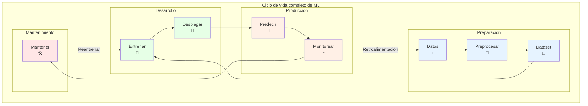
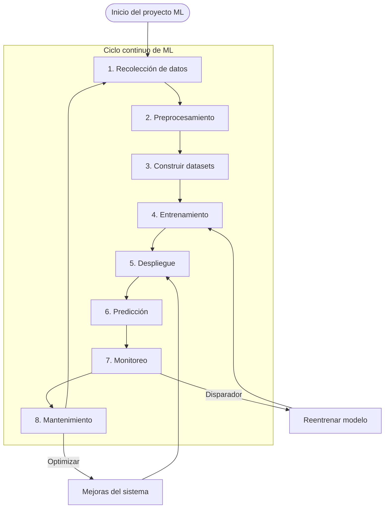

# Proyectos Generales de Machine Learning

## Ciclo de vida del machine learning

En general, los proyectos de machine learning requieren los siguientes pasos:

1. Recolección de datos
2. Preprocesamiento
3. Construcción de datasets
4. Entrenamiento del modelo (online / offline)
5. Despliegue del modelo — ver [ONNX](../04_WORKFLOWS/onnx.md) y
   [ONNX Runtime](../04_WORKFLOWS/onnx_runtime.md)
6. Predicción
7. Monitoreo de modelos
8. Mantenimiento, diagnóstico y reentrenamiento

Para cubrir todos estos pasos necesitamos herramientas suficientes en nuestro stack.

En muchas grandes empresas y startups, los proyectos de machine learning se despliegan atravesando las siguientes etapas:

1. Frameworks de machine learning
    - Open AI
    - Tensorflow
    - **Pytorch**
    - SageMaker
    - GridAI
2. Cómputo distribuido
    - Dask
    - **Spark**
    - Databricks
3. Evaluación de modelos y seguimiento de experimentos
    - **MLFlow**
    - neptune.ai
    - Comet
4. Despliegue de modelos
    - OctoML
    - **BentoML**
5. Monitoreo y gestión de modelos
    - Fidler
    - Cortex
6. Plataformas integrales (*end-to-end*)
    - nvidia
    - databricks
    - SageMaker

## Stacks de Big Data

- SMACK
- Hadoop Ecosystem
- ELK Stack
- Flink Stack
- Lambda Architecture
- Microsoft Azure Stack

## SMACK
- Spark
- Mesos
- Akka
- Cassandra
- Kafka

**Spark**: framework de procesamiento de datos en memoria que facilita el procesamiento distribuido y el análisis eficiente de grandes volúmenes de datos.

**Mesos**: sistema de gestión de clústeres que permite asignar recursos de forma eficiente entre aplicaciones y servicios en un entorno distribuido.

**Akka**: toolkit y entorno de ejecución para construir sistemas concurrentes y distribuidos basados en el modelo de actores, unidades de procesamiento independientes que se comunican entre sí.

**Cassandra**: base de datos distribuida, altamente escalable y tolerante a fallos, usada para gestionar grandes volúmenes de datos repartidos entre múltiples nodos.

**Kafka**: plataforma distribuida de streaming de eventos que facilita la ingesta y el procesamiento de datos en tiempo real mediante flujos de eventos.

## Revisión de proyectos: Big Data + ML + Minería de datos

- Análisis de geolocalización para aplicaciones de transporte
    - Servicio de proximidad
    - Amigos cercanos
- Sistema de búsqueda visual
- Sistema de difuminado de Google Street View
- Búsqueda de video en YouTube
- Detección de contenido dañino
- Sistema de recomendación de video
- Sistema de recomendación de eventos
- Predicción de clics en anuncios en plataformas sociales
- Anuncios similares en plataformas de alquiler vacacional
- Feed de noticias personalizado
- [People You May Know](PYMK/pymk.md)