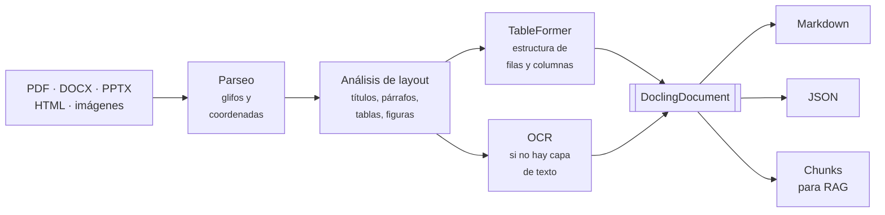

# Docling

**Docling** convierte documentos —PDF, DOCX, PPTX, XLSX, HTML, imágenes— en una representación
estructurada apta para alimentar [LLMs](../introduccion.md) y sistemas
[RAG](../RAGS/chatbot_rag_con_langchain.md).

Es un proyecto de IBM Research, de código abierto con licencia MIT, donado a la Linux Foundation
(LF AI & Data).

## El problema

Todo pipeline RAG empieza igual: hay que convertir documentos a texto. Y ahí es donde se pierde
la mayor parte de la calidad, mucho antes de llegar al modelo.

Un PDF **no contiene texto en orden de lectura**. Contiene instrucciones de dibujo: pon este
glifo en esta coordenada. La estructura —qué es un título, qué celda pertenece a qué columna, en
qué orden se lee— no está almacenada: hay que **inferirla de la disposición visual**.

Las librerías clásicas de extracción no lo intentan. Volcán los caracteres en el orden en que
aparecen en el archivo y el resultado es plano.

### El contraste, sobre un documento real

Partimos de un PDF con un título, tres encabezados, párrafos y una tabla financiera de cuatro
columnas.

**Extracción clásica con `pypdf`:**

```text
Resultados por trimestre
 Trimestre
Ingresos
Coste
Margen
Q1 2026
1,250,000
890,000
28.8%
Q2 2026
1,410,000
930,000
34.0%
```

La tabla se ha convertido en una lista vertical de valores sueltos. **Es irrecuperable**: no hay
forma de saber que `890,000` es el coste del primer trimestre. Si eso entra en un *chunk* y se
vectoriza, el modelo recibirá números sin significado y responderá cualquier cosa.

**El mismo PDF con Docling:**

```markdown
## Informe Financiero 2026

## Resumen ejecutivo

El ejercicio 2026 muestra una recuperacion del margen en el segundo trimestre, seguida de
una contraccion en el tercero atribuible al aumento de costes logisticos.

## Resultados por trimestre

| Trimestre   |   Ingresos |   Coste | Margen   |
|-------------|------------|---------|----------|
| Q1 2026     |  1,250,000 | 890,000 | 28.8%    |
| Q2 2026     |  1,410,000 | 930,000 | 34.0%    |
| Q3 2026     |  1,180,000 | 870,000 | 26.3%    |
```

La tabla está **reconstruida celda por celda**, y los encabezados son encabezados. Esa diferencia
se propaga a todo lo que venga después: el *chunking*, los *embeddings* y la calidad de las
respuestas.

## Cómo funciona

Docling no interpreta el PDF: lo **analiza como si fuera una imagen**, con modelos de visión.



Las dos piezas que hacen el trabajo pesado:

- **Modelo de layout** — detecta y clasifica las regiones de cada página: título, encabezado de
  sección, párrafo, tabla, figura, pie de página. De aquí sale el orden de lectura.
- **TableFormer** — reconstruye la estructura interna de las tablas, incluidas las que no tienen
  líneas de separación o llevan celdas combinadas.

El **OCR** solo entra cuando no hay capa de texto —documentos escaneados—. Hay varios motores
soportados: RapidOCR, EasyOCR, Tesseract.

## DoclingDocument

Todo converge en un objeto único, independiente del formato de origen:

```python
from docling.document_converter import DocumentConverter

resultado = DocumentConverter().convert("informe.pdf")
doc = resultado.document

print(len(doc.texts), len(doc.tables), len(doc.pictures))     # 6 1 0

for t in doc.texts[:4]:
    print(t.label, repr(t.text[:50]))
```

```text
section_header 'Informe Financiero 2026'
section_header 'Resumen ejecutivo'
text           'El ejercicio 2026 muestra una recuperacion del marge'
section_header 'Resultados por trimestre'
```

Cada elemento lleva su **etiqueta semántica** (`section_header`, `text`, `table`, `picture`,
`caption`, `list_item`), su posición en la página y su lugar en la jerarquía del documento.

Las tablas se pueden extraer directamente como datos:

```python
doc.tables[0].export_to_dataframe()
```

```text
Trimestre  Ingresos   Coste Margen
  Q1 2026 1,250,000 890,000  28.8%
  Q2 2026 1,410,000 930,000  34.0%
  Q3 2026 1,180,000 870,000  26.3%
```

Y exportar a varios formatos:

```python
doc.export_to_markdown()
doc.export_to_dict()          # JSON con toda la estructura y las coordenadas
doc.export_to_html()
```

## Formatos de entrada

Docling acepta más de treinta formatos. Los relevantes en la práctica:

| Categoría | Formatos |
|---|---|
| Documentos | `pdf`, `docx`, `doc`, `odt`, `epub`, `latex` |
| Presentaciones | `pptx`, `ppt`, `odp` |
| Hojas de cálculo | `xlsx`, `xls`, `ods`, `csv` |
| Web y marcado | `html`, `md`, `asciidoc`, `xml_jats`, `xml_uspto` |
| Imágenes | `image` (con OCR) |
| Otros | `email`, `audio`, `video`, `vtt` |

Que todos desemboquen en el mismo `DoclingDocument` es lo que permite escribir **un solo pipeline
de ingesta** en lugar de uno por tipo de archivo.

## Uso básico

```bash
pip install docling
```

```python
from docling.document_converter import DocumentConverter

conv = DocumentConverter()
res = conv.convert("informe.pdf")           # tambien acepta una URL

print(res.status)                           # success
print(res.document.export_to_markdown())
```

O desde la línea de comandos:

```bash
docling informe.pdf                 # genera informe.md
docling --to json informe.pdf
```

!!! note "La primera ejecución descarga modelos"
    Docling baja los modelos de layout y de tablas desde Hugging Face la primera vez. En el
    ejemplo de esta página, la conversión completa —incluida la carga de modelos— tardó **38 s**
    en CPU para un documento de una página. Las siguientes son mucho más rápidas, pero **no es
    una librería ligera**: hace inferencia de visión por cada página.

## Ver también

- [Docling en la práctica](docling_en_practica.md) — chunking, RAG e integraciones.
- [Chatbot RAG con LangChain](../RAGS/chatbot_rag_con_langchain.md)
- [De RAGs a LLM-Wiki](../RAGS/de_rags_a_llm_wiki.md) — la crítica al *chunking* ciego.

## Referencias

- [Documentación de Docling](https://docling-project.github.io/docling/)
- [docling-project/docling](https://github.com/docling-project/docling)
- Auer, C. et al. [*Docling Technical Report*](https://arxiv.org/abs/2408.09869) (2024).
- Livathinos, N. et al. [*Docling: An Efficient Open-Source Toolkit for AI-driven Document
  Conversion*](https://arxiv.org/abs/2501.17887) (2025).
