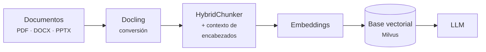

# Docling en la Práctica

La conversión está en [Docling](docling.md). Esta página cubre lo que viene después: partir el
documento en *chunks* útiles, integrarlo en un pipeline RAG, y qué esperar cuando el documento no
es tan limpio como el del ejemplo.

## Chunking consciente de la estructura

Aquí es donde el trabajo de conversión rinde de verdad. El *chunking* habitual parte el texto
cada N caracteres, lo que corta tablas por la mitad y separa un párrafo de su encabezado.

Docling incluye *chunkers* que respetan la jerarquía del documento:

```python
from docling.document_converter import DocumentConverter
from docling_core.transforms.chunker.hybrid_chunker import HybridChunker

doc = DocumentConverter().convert("informe.pdf").document
chunks = list(HybridChunker(max_tokens=64).chunk(doc))
```

Sobre el informe financiero del ejemplo salen **5 chunks**, y cada uno conserva su contexto:

```text
[0] headings='Metodologia'
     'Las cifras proceden del sistema contable consolidado y no han sido auditadas.'
[1] headings='Resumen ejecutivo'
     'El ejercicio 2026 muestra una recuperacion del margen en el segundo trimestre...'
[2] headings='Resumen ejecutivo'
     'La tendencia general se mantiene positiva.'
[3] headings='Resultados por trimestre'
     'Q1 2026, Ingresos = 1,250,000. Q1 2026, Coste = 890,000. Q1 2026, Margen = 28.8%...'
[4] headings='Resultados por trimestre'
     '930,000. Q2 2026, Margen = 34.0%. Q3 2026, Ingresos = 1,180,000...'
```

Dos cosas merecen atención.

**Cada chunk sabe bajo qué encabezados vive.** El `meta.headings` es la ruta jerárquica. Un chunk
que dice *"La tendencia general se mantiene positiva"* es inútil aislado; sabiendo que cuelga de
*"Resumen ejecutivo"* del *"Informe Financiero 2026"*, ya es recuperable. Conviene anteponer esa
ruta al texto antes de vectorizar:

```python
for c in chunks:
    contexto = " > ".join(c.meta.headings or [])
    texto_para_embedding = f"{contexto}\n\n{c.text}"
```

**La tabla se serializa como afirmaciones legibles**, no como una rejilla de números:

```text
Q1 2026, Ingresos = 1,250,000. Q1 2026, Coste = 890,000. Q1 2026, Margen = 28.8%.
```

Esto importa mucho más de lo que parece. Un embedding de `| Q1 2026 | 1,250,000 | 890,000 |` no
se parece a la pregunta *"¿cuál fue el coste del primer trimestre?"*. Un embedding de
`Q1 2026, Coste = 890,000` sí. **La tabla pasa de ser ruido a ser contenido recuperable.**

El `HybridChunker` además es consciente del **tokenizador**: respeta `max_tokens` del modelo de
embeddings, en vez de contar caracteres a ojo.

## En un pipeline RAG

Docling ocupa el primer tramo del pipeline descrito en
[Chatbot RAG con LangChain](../RAGS/chatbot_rag_con_langchain.md):



Un ejemplo de ingesta completo, apoyado en [Milvus](../../00_DATA/databases/milvus.md):

```python
from docling.document_converter import DocumentConverter
from docling_core.transforms.chunker.hybrid_chunker import HybridChunker
from pymilvus import MilvusClient

conv = DocumentConverter()
chunker = HybridChunker(max_tokens=512)
cli = MilvusClient("documentos.db")

filas, idx = [], 0
for ruta in ["informe.pdf", "manual.docx", "presentacion.pptx"]:
    doc = conv.convert(ruta).document
    for c in chunker.chunk(doc):
        contexto = " > ".join(c.meta.headings or [])
        filas.append({
            "id": idx,
            "vector": embed(f"{contexto}\n\n{c.text}"),   # tu modelo de embeddings
            "texto": c.text,
            "contexto": contexto,
            "documento": ruta,
        })
        idx += 1

cli.insert("documentos", filas)
```

Guardar `documento` y `contexto` como campos escalares permite además **filtrar** en la búsqueda
—solo este manual, solo esta sección— usando el
[filtrado durante el recorrido del índice](../../00_DATA/databases/busqueda_por_similitud.md).

### Integraciones

Docling tiene conectores para [LangChain](../RAGS/langchain.md), LlamaIndex, Haystack y Crew AI,
así que en esos frameworks se enchufa como un cargador de documentos más, sin escribir el bucle a
mano.

## Limitaciones observadas

Docling es un modelo de visión haciendo inferencia, no un parser determinista. Eso tiene
consecuencias que conviene conocer antes de confiar en él a ciegas.

### El orden de lectura puede salir mal

En el documento de ejemplo —un PDF de una sola página, generado programáticamente y con una
estructura sencilla— Docling colocó la sección **"Metodología" en primer lugar**, antes del propio
título del informe:

```text
0: ## Metodologia
4: ## Informe Financiero 2026
6: ## Resumen ejecutivo
10: ## Resultados por trimestre
```

El contenido está completo y la tabla es perfecta, pero **el orden no es el del documento
original**. El resultado se reprodujo entre ejecuciones, así que no es aleatorio: es el modelo de
layout equivocándose al ordenar las regiones.

Para RAG suele ser tolerable, porque cada *chunk* se recupera por separado y conserva su
encabezado. Para tareas que dependan de la secuencia —resumir un contrato cláusula por cláusula,
seguir un procedimiento paso a paso— **hay que verificarlo**.

### Es costoso

La conversión del ejemplo tardó **38 s en CPU** para **una página**, incluida la carga inicial de
modelos. Procesar miles de documentos requiere GPU, paralelismo —ver [Ray](../../04_WORKFLOWS/ray.md)—
o ambos. No es una operación que se haga en caliente dentro de una petición de usuario: es un
**proceso de ingesta por lotes**.

### Otras consideraciones

- **El OCR es el eslabón débil.** Sobre escaneos de mala calidad, los errores de OCR se propagan
  a todo lo demás. Merece la pena medir la tasa de error antes de industrializar.
- **Las tablas complejas siguen siendo difíciles**: celdas combinadas, tablas que cruzan páginas,
  encabezados de varios niveles.
- **Los modelos se descargan de Hugging Face** en la primera ejecución. En entornos sin salida a
  internet hay que precargarlos y fijar la caché.
- **Sin capa de texto no hay atajo**: un PDF escaneado obliga a pasar por OCR, con su coste y su
  error.

## Cuándo usarlo

Compensa cuando:

- Los documentos tienen **estructura que importa**: tablas, secciones, jerarquía.
- La entrada es **heterogénea** —PDF, Word, PowerPoint— y quieres un solo pipeline.
- La calidad de las respuestas del RAG está limitada por la **ingesta**, no por el modelo. Es más
  frecuente de lo que se admite: se cambia de LLM buscando mejoras que estaban perdidas en el
  primer paso.

No compensa cuando:

- Los documentos ya son **texto plano o Markdown limpio**. Convertirlos no aporta nada.
- El volumen es enorme y la estructura irrelevante; ahí una extracción rápida sale más a cuenta.
- Necesitas conversión **en tiempo real** dentro de una petición.

## Ver también

- [Docling](docling.md) — conversión y `DoclingDocument`.
- [Chatbot RAG con LangChain](../RAGS/chatbot_rag_con_langchain.md)
- [Búsqueda por similitud](../../00_DATA/databases/busqueda_por_similitud.md) ·
  [Milvus](../../00_DATA/databases/milvus.md)
- [De RAGs a LLM-Wiki](../RAGS/de_rags_a_llm_wiki.md)

## Referencias

- [Documentación de Docling](https://docling-project.github.io/docling/)
- [docling-project/docling](https://github.com/docling-project/docling)
