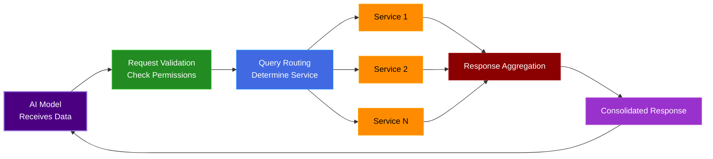

# Model Control Protocol

In november of 2024 Anthropic introduce MCP [https://www.anthropic.com/news/model-context-protocol](https://www.anthropic.com/news/model-context-protocol) which now is an standard.

You can find it in [https://github.com/modelcontextprotocol](https://github.com/modelcontextprotocol)


## Protocols

A **protocol** is a set of **rules and conventions** that define how systems communicate and exchange data. Unlike an **API**, an **implementation specific interface**, a protocol establishes a universal standard for interactions.

- **HTTP (Hypertext Transfer Protocol)**: Defines how web browsers and servers communicate.
- **OAuth (Open Authorization Protocol)**: A standard for secure authentication across different platforms.

Protocols ensure interoperability instead of every system reinventing how data should be exchanged, a protocol standardizes the process, reducing complexity and making integrations more scalable.


## Model Context Protocol (MCP)

Model Context Protocol (MCP) is an open standard developed by Anthropic to streamline how AI models access and interact with external data sources.

Instead of requiring AI systems to rely on custom API integrations, manually structured requests, and authentication per service, MCP provides a unified framework for AI agents to retrieve, process, and act on structured data in a standardized way.

MCP defines how AI models should request and consume external data whether from databases, APIs, cloud storage, or enterprise applications without needing developers to hardcode API-specific logic for each source.


## MCP’s Client-Server Architecture

MCP is built on a client-server model that structures how AI models retrieve and interact with external data sources.

MCP clients are AI agents, applications, or any system that requests structured data.
MCP servers act as intermediaries, fetching data from various APIs, databases, or enterprise systems and returning it in a consistent format.

Instead of AI models making direct API requests, MCP servers handle the complexity of authentication, data retrieval, and response normalization. This means AI agents no longer need to manage multiple API credentials, different request formats, or inconsistent response structures.

For example, if an AI model needs to pull information from multiple services like Google Drive, Slack, and a database, it does not query each API separately. It sends a single structured request to an MCP server, which processes the request, gathers data from the necessary sources, and returns a well-organized response.

## MCP Request/Response Lifecycle

A typical MCP interaction follows a structured request/response cycle that eliminates redundant API calls and standardizes data retrieval.

1. The AI agent sends a structured request to the MCP server. Instead of crafting individual API requests, the agent defines what data it needs in a uniform format.

    ```json
    {
    "request_id": "xyz-123",
    "queries": [
        {
        "source": "github",
        "action": "get_recent_commits",
        "repo": "company/project"
        },
        {
        "source": "slack",
        "action": "fetch_unread_messages",
        "channel": "social"
        }
    ]
    }
    ‍```

2. The MCP server processes the request by validating authentication, checking permissions, and determining which external systems to query.


3. Queries are executed in parallel, meaning data from multiple services is retrieved at the same time rather than sequentially, reducing overall latency, same idea to GraphQL approach or asynchronous process to fetch data through batches.


4. Responses from different sources are standardized into a structured format that AI models can easily process.

    ```json
    {
    "github": {
        "recent_commits": [
        {
            "author": "Carlos",
            "message": "Refactored AI pipeline",
            "timestamp": "2025-07-20T10:00:00Z"
        }
        ]
    },
    "slack": {
        "unread_messages": [
        {
            "user": "Carlos",
            "text": "Hey, can you review the PR?",
            "timestamp": "2025-07-20T10:00:00Z"
        }
        ]
    }
    }
    ```


Unlike raw API responses that require manual parsing, MCP ensures that all retrieved data follows a predictable, structured format, making it easier for AI models to understand and utilize.


## Query Execution and Response Aggregation

MCP is designed to optimize how AI models interact with external systems by introducing a structured execution process.




## Limitations of MCP

Model Context Protocol (MCP) is an important step toward making AI models more capable of interacting with external systems in a structured and scalable way. 

- Authentication Challenges
- Unclear Identity Management


MCP simplifies AI interactions, but authentication and structured API access remain key challenges.