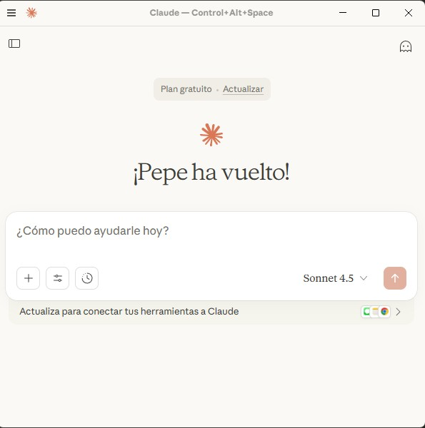
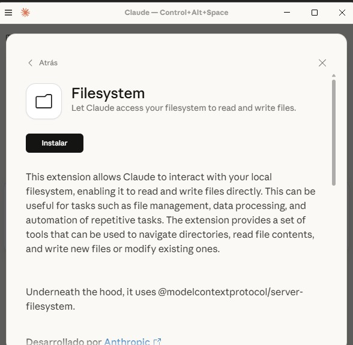
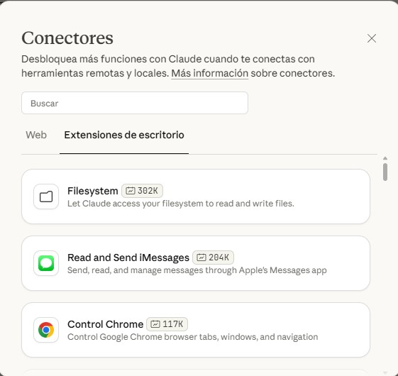
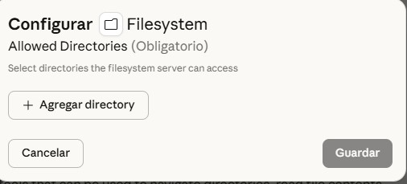
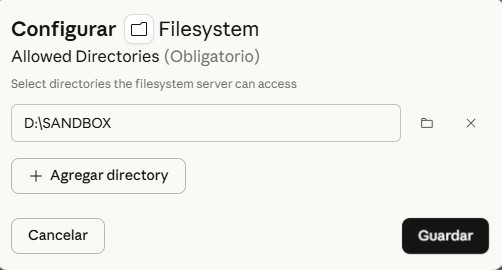
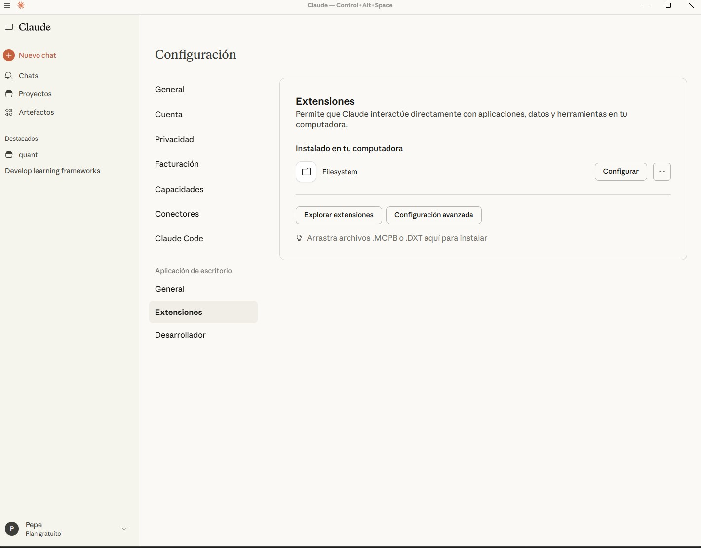
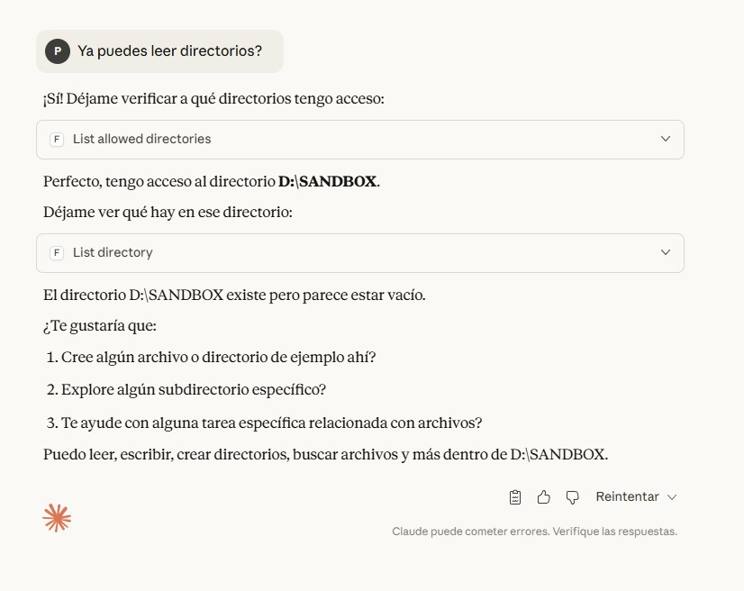
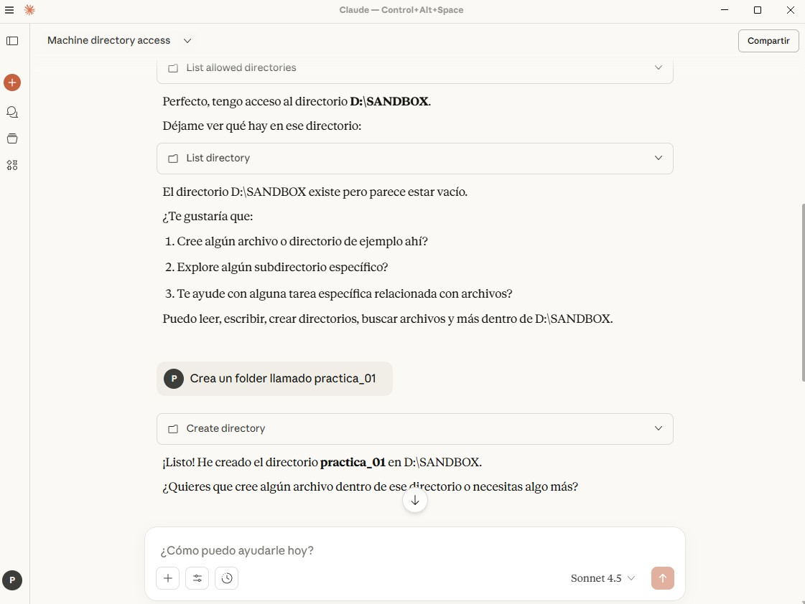

# Uso de MCPs

Algunas de las siguientes referencias traen aspectos importantes a considerar cuando usas MCPs y LLMs.

- https://www.anthropic.com/engineering/code-execution-with-mcp
- https://blog.cloudflare.com/code-mode/
- https://www.anthropic.com/engineering/effective-context-engineering-for-ai-agents

## Empecemos a trabajar con servidores/clientes MCP usando Claude

1. Primero ve a [claude](https://claude.ai/new) y luego crea una cuenta de Claude!
2. Usa el plan gratuito.
3. Descarga e instala Claude Desktop

En Claude Desktop, los MCPs se llaman extensiones o conectores.

## Crea una cuenta y abre tu Claude Desktop

## Instala la extensión (MCP) filesystem 

## Configura directorios para la extensión (MCP)

## Otorga permisos

## Verifica el acceso de Claude para leer/escribir archivos

## Solicita una tarea

