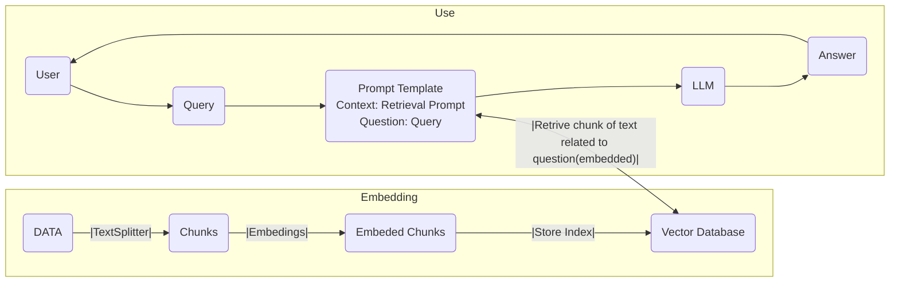

# Chatbot RAG con LangChain

Un **chatbot RAG** es un chatbot que usa *Retrieval Augmented Generation* (generación aumentada por recuperación). Está pensado específicamente para atender consultas sobre temas o artículos concretos.

**RAG** es una forma de ampliar lo que un [LLM](../introduccion.md) sabe, añadiéndole datos adicionales. Se compone de dos partes principales:

- **Indexación**: tomar datos de diversas fuentes y organizarlos de forma que el sistema pueda usarlos con facilidad.
- **Recuperación y generación**:
    - El componente de recuperación actúa como un buscador especializado: rastrea una base de información indexada para encontrar datos relevantes a la consulta del usuario, y se los pasa al LLM.
    - El modelo usa ese contexto, junto con su conocimiento entrenado, para generar una respuesta más informada y precisa. Este proceso permite a RAG dar respuestas más exactas, complementando su entrenamiento amplio pero generalista con información específica y dirigida.




## Herramientas

## Crear una cuenta de Hugging Face


Para crear una cuenta de Hugging Face, ve a [https://huggingface.co/join](https://huggingface.co/join) y regístrate.

Tras registrarte, entra en tu perfil, haz clic en *Edit Profile* y ve a *Access Tokens*.


En la página de *Access Tokens*, crea un token nuevo llamado `llm-test` o similar. **Asegúrate de que nadie más que tú tenga acceso a ese token.**

## Crear una base de datos vectorial en Pinecone

Para crear una cuenta en Pinecone, regístrate en [https://www.pinecone.io/](https://www.pinecone.io/). Ver [bases de datos vectoriales](../../00_DATA/databases/bases_de_datos_vectoriales.md) y,
como alternativa autoalojada, [Milvus](../../00_DATA/databases/milvus.md).


Tras registrarte en el plan gratuito, entra en el proyecto: para uso personal se crea uno automáticamente.

Una vez creado el proyecto, ve a la sección *API Keys* y comprueba que tienes una clave disponible. **No compartas esta clave.**


Instala las librerías:

- `langchain`
- `pinecone-client`
- `streamlit`


## Indexación de datos

Primero necesitamos los datos que el modelo usará para responder. En este caso hace falta un archivo de texto o un PDF sobre algún tema. Conviene usar información **reciente**, que no forme parte del entrenamiento de ningún LLM, ya que nuestro chatbot responderá preguntas sobre ella. Aquí tomaremos texto de un sitio web sobre el tema y lo guardaremos en un archivo `<tema>.txt` dentro del directorio del proyecto.

Puedes usar cualquier blog o artículo; solo asegúrate de emplear el contexto adecuado.


Recopilado el contenido textual, pasamos a la fase de indexación. Lo primero es **dividir los archivos de texto en segmentos manejables**, mediante un *text splitter* en el que definimos el tamaño de esos segmentos.

En este ejemplo fijamos `chunk_size` en 1000 y `chunk_overlap` en 4.

A continuación introducimos una utilidad de *embeddings*, en concreto `HuggingFaceEmbedding`, que será la encargada de vectorizar nuestros segmentos de texto.

```python
from langchain.text_splitter import CharacterTextSplitter
from langchain.document_loaders import TextLoader
from langchain.embeddings import HuggingFaceEmbeddings

loader = TextLoader('./topic.txt')
documents = loader.load()
text_splitter = CharacterTextSplitter(chunk_size=1000, chunk_overlap=4)
docs = text_splitter.split_documents(documents)

embeddings = HuggingFaceEmbeddings()
```


Tras el proceso de embedding, el siguiente paso es **depositar esos fragmentos vectorizados en la base de datos vectorial**, para almacenarlos y recuperarlos de forma eficiente.

Primero inicializamos el cliente de la base de datos con la clave API generada antes. Después asignamos un nombre de índice y comprobamos si ya existe: si existe, lo enlazamos a la variable `docsearch`; si no, creamos uno nuevo con `pinecone.create_index`, usando `cosine` como métrica y dimensión 768, adecuada para los embeddings de HuggingFace.

```python
from langchain.vectorstores import Pinecone
import pinecone

# Initialize Pinecone client
pinecone.init(
    api_key= os.getenv('PINECONE_TOKEN'),
    environment='gcp-starter'
)

# Define Index Name
index_name = "langchain-demo"

# Checking Index
if index_name not in pinecone.list_indexes():
  # Create new Index
  pinecone.create_index(name=index_name, metric="cosine", dimension=768)
  docsearch = Pinecone.from_documents(docs, embeddings, index_name=index_name)
else:
  # Link to the existing index
  docsearch = Pinecone.from_existing_index(index_name, embeddings)
```


## Configuración del modelo

Ya con los textos vectorizados en la base de datos, pasamos a configurar el modelo. Evidentemente no queremos crear, entrenar y desplegar el LLM desde cero en local; por eso usamos **HuggingFaceHub**, una plataforma a la que podemos conectarnos e invocar el modelo sin desplegarlo en nuestra máquina.

Con HuggingFaceHub basta con definir el ID del modelo a usar; en este caso, `mistralai/Mixtral-8x7B-Instruct-v0.1`.

Necesitamos definir dos variables:

- `top_k`: limita a *k* el número de palabras siguientes de mayor probabilidad.
- `temperature`: controla la aleatoriedad de la salida.

```python 
from langchain.llms import HuggingFaceHub

# Define the repo ID and connect to Mixtral model on Huggingface
repo_id = "mistralai/Mixtral-8x7B-Instruct-v0.1"
llm = HuggingFaceHub(
  repo_id=repo_id, 
  model_kwargs={"temperature": 0.75, "top_k": 20}, 
  huggingfacehub_api_token=os.getenv('HUGGINGFACE_TOKEN')
)
```


## Ingeniería de prompts


Para que el LLM responda a nuestra pregunta hay que definir un prompt que contenga toda la información necesaria, lo que nos permite adaptar el modelo a nuestras necesidades. En este caso le diremos que actúe como **experto en la materia** (*subject matter expert*) y responda solo preguntas relevantes. Además hay que pasarle `{context}` y `{question}`: el primero se sustituirá por el fragmento recuperado de la base vectorial, y el segundo por la pregunta del usuario. Ver [prompting](../prompting.md).

Creada la plantilla, definimos el objeto `PromptTemplate` pasándole la plantilla y las variables de entrada (`context` y `question`) como parámetros.


```python
from langchain import PromptTemplate

template = """
You are a {sme}. These Human will ask you a questions about {topíc}.
Use following piece of context to answer the question. 
If you don't know the answer, just say you don't know. 
Keep the answer within 2 sentences and concise.

Context: {context}
Question: {question}
Answer: 

"""

prompt = PromptTemplate(
  template=template, 
  input_variables=["context", "question"]
)
```

## Uniéndolo todo

- El objeto de índice de Pinecone (`docsearch`)
- La plantilla de prompt (`prompt`)
- El modelo (`llm`)


El proceso empieza con `docsearch` recuperando los documentos relevantes que aportan el contexto. Después la consulta pasa sin cambios mediante `RunnablePassthrough`. A continuación, un paso de `prompt` refina o modifica la consulta antes de que la procese nuestro modelo `llm`. Finalmente, la respuesta del modelo se convierte en texto con `StrOutputParser`.


```python
# Import dependencies here
from langchain.schema.runnable import RunnablePassthrough
from langchain.schema.output_parser import StrOutputParser

class ChatBot():
  load_dotenv()
  loader = TextLoader('./horoscope.txt')
  documents = loader.load()

  # The rest of the code here

  rag_chain = (
    {"context": docsearch.as_retriever(),  "question": RunnablePassthrough()} 
    | prompt 
    | llm
    | StrOutputParser() 
  )
```

En `main.py`, añade el siguiente código al final (es solo para probar y conviene eliminarlo después):

```python
# Outside ChatBot() class
bot = ChatBot()
input = input("Ask me anything: ")
result = bot.rag_chain.invoke(input)
print(result)
```

## Frontend con Streamlit


```python
from main import ChatBot
import streamlit as st

bot = ChatBot()

topic = "Some Topic"

st.set_page_config(page_title="Random {0} Bot".format(topic))
with st.sidebar:
    st.title('Random Fortune Telling Bot')

# Function for generating LLM response
def generate_response(input):
    result = bot.rag_chain.invoke(input)
    return result

# Store LLM generated responses
if "messages" not in st.session_state.keys():
    st.session_state.messages = [{"role": "assistant", "content": "Welcome, let's answer yout questions"}]

# Display chat messages
for message in st.session_state.messages:
    with st.chat_message(message["role"]):
        st.write(message["content"])

# User-provided prompt
if input := st.chat_input():
    st.session_state.messages.append({"role": "user", "content": input})
    with st.chat_message("user"):
        st.write(input)

# Generate a new response if last message is not from assistant
if st.session_state.messages[-1]["role"] != "assistant":
    with st.chat_message("assistant"):
        with st.spinner("Getting your answer from ..."):
            response = generate_response(input) 
            st.write(response) 
    message = {"role": "assistant", "content": response}
    st.session_state.messages.append(message)
```