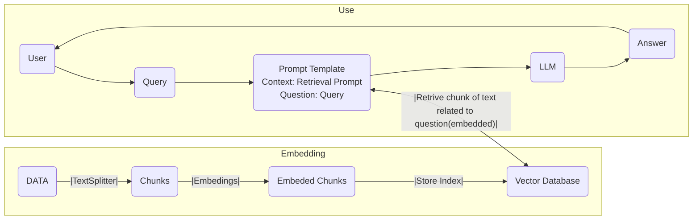

# Build a LLM RAG chatbot using Langchain

An LLM-RAG-chatbot is a chatbot that is using Retrieval Augmented Generation. This is specifically designed for handling queries related to specific topics or articles.

**RAG**, short for **Retrieval-Augmented Generation**, is a way to boost what Large Language Models (LLMs) know by adding more data to them. It’s made up of two main components:

- Indexing: This is about taking in data from various sources and organising it in a way that the system can easily use, which is indexing.
- Retrieval and Generation: 
    - The retrieval component acts like a focused search engine, scanning a database of indexed information to find relevant data related to the user’s query. This data is then fed into the Large Language Model. 
    - The model uses this context, along with its trained knowledge base, to generate a response that’s more informed and accurate. This synergistic process allows RAG to provide more precise answers by supplementing its extensive but generalised training with specific, targeted information.




## Tools

## Create a hugging face account


 To create a Hugging Face account, you can go to  [https://huggingface.co/join](https://huggingface.co/join) and sign up.

 After signing up, go to Your Profile page, click on Edit Profile, and go to Access Tokens.


 On the Access Tokens page, create a new token called llm-test, or similar. Make sure no one has access to this token except you.

## Create a vector database in Pinecone

To create a PineCone account, sign up via  [https://www.pinecone.io/](https://www.pinecone.io/).


 After registering with the free tier, go into the project, for personal use it creates a Project.

 After the project is created, go into the API Keys section, and make sure you have an API key available. Do not share this API key.


install libraries

- `langchain`
- `pinecone-client`
- `streamlit`


## Data indexing

We need to first have the data that our model will use to answer questions. In this case, we need a text file or a pdf about some topic, recommended to use some info that only exist in this year, then this data wont be part of any LLM, as our chatbot will be answering questions related to this. Here, we will be taking text from any topic website and storing it in a `<topic>.txt` file inside our project directory. 

Feel free to use any blog or article — just make sure you are using the right context.


Having gathered the textual content for our RAG application, it’s time to move on to the data indexing phase. Initially, we'll break down the text files into manageable segments. This is done by deploying a text splitter where we define the dimensions of these segments. 

In this example, we're setting the chunk_size to 1000 and chunk_overlap to 4.

Next, we introduce an embedding utility - specifically the `HuggingFaceEmbedding`tool. This will be instrumental in embedding our text segments.

```python
from langchain.text_splitter import CharacterTextSplitter
from langchain.document_loaders import TextLoader
from langchain.embeddings import HuggingFaceEmbeddings

loader = TextLoader('./topic.txt')
documents = loader.load()
text_splitter = CharacterTextSplitter(chunk_size=1000, chunk_overlap=4)
docs = text_splitter.split_documents(documents)

embeddings = HuggingFaceEmbeddings()
```


Following the embedding process, the next step involves depositing these embedded text fragments into our vector database, for efficient storage and retrieval.

First, we initialise the database client in our application using the API key previously generated. Then, we assign an index name and check if it already exists in the database. If it does exist, we link it to the docsearch variable. If not, we create a new index using `pinecone.create_index`, with `cosine` as the metric and a dimension of 768, suitable for HuggingFace embeddings.

```python
from langchain.vectorstores import Pinecone
import pinecone

# Initialize Pinecone client
pinecone.init(
    api_key= os.getenv('PINECONE_TOKEN'),
    environment='gcp-starter'
)

# Define Index Name
index_name = "langchain-demo"

# Checking Index
if index_name not in pinecone.list_indexes():
  # Create new Index
  pinecone.create_index(name=index_name, metric="cosine", dimension=768)
  docsearch = Pinecone.from_documents(docs, embeddings, index_name=index_name)
else:
  # Link to the existing index
  docsearch = Pinecone.from_existing_index(index_name, embeddings)
```


## Model setup

Now that we have our embedded texts on the vector database, let's move on to the model setup part. Of course, we don't want to create, train, and deploy the LLM from scratch locally. This is why we are using HuggingFaceHub, which is a platform we can connect and call the model without having to deploy it on our machine.

With HuggingFaceHub, we just define the ID of the model we want to use - in this case, it will be `mistralai/Mixtral-8x7B-Instruct-v0.1` 

we need to define two variables:

- `top_k`: limits the number of highest probability next words to k
- `temperature`: which controls the randomness in the output

```python 
from langchain.llms import HuggingFaceHub

# Define the repo ID and connect to Mixtral model on Huggingface
repo_id = "mistralai/Mixtral-8x7B-Instruct-v0.1"
llm = HuggingFaceHub(
  repo_id=repo_id, 
  model_kwargs={"temperature": 0.75, "top_k": 20}, 
  huggingfacehub_api_token=os.getenv('HUGGINGFACE_TOKEN')
)
```


## Prompt engineering


For LLM to answer our question, we need to define a prompt that will contain all of the necessary information. This allows us to customise the model to fit our needs. In our case, we will tell the model to be a `Some Matter Expert` (SME) and answer only relevant questions. Additionally, we need to pass `{context}` and `{question}` to the prompt. These values will be replaced with the data chunk we retrieve from our vector database for `{context}` and the question the user asked for the `{question}`.

With this template created, we then define the PromptTemplate object taking our template and input variables (context and questions) as a parameter.


```python
from langchain import PromptTemplate

template = """
You are a {sme}. These Human will ask you a questions about {topíc}.
Use following piece of context to answer the question. 
If you don't know the answer, just say you don't know. 
Keep the answer within 2 sentences and concise.

Context: {context}
Question: {question}
Answer: 

"""

prompt = PromptTemplate(
  template=template, 
  input_variables=["context", "question"]
)
```

## Putting it all together

- Pinecone database index object( docsearch)
- PromptTemplate ( prompt )
- Model ( llm )


The process starts with `docsearch` pulling relevant documents to provide context. Then, the query goes through unchanged using `RunnablePassthrough`. Next, a `prompt` step refines or modifies the query before it's processed by our model, `llm`. Finally, the response from the model is turned into text with `StrOutputParser`.


```python
# Import dependencies here
from langchain.schema.runnable import RunnablePassthrough
from langchain.schema.output_parser import StrOutputParser

class ChatBot():
  load_dotenv()
  loader = TextLoader('./horoscope.txt')
  documents = loader.load()

  # The rest of the code here

  rag_chain = (
    {"context": docsearch.as_retriever(),  "question": RunnablePassthrough()} 
    | prompt 
    | llm
    | StrOutputParser() 
  )
```

In `main.py`, add the following code at the end (this is just for testing purposes and should be removed this later):

```python
# Outside ChatBot() class
bot = ChatBot()
input = input("Ask me anything: ")
result = bot.rag_chain.invoke(input)
print(result)
```

## Streamlit frontend


```python
from main import ChatBot
import streamlit as st

bot = ChatBot()

topic = "Some Topic"

st.set_page_config(page_title="Random {0} Bot".format(topic))
with st.sidebar:
    st.title('Random Fortune Telling Bot')

# Function for generating LLM response
def generate_response(input):
    result = bot.rag_chain.invoke(input)
    return result

# Store LLM generated responses
if "messages" not in st.session_state.keys():
    st.session_state.messages = [{"role": "assistant", "content": "Welcome, let's answer yout questions"}]

# Display chat messages
for message in st.session_state.messages:
    with st.chat_message(message["role"]):
        st.write(message["content"])

# User-provided prompt
if input := st.chat_input():
    st.session_state.messages.append({"role": "user", "content": input})
    with st.chat_message("user"):
        st.write(input)

# Generate a new response if last message is not from assistant
if st.session_state.messages[-1]["role"] != "assistant":
    with st.chat_message("assistant"):
        with st.spinner("Getting your answer from ..."):
            response = generate_response(input) 
            st.write(response) 
    message = {"role": "assistant", "content": response}
    st.session_state.messages.append(message)
```