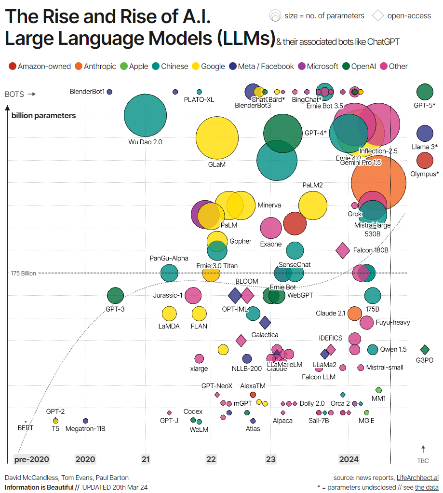

# Introduction to LLMs

LLMs are AI systems used to model and process human language. They are called ``large'' because these types of models are normally made of hundreds of millions or even billions of parameters that define the model's behavior, which are pre-trained using a massive corpus of text data.

The underlying technology of LLMs is called **transformer neural network**, simply referred to as a **transformer**. As we will explain in more detail in the next section, a transformer is an innovative neural architecture within the field of deep learning.

Presented by Google researchers in the famous paper Attention is All You Need in 2017, transformers are capable of performing natural language (NLP) tasks with unprecedented accuracy and speed. With its unique capabilities, transformers have provided a significant leap in the capabilities of LLMs. It’s fair to say that, without transformers, the current generative AI revolution wouldn’t be possible.

Source: [Information is Beautiful](https://informationisbeautiful.net/visualizations/the-rise-of-generative-ai-large-language-models-llms-like-chatgpt/)

We can see, the first modern LLMs were created right after the development of transformers, with the most significant examples being 

- BERT: the first LLM developed by Google to test the power of transformers 
- GPT-1 and GPT-2, the first two models in the GPT series created by OpenAI. 

But it's only in the 2020s that LLMs become mainstream, increasingly bigger (in terms of parameters), and hence more powerful, with well-known examples like GPT-4 and LLaMa.

 