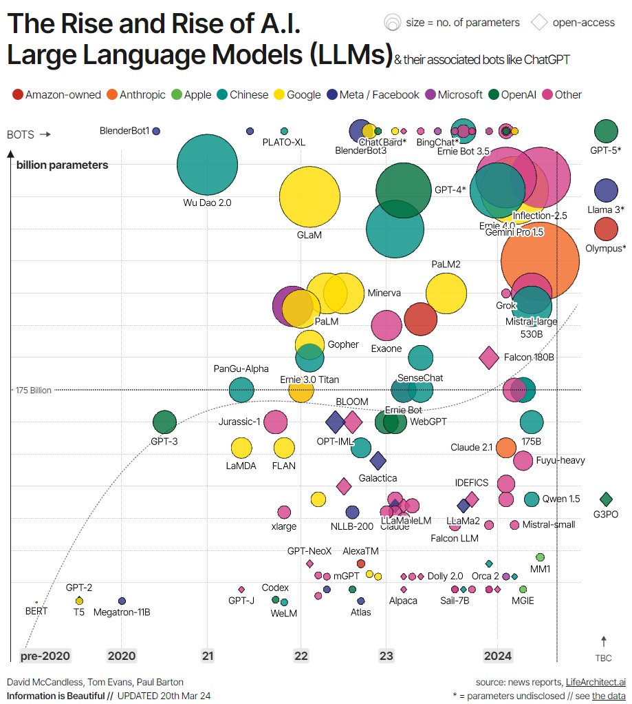

# Introducción a los LLMs

Los **LLMs** (*Large Language Models*, modelos grandes de lenguaje) son sistemas de IA usados
para modelar y procesar el lenguaje humano. Se les llama *grandes* porque este tipo de modelos
se compone normalmente de cientos de millones —o incluso miles de millones— de parámetros que
definen su comportamiento, preentrenados sobre un corpus masivo de texto.

La tecnología subyacente se llama **red neuronal transformer**, o simplemente **transformer**:
una arquitectura neuronal innovadora dentro del campo del deep learning.

Presentados por investigadores de Google en el famoso artículo *Attention is All You Need*
(2017), los transformers son capaces de realizar tareas de procesamiento de lenguaje natural
(NLP) con una precisión y velocidad sin precedentes. Sus capacidades supusieron un salto
significativo para los LLMs; es justo decir que **sin transformers la revolución actual de la
IA generativa no sería posible**.

Fuente: [Information is Beautiful](https://informationisbeautiful.net/visualizations/the-rise-of-generative-ai-large-language-models-llms-like-chatgpt/)

Como se aprecia, los primeros LLMs modernos se crearon justo después del desarrollo de los
transformers. Los ejemplos más significativos son:

- **BERT**: el primer LLM desarrollado por Google para probar la potencia de los transformers.
- **GPT-1** y **GPT-2**: los dos primeros modelos de la serie GPT, creados por OpenAI.

Pero es en la década de 2020 cuando los LLMs se vuelven mayoritarios, cada vez más grandes en
número de parámetros y, por tanto, más capaces, con ejemplos conocidos como GPT-4 y LLaMA.

## En esta sección

- [LLMs open source](llms_open_source.md)
- [Requerimientos de hardware](requerimientos_de_hardware.md)
- [Prompting](prompting.md)
- [Docling](DOCUMENTOS/docling.md) — convertir documentos en algo que un LLM pueda usar.
- [MCP](MCP/introduccion_mcp.md) — el protocolo para dar contexto y herramientas a los modelos.
- [RAGs](RAGS/chatbot_rag_con_langchain.md) — generación aumentada por recuperación.
- [LM Studio](llmstudio/introduccion_lm_studio.md) y
  [LLMs locales](LOCAL_LLM/llms_locales.md).
